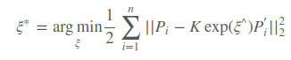
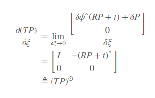
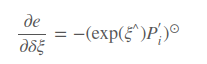

## ICP 算法

坑挖好了，后面有时间填，旋转矩阵非线性优化

位姿求解Icp 算法广泛应用于机器人领域，整个问题可描述如下：

已知$n$对真实坐标点$(p_i, q_i)$，其中$p_i$是机器人在位置$P$观测的实物位置坐标，$q_i$是机器人在位置$Q$观测的实物位置坐标，现在需要求解相关位姿变换$R,T$（$Q$相对于$P$）

​														$$min \Sigma_i (Rp_i + t -q_i) $$

### 2D 坐标

二维坐标下，算法复杂度大幅度下降，旋转矩阵退化为旋转角度$R$

算法流程：

* 将两个点云归一化的各自中心坐标下$$(p_i - \bar p, q_i-\bar q)$$
* 计算平均角度误差量，包括线性与非线性两种
* 最后计算平移向量$$t = \bar p - R\bar q$$

#### 线性算法

**示例代码** 计算平均角度误差

```c++
template <typename PointPairContainer>
double icpStep(OrientedPoint & retval, const PointPairContainer& container){
	typedef typename PointPairContainer::const_iterator ContainerIterator;
	PointPair mean=std::make_pair(Point(0.,0.), Point(0.,0.));
	int size=0;
	for (ContainerIterator it=container.begin(); it!=container.end(); it++){
		mean.first=mean.first+it->first;
		mean.second=mean.second+it->second;
		size++;
	}
	mean.first=mean.first*(1./size);
	mean.second=mean.second*(1./size);
	double sxx=0, sxy=0, syx=0, syy=0;
	
	for (ContainerIterator it=container.begin(); it!=container.end(); it++){
		PointPair mf=std::make_pair(it->first-mean.first, it->second-mean.second);
		sxx+=mf.first.x*mf.second.x;
		sxy+=mf.first.x*mf.second.y;
		syx+=mf.first.y*mf.second.x;
		syy+=mf.first.y*mf.second.y;
	}
	retval.theta=atan2(sxy-syx, sxx+sxy);
	double s=sin(retval.theta), c=cos(retval.theta);
	retval.x=mean.second.x-(c*mean.first.x-s*mean.first.y);
	retval.y=mean.second.y-(s*mean.first.x+c*mean.first.y);
	
	double error=0;
	for (ContainerIterator it=container.begin(); it!=container.end(); it++){
		Point delta(
			c*it->first.x-s*it->first.y+retval.x-it->second.x, s*it->first.x+c*it->first.y+retval.y-it->second.y);
		error+=delta*delta;
	}
	return error;	
}
```


#### 非线性算法

**代码示例** 算法 $$sin 与 cos $$累计误差

```c++
template <typename PointPairContainer>
double icpNonlinearStep(OrientedPoint & retval, const PointPairContainer& container){
	typedef typename PointPairContainer::const_iterator ContainerIterator;
	PointPair mean=std::make_pair(Point(0.,0.), Point(0.,0.));
	int size=0;
	for (ContainerIterator it=container.begin(); it!=container.end(); it++){
		mean.first=mean.first+it->first;
		mean.second=mean.second+it->second;
		size++;
	}
	
	mean.first=mean.first*(1./size);
	mean.second=mean.second*(1./size);
	
	double ms=0,mc=0;
	for (ContainerIterator it=container.begin(); it!=container.end(); it++){
		PointPair mf=std::make_pair(it->first-mean.first, it->second-mean.second);
		double  dalpha=atan2(mf.second.y, mf.second.x) - atan2(mf.first.y, mf.first.x);
		double gain=sqrt(mean.first*mean.first);
		ms+=gain*sin(dalpha);
		mc+=gain*cos(dalpha);
	}
	retval.theta=atan2(ms, mc);
	double s=sin(retval.theta), c=cos(retval.theta);
	retval.x=mean.second.x-(c*mean.first.x-s*mean.first.y);
	retval.y=mean.second.y-(s*mean.first.x+c*mean.first.y);
	
	double error=0;
	for (ContainerIterator it=container.begin(); it!=container.end(); it++){
		Point delta(
			c*it->first.x-s*it->first.y+retval.x-it->second.x, s*it->first.x+c*it->first.y+retval.y-it->second.y);
		error+=delta*delta;
	}
	return error;	
}
```

### 3D 变换

算法流程：

* 将两个点云归一化的各自中心坐标下$$(p_i - \bar p, q_i-\bar q)$$
* 计算相对的旋转矩阵，包括直接线性变换与非线性优化两种
* 最后计算平移向量$$t = \bar p - R\bar q$$

#### 直接线性变换DLT


**代码示例**


#### 非线性优化







求出雅克比矩阵之后，就可以无脑高斯牛顿了

**代码示例**


