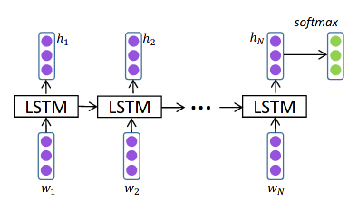
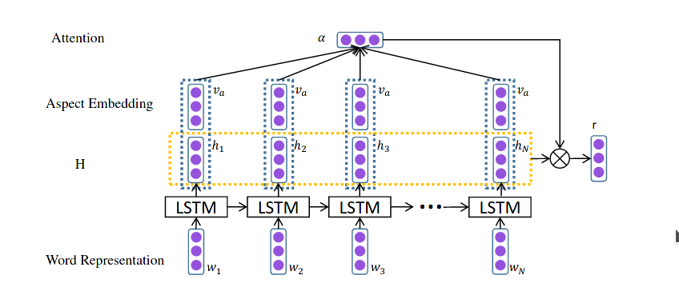
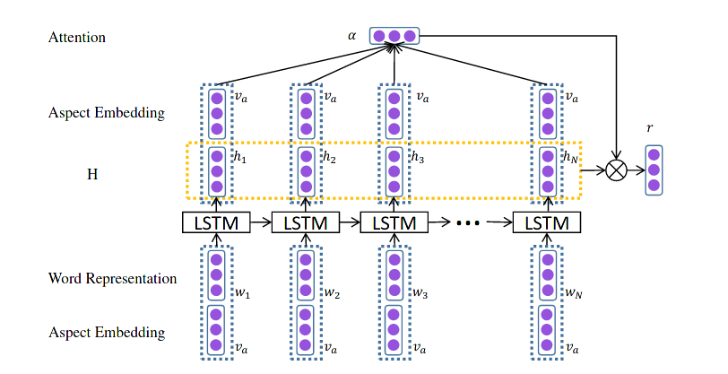
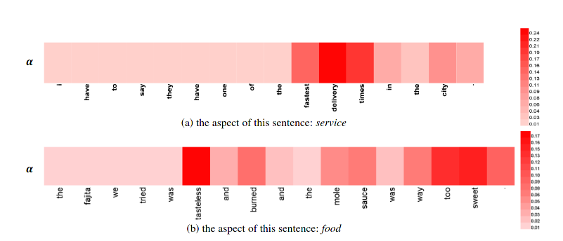
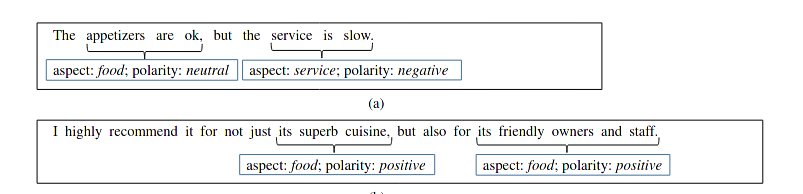
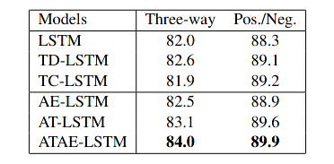

#### Attention-based LSTM for Aspect-level Sentiment Classification

Aspect-level sentiment classification is a fine-grained task in sentiment analysis, Since this task consider a more complicated and more in-depth hypothesis, or in short the connection between sentence words relative to aspect word  in demand. Thus this paper purposed a novel LSTM architecture with attention mechanism in order to announce the culmination of this arduous problem (雾).

Also, this paper is given birth on 2016, even from the viewpoint of today, it is also charming. This paper focused on the discrete aspect sentiment classification without the capability to inference multi aspect simultaneously.  

### Ideology

#### LSTM

the LSTM module can be formulated as following : 
$$
X = [h_{t-1}, x_t]^T \\
f_t = \sigma(w_f^T X + b_f) \\
i_t = \sigma(w_i^T X + b_i) \\
o_t = \sigma(w_o^T X + b_o) \\
c_t = f_t \odot c_{t-1} + i_t \odot \tanh (w_c^T X + b_c)
h_t = o_t \odot \tanh(c_t)
$$

#### Attention-based LSTM

Given a sentence consist of a serial words, which use word embedding to represent its general meaning.  $s = [w_1, ...w_N]$,  the main procedure can be formulated as following:
$$
h_i =  Lstm(h_{t-1}, w_i) \\
\mathcal H = [h_0, h_1, ... h_N] \\
\mathcal M = \tanh([w_h^T \mathcal H, \  w_a^T v_a]^T) \\
\mathcal r = \mathcal H \otimes softmax(w^T \mathcal M)
$$

#### Attention-based LSTM with aspect embedding

input embed vector can also contains the aspect vector:
$$
h_i =  Lstm(h_{t-1}, [w_i, v_a]^T) \\
\mathcal H = [h_0, h_1, ... h_N] \\
\mathcal M = \tanh([w_h^T \mathcal H, \  w_a^T v_a]^T) \\
\mathcal r = \mathcal H \otimes softmax(w^T \mathcal M)
$$

### Experimental

#### Visualization of the attention

    
    

#### Result

* Three way means **Pos** **Neg ** and **Neutral**
* Pos\Neg is representing the binary classification problem

