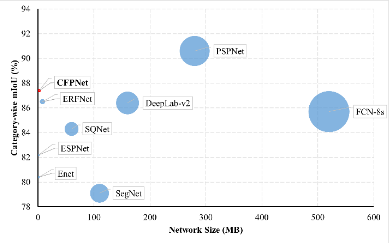
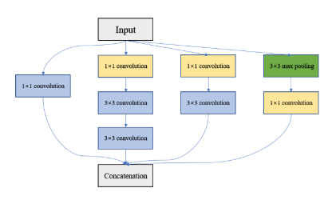
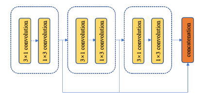
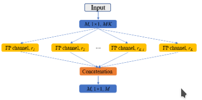
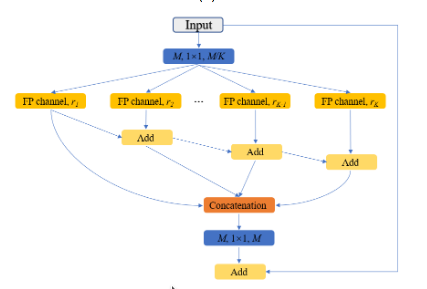
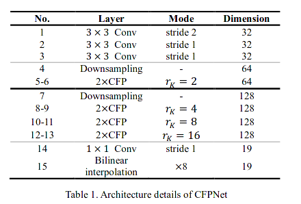
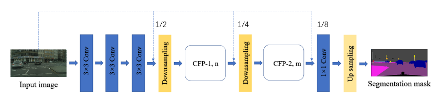
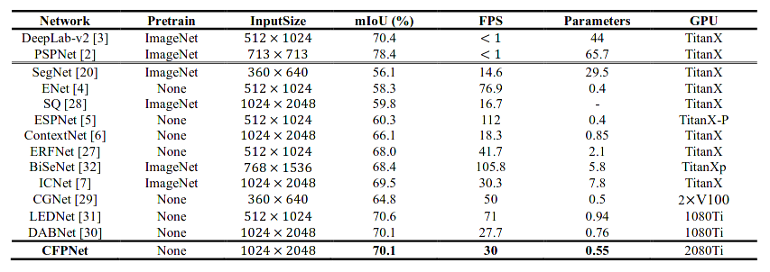

#### CFPNet: Channel-wise Feature Pyramid for Real-Time Semantic Segmentation

### Motivation

The CFPNet is proposed for real-time semantic segmentation, which is follow a encoder-decoder style architecture by incorporating the channel wise feature pyramid. Unlikely heavy encoder eg. UNet, SegNet.

The mission of **CFPNet** can be summerized to achieve **model size**, **parameters**, **inference speed** and **mIOU accuracy**

### Ideology

**Feature Pyramid module**

**Inception module** use different size kernel to extract different receptive filed feature, then cat those feature up. thus channel wise feature vector of consequent feature map has a property of multi scale. while the feature extract is separate which lead to parallel ability. **Inception module v2   [Left]** employ factorization into feature extraction via replace 5x5 convolution layer by two 3x3 convolution layer, which reduces parameter size heavily. **Go Further** , to apply more aggressive *factorization* through replace 3*3 convolution layer by 3x1 convolution and 1x3 convolution is also a memory efficient conduct. **Asymmetric convolution   [Right] ** use a unique  branch feature to construct a feature pyramid, despite unable to parallel, this operation reduce other branch convolution to achieve a more parameter efficiency.

     
    

**Dilated convolution ** dilated convolution layer can increase the receptive filed size of feature vector in feature map rapidly, this is also a technical operation.

**CFP module**

cfp module employ all the technical skills to form a super efficient channel wise feature pyramid .

with idea of multi head feature extractor, cfp module use different dilated rates to form **multi head** function, as left image show. to make the deep neural network trained, cfp module incorporates **skip-connection**  to link different channel head.

    
    

### Architecture

**CFPNet** extract 1/8 size of feature, then use bilinear interpolation to recover origin input shape. The basic head num for experiment is $K=4$ ,  the dilated rate for each channel head is   $[ 1, {r_k\over4},{r_k \over 2},r_k ]$,  with floored  by 1.

### Experiment (cityscapes)

