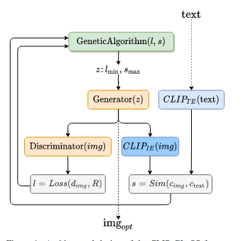
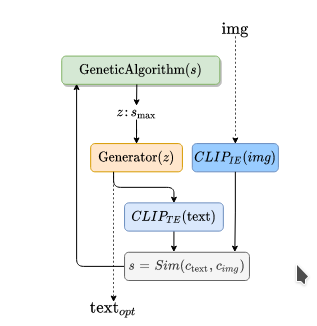

**Generating images from caption and vice versa via CLIP-Guided Generative Latent Space Search**

### Introduction

I d like to regard this article as a novelty technical report rather than a computer vision paper with solid works, due to the limited contribution of generative model, which only explores the inference procedure with a rough analysis. This paper improves synthesized image or text quality by leverage similarity computed from CLIP. The whole architecture consists of there components, CLIP, GAN, genetic searcher. 

### Method

leverage genetic algorithm to search an optimal generative output (text or image)

    
    

the objective of genetic searcher is :
$$
\begin{aligned}
z &= \arg \max \text {sim} ( \text{CLIP}(\mathbb G({z}), \text{CLIP}(\mathbb I_{text}) ) \\
z &=  \arg \min L (\mathbb D(z), \mathcal R)
\end{aligned}
$$

### Conclusion

the method proposed by this article achieves a zero-shot generative procedure, which is fed with a image, generating a corresponding text and vice verse.

