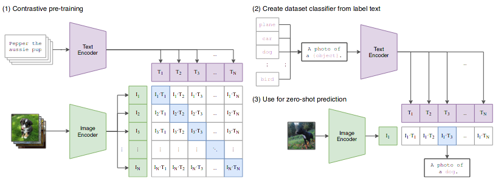
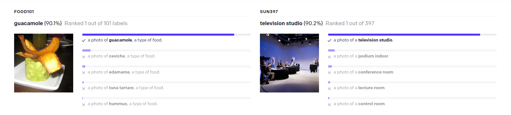

#### Learning Transferable Visual Models From Natural Language Supervision

state of art computer vision task are trained to predict a fixed set of predetermined object categories, This restricted form of supervision limits their generality and usability since  additional labeled data in needed to specify any other visual concept. Thus learning directly from raw image data, is a promising alternative approach which could leverage more border resource, and this approach is regard as self-supervised learning. Here proposed a novel way which collaborate visual information with neural language information, it enables the zero-shot representation learning.  

### Motivation

### Method

use encoder to get the feature representation of text and image, thus use the text feature representation as a classifer, where the visual feature representation will project on. The above process generates a multi object class distribution, which indicates the class probability  of the image.

During training process(**cross batch contrastive**), batch size $N$ contains $N$ pair $[image, text]$,  $N$ texts can be regarded as  $N$ randomly generated classes, which is different from the class category of image dataset , and the corresponding text feature representation on behalf of the corresponding classifier. 
$$
P_c(I) = en(I)^T \cdot en(Text_c) \\
P(I) = \mathcal M[ en(Texts)]^T en(I)
$$
the supervision objective function is to max the the corresponding pair representation [image, text] inner product. which can be solved by **contrastive learning**.
$$
\max \ \ \ en(I)^T en(Text_c) \\
$$
when inference as zero shot learning. in order to improve the classify quality. prompt template is employed.
$$
this \ is \ a \ \ \{ object\}.   \ \ \ object \in C
$$

### Experimental

