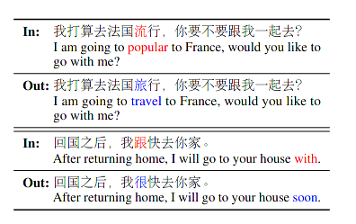
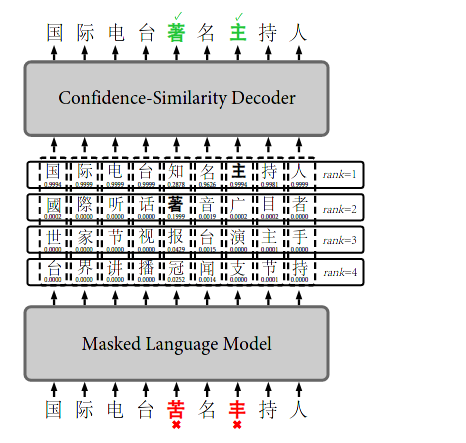
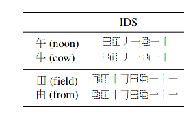
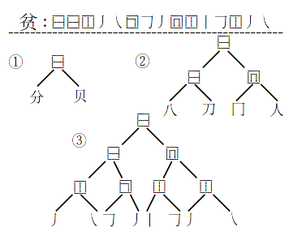
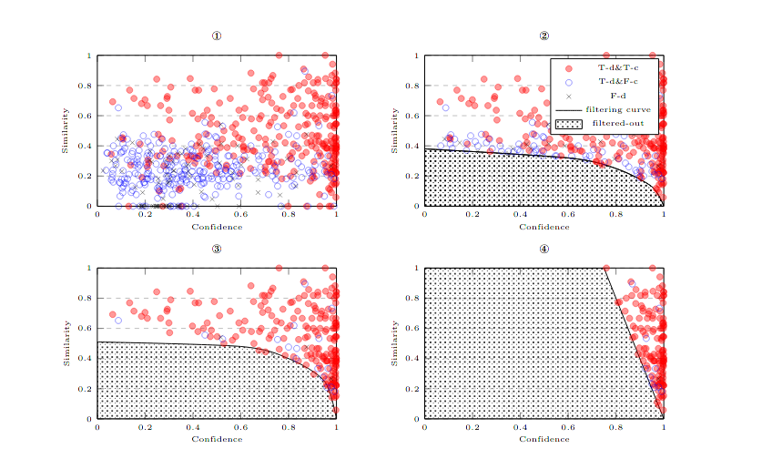
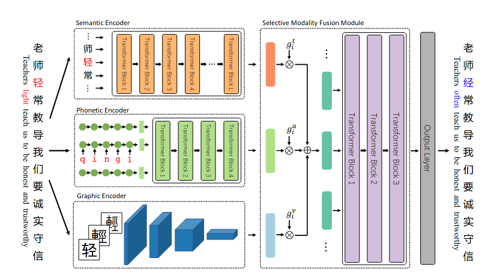
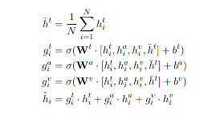
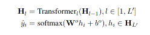

# CSC (Chinese Spell Correction)

The CSC is represented for Chinese spell correction, which aims to find the erroneous character in a sentence or paragraph while replace the error one with most likely character. This task conventionally contains two parts: **error detection** and **error correction** 

### Background of CSC 

along with the rapid development of CHINA, the international influence and impact from Chinese culture is generally increasing, but we turn around to the chinese web environment, filled with erroneous spelling character sentences emerging, which is really damage our culture and reading capability. the general error including **semantic base error**, **phonetic similarity error**, and  **visual similarity error**

* semantic base error
* phonetic similarity error
* visual similarity error

### Approach towards CSC

总结几个基于深度学习的中文文本检错方案

#### Basic Bert

#### FASpell

[[PDF](https://aclanthology.org/D19-5522.pdf)] [CODE]

考虑到了多模态信息，但是没完全考虑到，有些实验设置蛮好笑的，大致分为两阶段，第一阶段使用了模型   **Bert-MLM**  来预测候补的词汇，如果最高概率的输出跟输入一致，就不处理，如果不一样就使用滤波器，来选择最优的候选词汇。

#### Bert-MLM

#### Confidence Similarity Filter

**Visual similar**

作者说，根据他的观察，在confidence-similarity统计图像中，**正确检测并且改正（TD-TC）位于右上角，正确检测但是改正错误（TD-FC）在左下角**， 所以只要找一条曲线(manually)可以最优分割，就可以高效分类了

#### REALISE

[[PDF]](https://arxiv.org/pdf/2105.12306v1.pdf)  [[CODE]](https://github.com/DaDaMrX/ReaLiSe)

这篇已经解决了大部分问题，方法是基于多模态信息融合，创想点主要有两个: **selective modality fusion**, and **Phonetic levels encoder**, 效果非常好

##### Semantic Encoder

Supposed we have a sentence "老师经常教导我们要诚实守信"，the semantic encoder consists of the bert backbone which are cascading  $L$ transformers, and the input token  which are word-embedding and position-embedding. The semantic encode procedure can be described as following :

 $$ W_0, .... W_N = E(老师经常教导我们要诚实守信)$$  $$T_0 .... T_N = W_0 + P_0, ... W_N+P_N $$ $$H^s_l = Bert(T_0, ...T_N) $$

##### Phonetic Encoder

As referring to "轻"，the pinyin for this character is ${qing}^1$,  we can use ${q, i, n,g,1}$ to describe or index "轻"， but this phonetic representation is varying aspect to length, one approach to address this problem is to use phonetic embedding for every element in $q,i,n,g,1$, but this is not enough due to the property of average weight, thus this paper utilize **GRU** to model the character level phonetic encoder

​							$h^p_j = GRU(h_{j-1}^p , E[p_{i,j}])$

​							$H^p = transformers(h^p_0,....h_N^p)$

**预训练任务**

语音编码器预训练任务类似于Bert预训练，采用输入mask，输出预测恢复的方式

##### Graphic Encoder

图形编码比较简单，用**CNN**来提取每个文字图像特征向量

​								$h^v_i = Norm(Res_5(I_i))$

​								$H^v = \{h_0^v,... h_N^v\}$

##### Selective Modality Fusion

As described in **Phonetic Encoder**, the average is not enough for the modality fusion, the dynamic weight strategy is applied for this task

then use transformers to enhance the feature representation.

