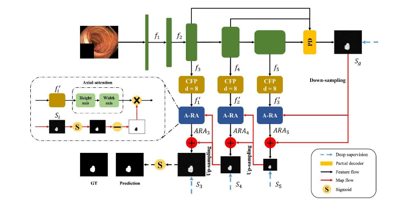

##### Context Axial Reverse Attention Network for Segmentation of Small Medical Objects

### Motivation

**for the brain tumor, the survival rate will decrease with the growing size of brain tumor**

thus detection method for small tumor is necessary for reduce mortality rate caused by small tumor. 

### Partial Decode

detailed feature computation is exhausted, thus just use finial three feature map  to reconstruct segment image. and use reverse attention mechanism  to compensate the immediate segment via a coarse to fine style 

### Axial Reverse Attention

Given score map $S$, and feature map $F_{ij}$ , the process function can be formulated as following:

​													$F^H_{ij} = attention^H(F_{ij}, F_{i,j})$

​													$F_{ij}^{HV} = attention^V(F^H_{ij}, F^H_{ij})$

​													$\hat S = 1 - sigmod(S)$

​												  	$\hat F = \hat S \cross F_{ij}^{HV} $  

### Deep Supervision

apply weighted IOU loss to each immediate output $\hat F_i$ , given ground truth $G$

​										$Loss = \Sigma_{i=3}^5L(G, upsampel(\hat F_i)$

