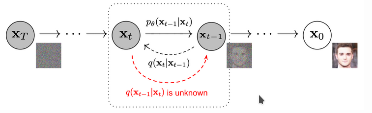

### Diffusion Model

生成模型博大精深呢，我学不会捏，:crying_cat_face::crying_cat_face::crying_cat_face::crying_cat_face:

今天学了一点diffusion model, 我自己感觉diffusion model主要思想就是用网络估计后验，使得网络生成能力up.

给定当前状态 $X_i$, 经过一个变换，成为 $X_{i+1}$， 两者之间存在转移概率 $q(X_{i+1} | X_i)$ , 然后从$X_0$, 变换生成出一个序列， 我们的任务就是学习这个序列得到逆变换， 可以从 $X_T$ 变换回 $X_0$ .

### 关于目标函数

生成的最直接驱动，是最大化最终生成结果 $p_{\theta}(X_0)$
$$
\begin{aligned}
\log p_{\theta}( X_0) 
&\ge \log p_{\theta}( X_0) - \mathcal D_{kl}(q(X_{1:T}|X_0) || p_{\theta}(X_{1:T})|X_0) 
\\
&= \log p_{\theta}( X_0) - \mathbb E_{X_{1:T}}[\log { q(X_{1:T} | X_0) p_{\theta}(X_0)\over p_{\theta}(X_{0:T}) }]
\\
&= \log p_{\theta}( X_0) - \mathbb E_q[\log { q(X_{1:T} | X_0) \over p_{\theta}(X_{0:T}) }] - \log p_{\theta}(X_0) 
\\
&= - \mathbb E_q[\log { q(X_{1:T} | X_0) \over p_{\theta}(X_{0:T}) }]
\end{aligned}
$$
这就是我们要优化的东西，但是现在表达式还是不够清楚：

$$
\begin{aligned}
\mathbb L_{vlb} 
&= \mathbb E_q[\log { q(X_{1:T} | X_0) \over p_{\theta}(X_{0:T}) }] \\
&= \mathbb E_q[\log { \Pi_{t=1} q(X_t | X_{t-1}) \over p_{\theta}(X_T) \Pi_{t=1}p_{\theta}(X_{t-1} | X_t)}] \\
&= \mathbb E_q[-\log p_{\theta}(X_T) + \mathop \Sigma_{t=1}^T \log {q(X_t | X_{t-1}) \over p_{\theta}(X_{t-1}| X_t)} \\
&= \mathbb E_q[-\log p_{\theta}(X_T) + \mathop \Sigma_{t=2}^T \log {q(X_t | X_{t-1}) \over p_{\theta}(X_{t-1}| X_t)} + \log {q(X_1 | X_0) \over p_{\theta}(X_0 | X_1)} \\
&= \mathbb E_q[-\log p_{\theta}(X_T) + \mathop \Sigma_{t=2}^T \log {q(X_{t-1} | X_{t}, X_0) \over p_{\theta}(X_{t-1}| X_t)}{q(X_t | X_0) \over p_\theta (X_{t-1} | X_0 )} + \log {q(X_1 | X_0) \over p_{\theta}(X_0 | X_1)} \\
&= \mathbb E_q[-\log p_{\theta}(X_T) + \mathop \Sigma_{t=2}^T \log {q(X_{t-1} | X_{t}, X_0) \over p_{\theta}(X_{t-1}| X_t)} + \mathop \Sigma_{t=2}^T {q(X_t | X_0) \over p_\theta (X_{t-1} | X_0 )} + \log {q(X_1 | X_0) \over p_{\theta}(X_0 | X_1)} \\
&= \mathbb E_q[-\log p_{\theta}(X_T) + \mathop \Sigma_{t=2}^T \log {q(X_{t-1} | X_{t}, X_0) \over p_{\theta}(X_{t-1}| X_t)} +  {q(X_T | X_0) \over p_\theta (X_{1} | X_0 )} + \log {q(X_1 | X_0) \over p_{\theta}(X_0 | X_1)} \\
&= \mathbb E_q[\log {q(X_T | X_0) \over p_{\theta}(X_T) } + \mathop \Sigma_{t=2}^T \log {q(X_{t-1} | X_{t}, X_0) \over p_{\theta}(X_{t-1}| X_t)}  -\log { p_{\theta}(X_0 | X_1)} \\
\end{aligned}
$$
最后总结一下：
$$
\begin{aligned}
\mathbb L_{vlb} &= \mathop \Sigma_{i=0}^T\mathbb L_{i} \\
\mathbb L_{T} &= \mathbb D_{kl}(q(X_T | X_0) || p_{\theta}(X_T)) \\
\mathbb L_{i}  &=  \mathbb D_{kl}(q(X_t | X_{t+1}, X_0) || p_{\theta}(X_t | X_{t+1})) \\
\mathbb L_{0} &= -\log { p_{\theta}(X_0 | X_1)}
\end{aligned}
$$

### 关于转移概率

#### 连续状态的变量

变量的状态连续，假如说，就以人脸为例，像素虽然是0-255,但是数据处理的时候，会变成浮点数，可以想象成连续的一个超大向量（拉平图像到一维）。 根据当前状态作为均值，生成正态分布噪声的过程，可以表示：
$$
q(x_t | x_{t-1}) = \mathcal N(X_t ; X_{t-1} , \beta_t \mathbb I)
$$
如果是和正态分布噪声按照比例混合（添加噪声）， 则可以表示为
$$
q(x_t | x_{t-1}) = \mathcal N(X_t ; \sqrt{1-\beta_t} \ X_{t-1} , \beta_t \mathbb I)
$$
这样有了转移的表达式，就可以计算前向条件概率，得到计算损失的时候需要的对应后验分布：
$$
q(X_t | X_{t+1}, X_0) = q(X_{t+1} | X_{t}, X_0) {q(X_{t-1} | X_0) \over q(X_t | X_0)}
$$

#### 离散状态的变量

主要是马尔可夫链，转移就是转移概率矩阵，只是状态变成离散的, 也主要是利用这个公式，计算左边。
$$
q(X_t | X_{t+1}, X_0) = q(X_{t+1} | X_{t}, X_0) {q(X_{t-1} | X_0) \over q(X_t | X_0)}
$$
