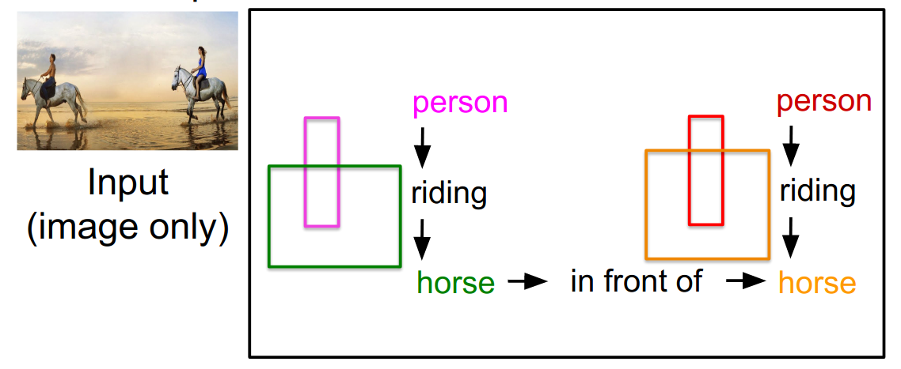
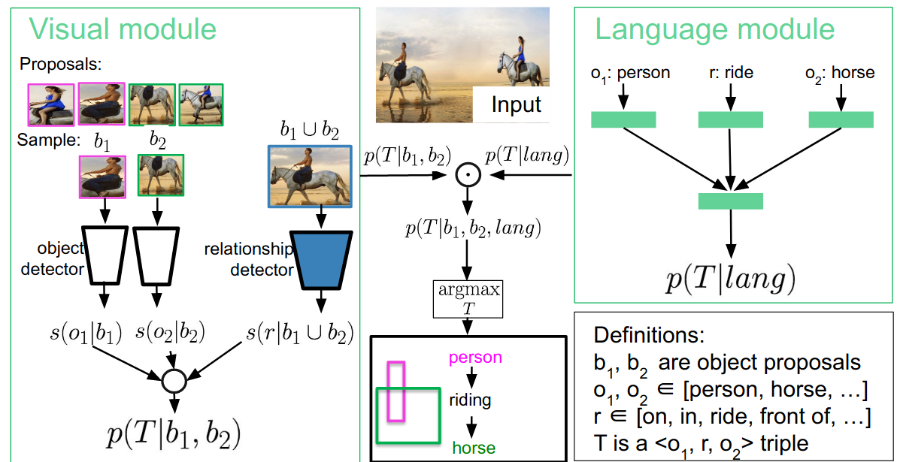
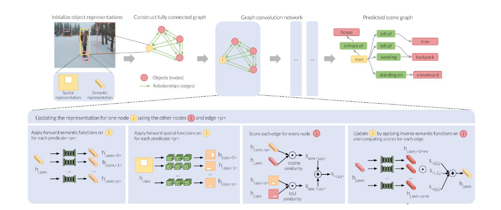

## Scene Graph Generation

### the Basic concept of Scene Graph Generation

### challenge of Scene Graph Generation

- [x] Quadratic explosion of relationships

- [x] Long tail distribution 

  amount rare but exist relationships

### Vision-Language Model

* vision model : predict the object and the relationship (N+k)
* language model : to correct the relationship and objects 

#### the cons :

- [x] neglect other relationships

### Graph representation Model

representing objects as graph with dense connection 

