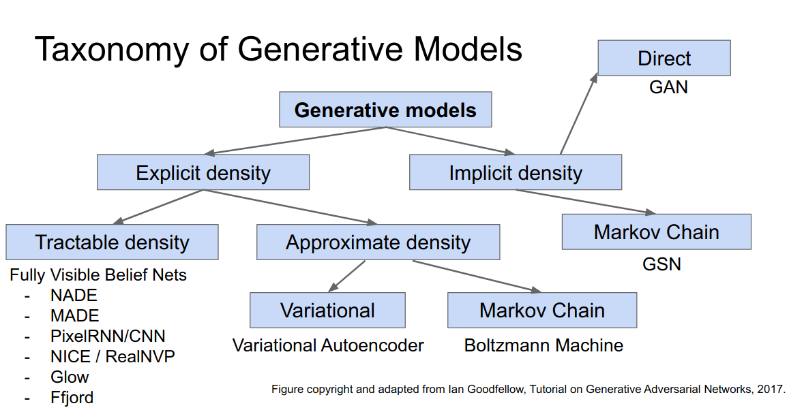
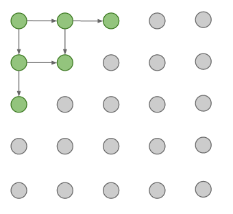
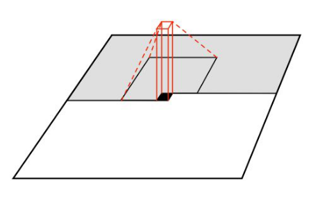
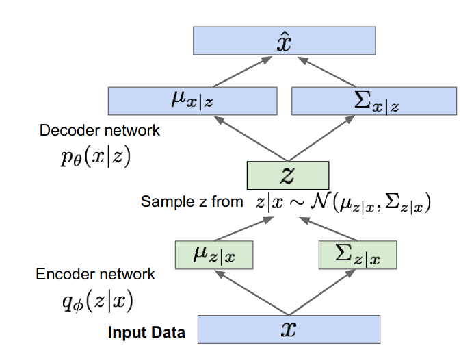
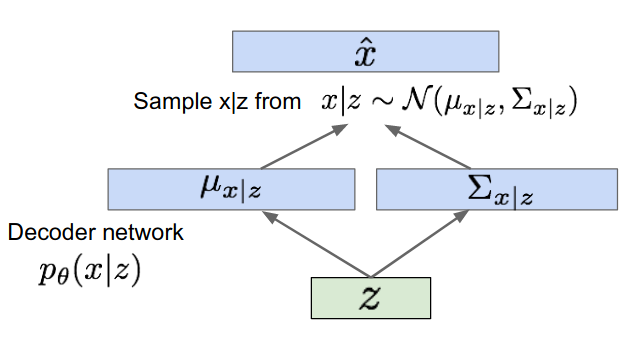
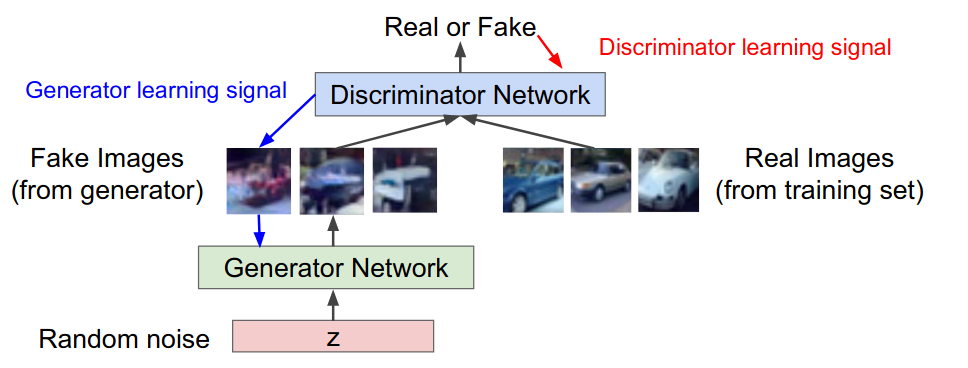
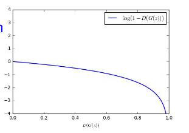

## Generative Modeling

### The Basic Concept of Generative Modeling

* the objectives of Generative Modeling
  - [ ] learning $P_{model}$ which approximates $P_{data}$
  - [ ] using the $P_{model}$ to sample new data

* the density estimate formulation
  * explicit density estimation : solve parameters of a known model
  * implicit density estimation : using math methods to represent the whole model without defining it

* the estimation model architecture 

********************************************

### Fully visible belief network

- [ ] explicit density model

- [ ] use chain rule to decompose likelihood of an image x into product of :

  $P(x) = \Pi_{i=1} P(x_i|x_1,...x_{i-1}) \\\\$

#### Recurrent Neural Network

##### Pixel RNN

##### Pixel CNN

use context region instead of single pixel

************************************************

### Variational  Autoencoders

- [ ] also using explicit density but not tractable

- [ ] the intractable density function with latent $Z$ is formulate as following :

  $P_{\theta}(x) = \int P_{\theta}(z) \ P_{theta}(x|z)dz$

- [ ] there is no dependencies among pixels, avoid the repeated compute

- [ ]  Cannot optimize directly

#### how make autoencoder a generative model?

assume training data ${x^{(i)}}^N_{i=1}$ is generated from the distribution of latent vars $Z$

* samples from true conditional : $P_{\theta *}(x|z^i)$
* samples from true prior : $Z^{(i)} \sim P_{\theta *}(Z)$

the objective function is to maximize the likelihood  $log P_{\theta}(x^{(i)})$ ,  the purpose of this conduct is that estimate the correct parameters of dataset distribution

$\theta + \phi$ is the whole parameters of autoencoder

$\theta$ is the parameters of decoder neural network

$\phi$ is the parameters of encoder neural network
$$
log P_{\theta + \phi}(x^{(i)})  = E_{z \sim q_{\phi}(z|x^i)}[logP_{\theta + \phi}(x^i)] \\
=  E_z[log{{p_\theta(x^i | z) p_\theta(z)}\over p_\theta (z | x^i)}] 
\\ = E_z[log{{p_\theta(x^i | z) p_\theta(z)}\over p_\theta (z | x^i)}{q_\phi(z | x^i) \over q_\phi(z | x^i) }] 
\\ = E_z[logP_\theta(x^i|z)] - D_{KL}({q_\phi(z|x^i)|| p_\theta(z)}) + D_{KL}(q_\phi(z|x^i)||p_\theta{(z|x^i)})
$$
and  $D_{KL}(q_\phi(z|x^i)||p_\theta{(z|x^i)})  \ \ $  is obviously an intractable term, because of the irreversible property of neural network.  需要换行

the tractable lower bound is :

 $E_z[logP_\theta(x^i|z)] - D_{KL}({q_\phi(z|x^i)|| p_\theta(z)})$

this optimization method is some kind like SVM mathematics formulation

##### the training process

**must assume the latent variable and input data follow a certain distribution, such as Gaussians distribution **

* the encoder objective function :  $- D_{KL}({q_\phi(z|x^i)|| p_\theta(z)})$

  the KL-divergence has a closed form solution

* the decoder objective function : $E_z[logP_\theta(x^i|z)]$

  the expectation needs the sampling latent from latent variable parameters

  ​              $Z = \mu_{z|x} + \epsilon \Sigma_{z|x}$

  then compute the generative data $\hat x$

  and finally the loss :   $E_z[logP_\theta(x^i|z)]$

##### the inference process

use the decoder network to construct the model parameters, use this known model to sample images, as the following: $Z$ is the latent variable, also called as prior knowledge used in generative model.

******************************************************

### Generative Adversarial Networks

Want to sample from complex, high-dimensional training distribution

- [ ]  Sample from a simple distribution we can easily sample from, e.g. random noise.  
- [ ] learning a ability to transform a distribution to the other

#### how model this Idea?

* Discriminator network : try to distinguish between real and fake images

* Generator network : try to fool the discriminator by generating real-looking images

  

the minimax objective function :

​		$min_{\theta_g}max_{\theta_d}[E_{x \sim p_{data}}logD_{\theta_d}(x) + E_{z \sim p(z)}log(1-D_{\theta_d}(G_{\theta g}(z)))]$ 

* Gradient ascent for discriminator

  $max_{\theta_d}[E_{x \sim p_data}logD_{\theta_d}(x) + E_{z \sim p(z)}log(1-D_{\theta_d}(G_{\theta g}(z)))]$

* Gradient descent on generator

  $min_{\theta_g} E_{z \sim p(z)}log(1-D_{\theta_d}(G_{\theta g}(z)))]$

  but due to the gradient of  generator objective function. it is difficult to learning, when loss is little, which is indicating generator perform worsly, the learning purpose should give the generator a heavy push, but the gradient of objective function is also small, so it difficult. 

  * alternate objective function for generator

    $max_{\theta_g} E_{z \sim p(z)}log(D_{\theta_d}(G_{\theta g}(z)))]$

