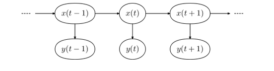
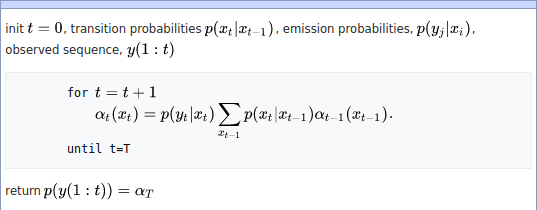
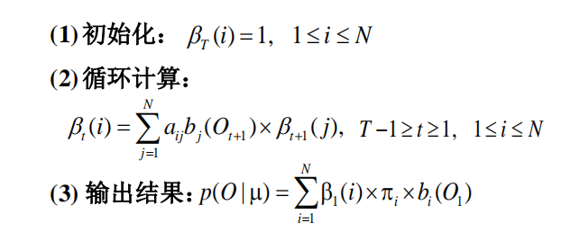
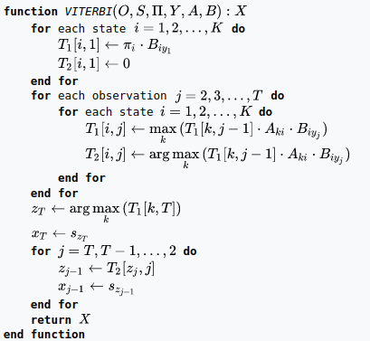

# HMM

隐马尔可夫模型，随机过程观测$Y$，与随机过程状态$X$ ,满足：$P(Y_n|X_1X_2 ...X_n) = P(Y_n|X_n)$

同时 状态之间存在转移矩阵 $A$,以及观测与状态之间存在变换矩阵$B$, 隐马尔可夫模型可表示为：

$M(A,B,X,Y,\pi)$, 其中$\pi$为初始状态

## 问题

### 概率估计

已知观测序列$O = Y_1Y_2Y_3Y_4...Y_n$，以及模型参数$A,B,\pi$,求解观测出现的概率$P(O|M(A,B,\pi))$

#### 算法

* 前向算法

  动态规划 或者 递推

  

* 后向算法

  

### 状态估计

已知观测序列$O = Y_1Y_2Y_3Y_4...Y_n$，以及模型参数$A,B,\pi$,求解最可能出现的内部状态序列$X = X_1X_2..X_n$

#### 算法

* veterbi 算法

  

### 参数训练

* EM 算法

