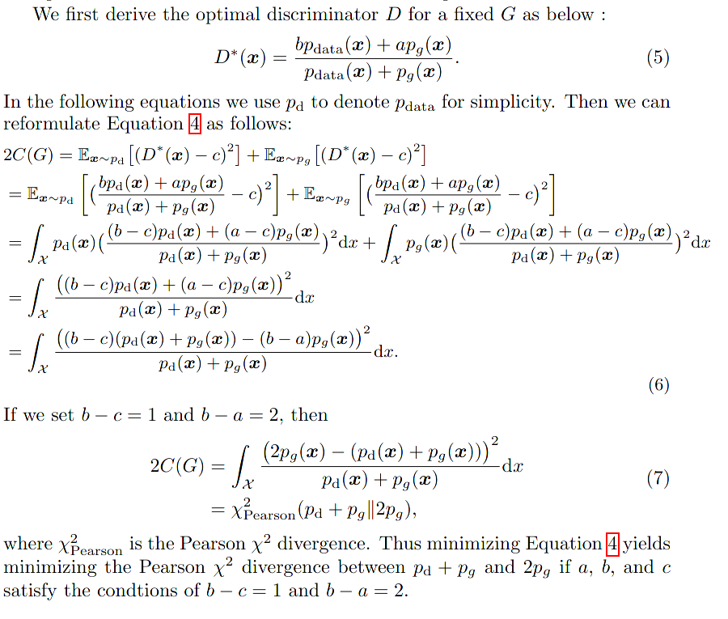
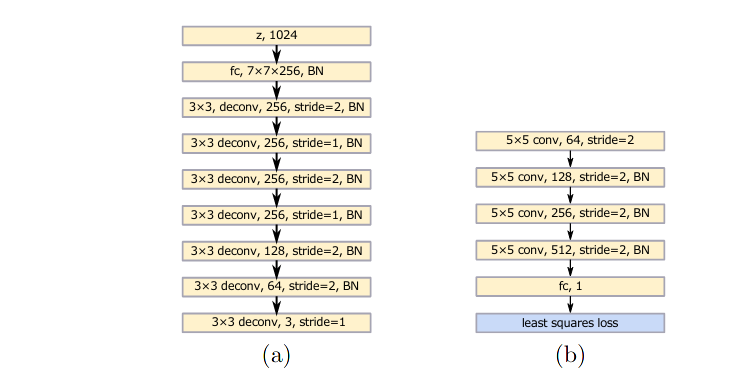
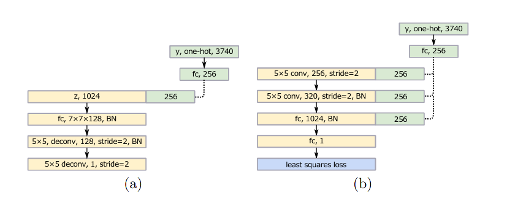

### LS-GAN

unsupervised learning with generative adversarial networks has proven hugely successful. regular Gans hypothesize the discriminator as a classifier with sigmoid cross entropy loss function, which may hurts the learning process with its vanished gradient when the loss is nearly 0 or 1.

### Formulation

similar to general gan algorithm. revise the objective function to improve stability of learning procedure. 
$$
\begin{aligned}
\min_D \mathbb L(D) &= \mathbb E_{data} (D(x) - b)^2 + \mathbb E_{z} (D(G(z))-a)^2 \\
\min_G \mathbb L(G) &= \mathbb E_{z} (D(G(z)) -c)^2
\end{aligned}
$$

### Experiment

the detailed result of experiment shows high fidelity and stability of LS-GAN, compared with regular GAN, LS-GAN really relieve the mode collapse phenomena.  

#### scene generative model

#### conditional generative model

