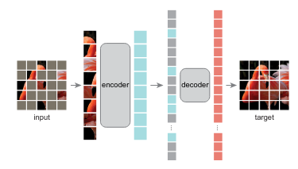
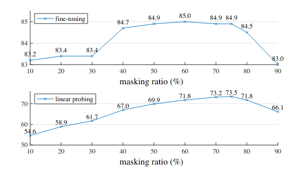
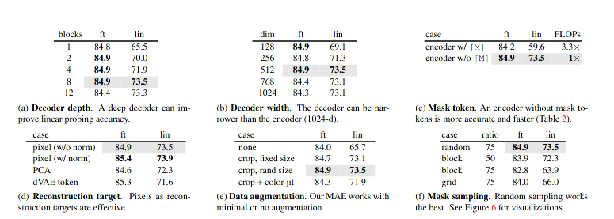
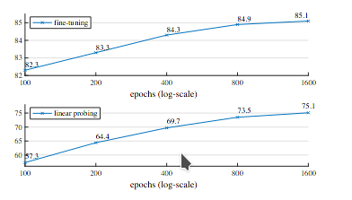
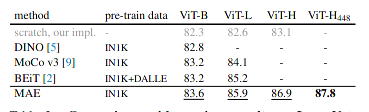
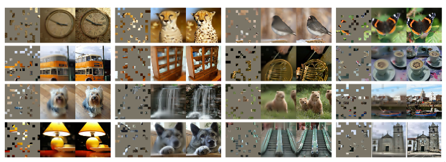

#### Masked Autoencoders Are Scalable Vision Learners

masked autoencoder are scalable self supervised learners for computer vision, this paper focused on transfer masked language model to vision aspect, and the downstream task shows good performance.

And instead of attempting to remove objects, they remove random patches that most likely do not form a semantic segment. Likewise,  MAE reconstructs pixels, which are not semantic entities. Nevertheless, we observe that  MAE infers complex, holistic reconstructions, suggesting it has learned numerous visual concepts, i.e., semantics. 

### Motivation

Due to the hardware development, the deep learning methods are march towards explosive model size and huge parameters, and meanwhile there exists a big demand for labeled images, which is nearly inaccessible. Thus self supervised learning drives a new thread in computer vision.

Compared to Neural Language, which is generated by human with a high information density,   visual signal is relative sparse in information density, which contains a mount spatial redundancy, even a missing patch can be recovered from high level understanding representation.

### Backgroud

#### Masked Language Model

[[Bert]()] and [[GPT]()] are pioneer work which employs mask token then predict diagram to introduce self-supervised into nlp aspect, this technology shows scale excellent performance and a large abundance of evidence indicates pre-trained representation generalize well to various dowstream task.

#### Autoencoder

AE is a classical method for learning representation which aims to compress redundant information to generate a high level and dense representation, PCA and K-means are old fashion autoencoder.

#### Masked image Encode

use context information to recover masked region, just like inpaints ! 

### Approach

 

* **Masking**  75% masked while only 25% keep original
* **MAE encoder**  [ViT]  applied only on not masked region patch vector with position embedding
* **MAE decoder**  [Transfomers]  [only pre train]  all tokens with position embedding

#### Reconstruction target

use mean square error to supervise the gap between missing patch and original patch

### Experimental

#### mask ratio

#### ablation experimental

#### Accuracy

    
    

### Result

