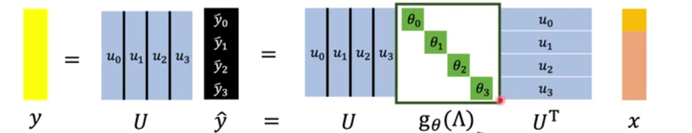

## Graph Neural Network

### The Concept of GNN

* how to embed node into feature space using convolution?
  * **Spatial-based**  convolution with sparse graph structure 
  * **spectral-based**  signal processing

#### The Task of GNN

* semi-supervised node classification
* regression
* graph classification
* graph representation learning
* link prediction

#### The Data-Set of GNN

#### The Benchmark of GNN

### Spatial-based Convolution

* Aggregate : node feature update
* Readout : using the node feature to represent the whole graph

#### [[NN4G]()] Neural Networks for Graph

#### [[DCNN]()] Diffusion-Convolution Neural Network

#### [[DGC]()]     Diffusion Graph Convolution

#### [[GAT]()]     Graph Attention Networks

#### [[GIN]()]      Graph Isomorphism Networks

### Graph Signal Processing

* 向基函数系（不一定是正交函数系）分解

感觉就是谱分解那些，用拉普拉斯矩阵做连通图拆解

根据拉普拉斯矩阵，分解出能量不变的特征图，然后将输入特征投影到特征图上，形成新的特征

### Spectral-based GNN

 

#### [[ChebNet]()] Use polynomial 

#### [[GCN]()] Graph Convolution Network

​       

