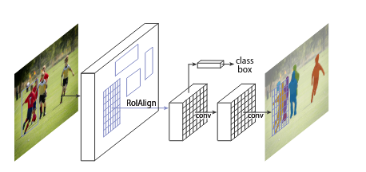
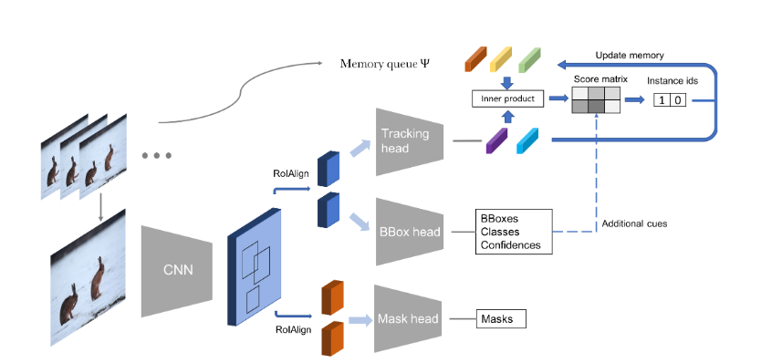
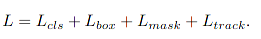
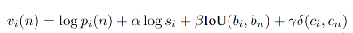
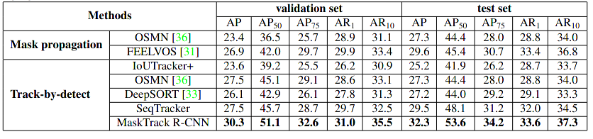
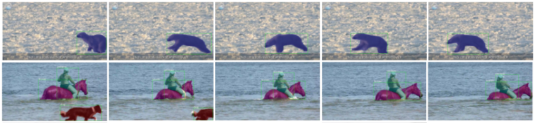

### Video Instance Segmentation

[[PAPRE](https://arxiv.org/pdf/1905.04804.pdf)] [[CODE]()]

### Motivation

文章提出了一个新的视觉任务，视频实例分割，包含分类，定位，跟踪，分割，都要同时完成

#### Video Instance Segmentation

* 视频实例分割
* 需要目标检测，分割（全部像素，不是物体则为背景），跟踪

### Background

#### Image Instance Segmentation

* 图像实例分割
* 关注于像素级别的分割，以及分类

#### Video Object Tracking

* 在视频序列中，进行物体的跟踪
* 基于检测的跟踪，需要同时检测和跟踪
* 基于初始化框的跟踪，只有第一帧的初始化框，不需要关注类别信息

#### Video Object Detection

* 视频序列的目标检测
* 不用分割，不用跟踪

#### Video Semantic Segmentation

* 视频语义分割
* 关注于像素级别的分割，同时还要分类
* 不用跟踪

#### Video Object Segmentation

* 视频目标分割
* 关注于分割目标物体，以及分类，而不是全部像素
* 基于半监督，分割给定的物体，有一部分粗略的mask
* 基于无监督，分割前景

### Ideology

基于Mask-RCNN, 用backbone得到特征图之后，有四个分支进行，分类，包围框回归，像素分割，以及跟踪分支。

#### Mask-RCNN

* 使用feature map生成region proposal $(b,n,4)$
* ROIalign提取配准的region feature $(b.n.4)$
* 二阶段：分类  $(b,n,c+1)$，回归包围框  $(b,n,4)$
* 二阶段：生成mask，大小为$(b,n,c, t_1,t_2)$
* 推理：根据二阶段类别结果选择mask，然后将mask缩放放置到包围框里面

#### MaskTrack-RCNN

#### 跟踪分支

对每一帧提取的物体特征，存储到外围内存中，对于当前帧的结果，用物体的特征向量相似度来表示跟踪结果

#### 训练过程

#### 推理过程

考虑到其他的约束，$P(n)$ 为特征向量相似度，$s$ 为类别置信度， $lou(b, b_i)$ 为包围框的交并比， $\delta(c, c_i)$ 为类别连续性，表示两个实例相同则为1,不同则为0

### Experiment

