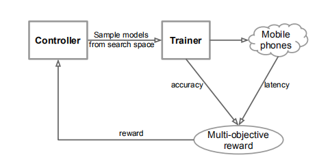
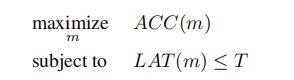
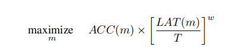
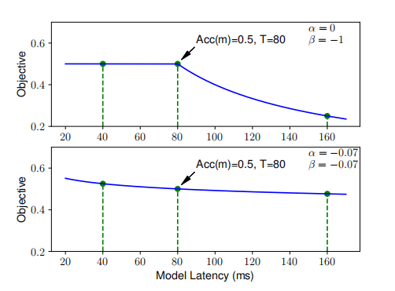
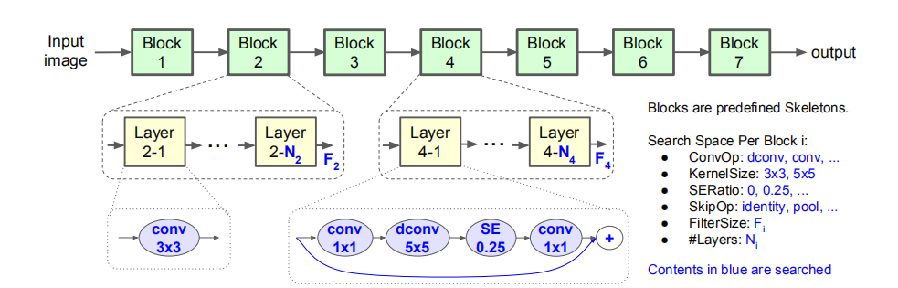
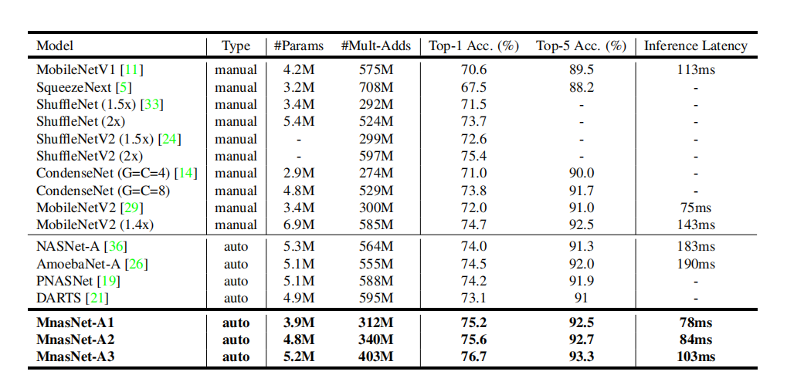
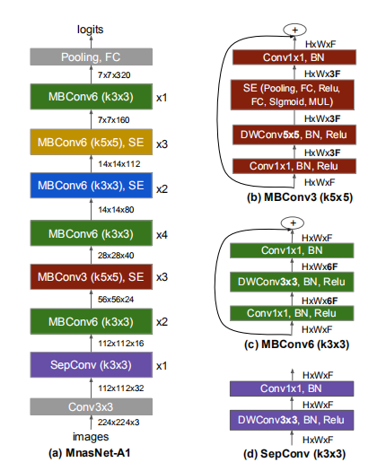

#### MnasNet: Platform-Aware Neural Architecture Search for Mobile

首先确定优化函数以及约束：

准确度在Trainer训练过程中就可以得到，latency这是在手机上直接测试，而不是FLOPs指标

转化为软约束问题：

这样设置可以对参数调节然后达到软约束和硬约束的变化

使用强化学习最大化reward在搜索空间上搜索：

结果：

得到的最优解：

**这篇文章只放出了结果没有放出搜索过程代码，真狗**