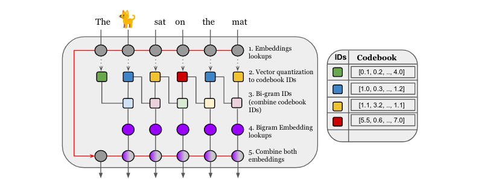
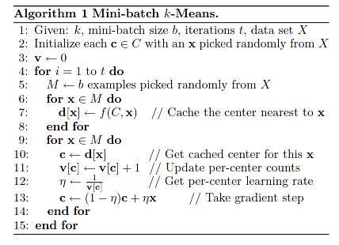
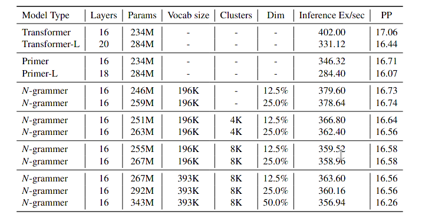

#### N-grammer: Augmenting Transformers with latent n-grams

The area of generative modeling rapid and impressive process driven by the adoption of self-attention to neural network. Transformer models have recently emerged as one of the foundational models in natural language processing, and as a byproduct, there has been significant recent interest and investment in scaling transformers, this article is focus on to combine traditional approach n-gram with neural network.

this paper introduces the N-grammer layer for augmenting transformer architecture with latent n-grams, and find that it can match a larger transformer while being significantly faster in inference procedure.

### BackGround

* mini-batch k-means (for clustering learning codebook)

### Terminology

* embedding lookup

  word2vec. to replace input token id to word embed vector

* vector quantization (clustering)

  the experiment is based on mini-batch cluster algorithm. Note that there is a trade-off in computing the discrete latent representation of text sequence, where is may be faster to **directly cluster the uni-gram vocabulary** instead of using methods mentioned above.

  * inference 
    $$
    \text{id}_u = \arg \min_k || x - c_k||
    $$

  * learning: use mini batch k-means(as demonstrated above)

* construct bi-gram vector representation

$$
\text{id}_b = \text{id}_u(i+1) + \text K \times \text{id}_u(i+1) \\
\text{codebook }(\ \text{id}_b(i) \ ) = \text{embed}[\text{hash(id(i))}]
$$

* combine bi-gram vector with origin word vector
  $$
  \text{out}(i) = \textbf[ \ \text{codebook }(\ \text{id}_b(i) \ ) \ ,  \text{word2vec}(\ \text{id}(i) \ ) \ \textbf]
  $$
  

### Result

* C4 dataset (machine translation)
* Primer (3x1 Conv + squared RELU)
* transfomer (G-Linear+GELU)
* N-grammer (G-Linear+GELU)

