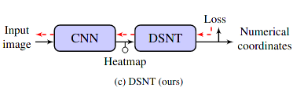
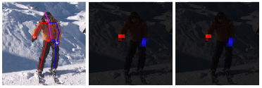

#### Numerical Coordinate Regression with Convolutional Neural Networks

This paper proposed a general approach to inferring numerical coordinates for points of an images by take advantages of mean characteristics of probability distribution, thus construct a fully differentiate backend to supervise whole network. In contrast to heatmap match approach, this method provides opportunity for network to perceive numerical coordinate directly. Compared to fully connected neural network prediction method, this approach is more capable in generalization  and suitable for fewer data situation.

### Main idea

use mean not mode to regression coordinate.

 

#### Inference

During inference,numeric coordinates are calculated based on the brightest pixel of the heatmap, with small adjustments to the location made based on the brightness of adjacent pixels.
