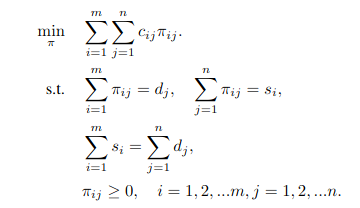
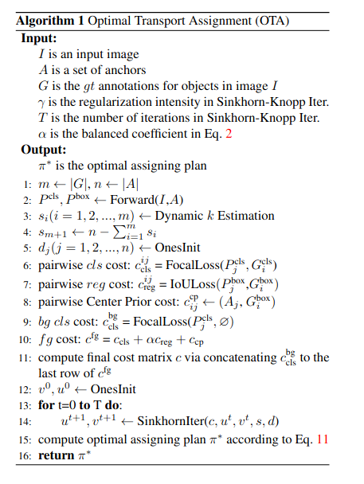

### Optimal Transport Assignment for Object Detection

看YOLOX的时候，半路杀出来个OTA，所以需要补一下课！

### label assignment 的今生与过往

##### Fixed Label Assignment

存在的问题也是显而易见的，重叠，目标的大小变化丰富

* IOU 阈值导向
* label center 导向
* key point 导向

##### Dynamic Label Assignment

* DTER   (global)
* ATSS
* MetaAnchor
* NosiyAnchor
* FreeAnchor
* PAA
* GuidedAnchoring 

### 最优传输问题定义

The Optimal Transport (OT) describes the following problem: supposing there are m suppliers and n demanders in a certain area. The i-th supplier holds si units of goods
while the j-th demander needs dj units of goods. Transporting cost for each unit of good from supplier i to demander j is denoted by cij. The goal of OT problem is to find a transportation plan π∗= {πi,j|i = 1,2,...m,j = 1,2,...n}, according to which all goods from suppliers can be transported to demanders at a minimal transportation cost:

### OTA 的 Methods

#### Dynamic k Estimation

因为每个标签可能存在的anchor应该是有一定数量的差异的，这个数量应该正比于预测是该标签的anchor数量，因此可以通过IOU求和可以代表。
