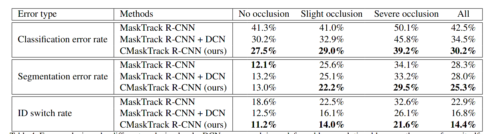
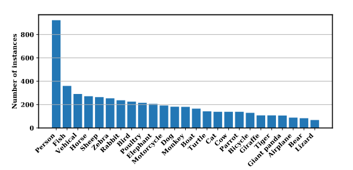
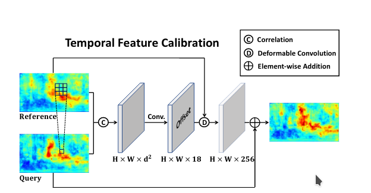
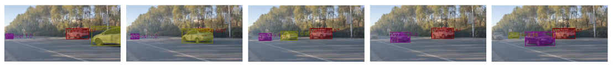

### Occluded Video Instance Segmentation

[[PDF](https://arxiv.org/pdf/2102.01558v4.pdf)] [[CODE](https://github.com/qjy981010/CMaskTrack-RCNN)] 

### Motivation

While human vision system can understand those occluded instance by contextual reasoning and association, can video understanding system alleviate the difficulty of occlusion condition instance understanding?

### DataSet

* Youtube-VIS
* OVIS (**proposed**)

### Ideology

use reference frame to calibrate the occluded information. 

**Maybe optical flow estimation is  crucial to calibrate ref frame to query frame ?**

### Experiment

