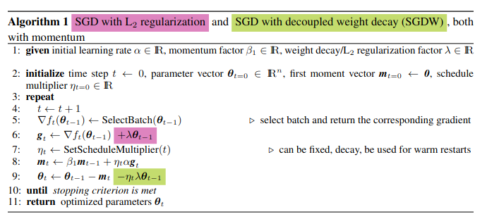
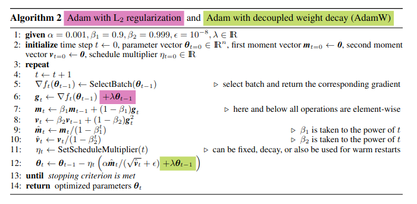
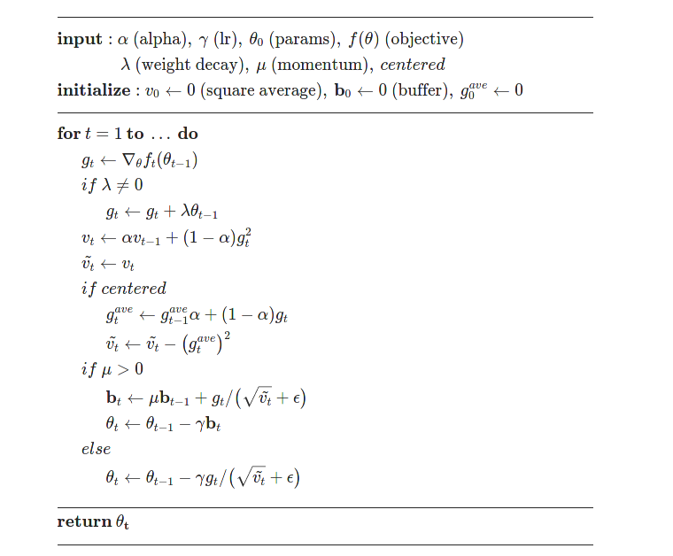

### SGD

### AdamW

### RMPprop

to solve some gradient oscillation occasion with only consider sign of gradient for mini-batch learning , where the error surface is a ellipse. typically speeking, a lot of gradients deviated from direction towards optimal point.

* moment
* only consider sign
* adjust learning rate according to gradient consistency

