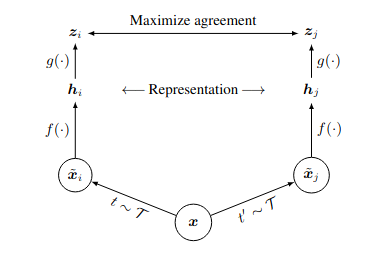

### A Simple Framework for Contrastive Learning of Visual Representations

## Framework

## Methods

### data augmentation

**asymmetric** : using data augmentation to **one branch**, leave the other branch as identity

* crop 
* resize
* color distort

### object function

### projective head

## hypothesis

* the sort path of learning difference by color distribution, to eliminate this problem:

  **using color distortion to make distribution of crop different**

  

* the bigger batch make the gap between self-supervise and supervise disappear

* the more training epoch make the difference result from batch smaller  

* nonlinear head only learning the similirity of two branch, thus make the backbone gain more information.

* **semi-hard negative mining **

  weigh the negatives by their relative hardness.

