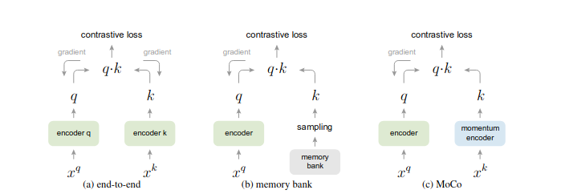
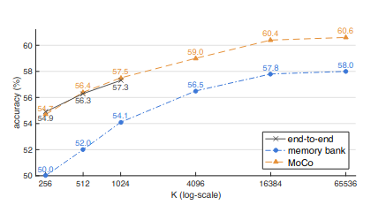
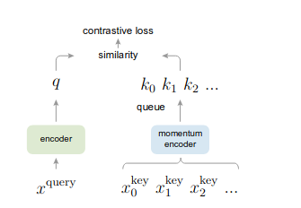
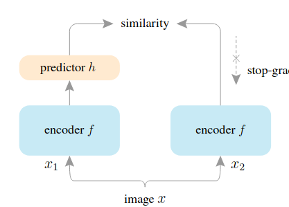
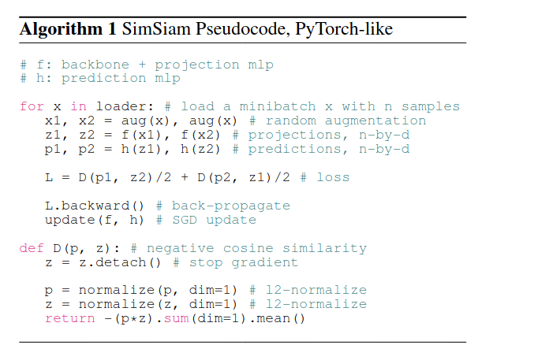
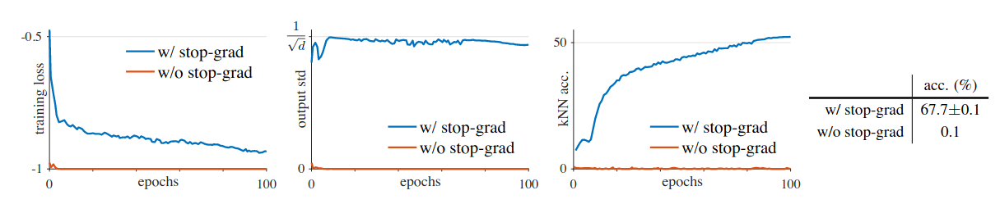
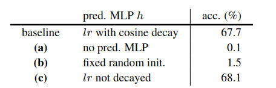

### end To end arch

* the encoder q and the encoder k can be very different

* cost a vast memory 

### memory bank arch

* using same encoder, thus there is a inevitable problem the feature vector stored in memory bank is not consistence, one maybe from the initial state, while the other is from the recent encoder, because the learning schedule of encoder

### momentum encoder

* denoting the parameters of the encoder of key encoder is $\theta_k$ , which is a copy of query encoder parameters  in memory bank pattern, the momentum encoder is just like :

  ​			$\theta_k(t+1) = m \ \theta_k(t) + (1-m)\theta_q(t) $

   which aims to solve the consistency of the memory bank solution​

### stop gradient

* using predictor to project
* only one encoder
* never need a lot of negative samples

#### algorithm

#### results

* the ablation study for stop grad
  * i think this is because the rapid update without negative samples
  * in the video ,  one author argues that : this is just like a **momentum encoder** 

* the projective head

  * when using the symmetric loss with stop gradient is **equivalent** to discard the stop gradient and scale the loss with 0.5  **(thus it not work)**

  * when using the asymmetric loss without the projective head, the collapse result appears **(this is wield to understand)**

  * when the projective head parameters is fixed randomly, the loss is bigger and not convergence 

    * 我做一个猜想，矩阵投影存在可逆，比如$Pa = b$​ , 然后分解一下也有: $P_1a = P_2b$

      其中，$P_2^{-1}P_1 = P$​​, 神经网络也会这样，高层映射存在一定可逆，但是为啥resnet的encoder不行呢，我猜是因为一般卷积无法满足这样的投影性，因此可以补一个实验，encoder 后面都接一个mlp， 然后可以传递梯度到两个mlp上面，encoder依旧stop gradient, 这样预期结果应该是和baseline结果近似，有时间做一下

       ( i think this is because the feature vector need to be projected to embedding space ? )

  
