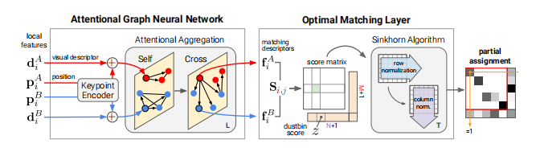
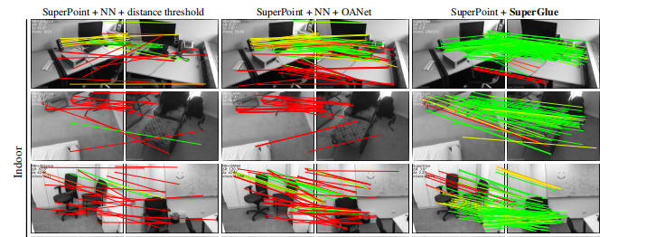
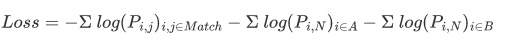

**SuperGlue: Learning Feature Matching with Graph Neural Networks**

这篇文章实验和代码都很简单，总结一句话就是，用attention（self/cross-attention）增强特征点的全局语义，然后构造匹配score matrix, 利用最优传输得出配对



#### 损失函数

要最大化正确匹配的配对分数，应用上对数似然估计，就是**最小化负对数似然估计（NLL）**, $N$ 为未匹配（垃圾桶点），由于图片$A,B$遮挡等一系列原因，有的特征点确实没有匹配的真值

$$Loss = - \Sigma log(P_{i,j})_{i,j \in Match} - \Sigma log(P_{i,N})_{i \in A} - \Sigma  log(P_{i,N})_{i \in B}$$



如果使用softmax归一化，那么损失函数就等价于**crossentrpy**

#### 最优传输部分代码

**很难理解，呜呜呜**

```python
def log_sinkhorn_iterations(Z, log_mu, log_nu, iters: int):
    """ Perform Sinkhorn Normalization in Log-space for stability"""
    u, v = torch.zeros_like(log_mu), torch.zeros_like(log_nu)
    for _ in range(iters):
        u = log_mu - torch.logsumexp(Z + v.unsqueeze(1), dim=2)
        v = log_nu - torch.logsumexp(Z + u.unsqueeze(2), dim=1)
    return Z + u.unsqueeze(2) + v.unsqueeze(1)


def log_optimal_transport(scores, alpha, iters: int):
    """ Perform Differentiable Optimal Transport in Log-space for stability"""
    b, m, n = scores.shape
    one = scores.new_tensor(1)
    ms, ns = (m*one).to(scores), (n*one).to(scores)

    bins0 = alpha.expand(b, m, 1)
    bins1 = alpha.expand(b, 1, n)
    alpha = alpha.expand(b, 1, 1)

    couplings = torch.cat([torch.cat([scores, bins0], -1),
                           torch.cat([bins1, alpha], -1)], 1)

    norm = - (ms + ns).log()
    log_mu = torch.cat([norm.expand(m), ns.log()[None] + norm])
    log_nu = torch.cat([norm.expand(n), ms.log()[None] + norm])
    log_mu, log_nu = log_mu[None].expand(b, -1), log_nu[None].expand(b, -1)

    Z = log_sinkhorn_iterations(couplings, log_mu, log_nu, iters)
    Z = Z - norm  # multiply probabilities by M+N
    return Z
```


