#### Is Space-Time Attention All You Need for Video Understanding?

## 论文介绍

这篇文章基本就是从vit结构入手的，对视频进行分类，我做过实时目标检测，我其实挺想利用一下spiatio的信息，但是我的知识当时仅限于单张图片的detection，难受，这个工作使用transformer在视频理解上终结了三维卷积，其实说到三维卷积，我还感触颇深的，在2020年我刚刚大三，参加了三位视觉实验室，做的一个工作就是双目立体匹配，这个领域包括光流以前都是三维卷积，听说一次实验就是两周，然后大名顶顶的RAFT出现了，使用GRU+corelatiobn table迭代的方式解决了三维卷积提取信息计算量冗余的特点，所以我的工作就是把raft改到stereo上，当时不知道transformer，太可惜了，要不然我必中cvpr

## 论文方法

### Decomposition to Patch

基本思路和vit一样，就是将图片分成不重合的patch，每个patch通过flatten 成一个向量$X \in R^{n*n*3}$, 

需要注意的是，所有视频帧合起来的patch数量是$f*HW/n^2 + 1$,有个bias vector，这个东西vit里面后面用来做分类了，叫做 cls token

 

### Linear embedding

就是通过一个线性层，需要学习映射$E$ 和位置偏置$e$

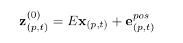

这里，我又想起来一个面试问题，线性变换和仿射变换，看吧上面

### Self Attention

跟vit代码里面一样

$p$是patch，$t$是time，$a$是注意力头，$L$ 是第几层

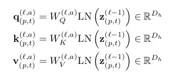

权重计算：

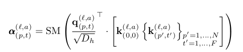

signal head attention：

$V_{(0,0)}^{l,a}$ 就是类似于上面提到vit里面那个bias vector。

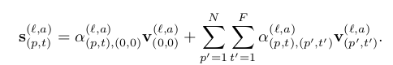

muti head：

这块链接也真是6, 用的res那种残差链接，我是真没想到还有这个操作

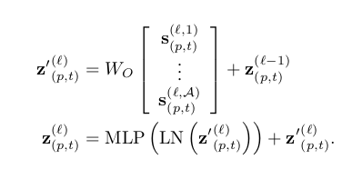

result：

和vit差不多

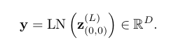

## 论文实验

论文中很大一个创新点就是把计算量从时空同时attention做成了，分开进行，先做时间，再做空间，计算量从$N*F+1$，减少到$(N+1) + (F +1)$,N是patch的数量，不是token的，token多一个bias vector。

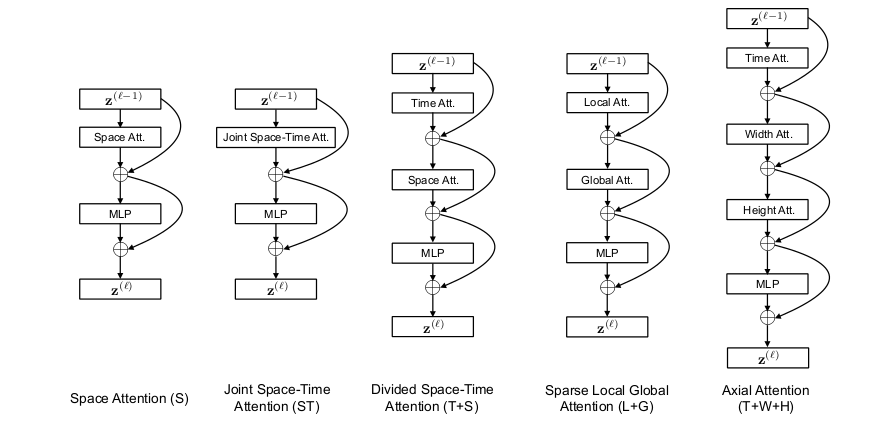

文章中提到了总共五个方案：

**space**: 在时间上不做，也就是vit，变成了一个图像分类任务

**Joint spatio**: 同时做

**Divided space time**: 就是最大的一个创新点，减少了许多冗余的计算量，不过我有其他看法，这里patch没能直接cross 到其他图像的patch，我觉得swin的思路还是可以借鉴的

**Sparse spatio**: 如图，没法描述

**Axial spatio**：只对行列进行attention，这个肯定信息获得不够

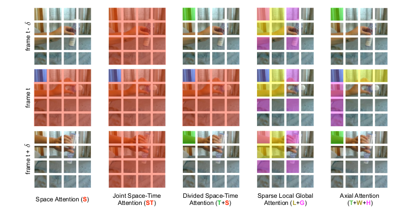

实验结果：

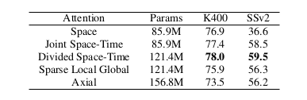

#### 数据集效果

transformer 计算量就算大，比起3d cnn，那可是好多了，当然效果更好

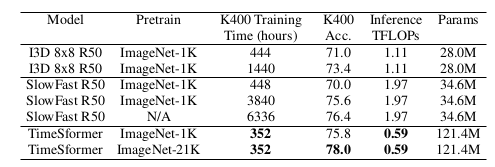

**Kinetics-600** 数据集

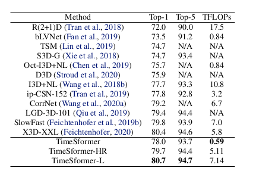

**SSV2** 数据集

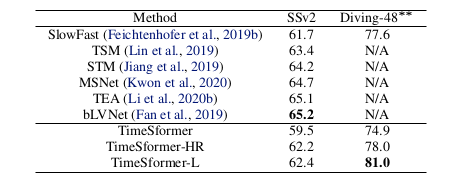

#### Qualitative Results

heatmap可视化：

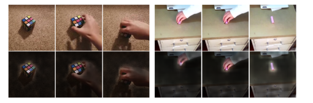

feature 可视化：

每段视频都被可视化为一个点，同一个行为，就是同一个颜色。

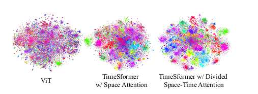