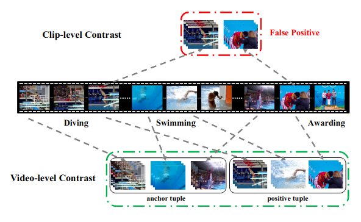
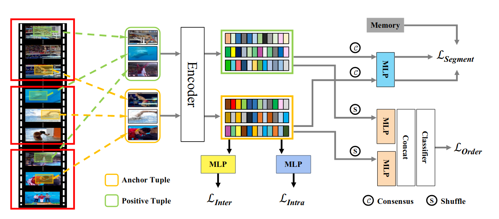
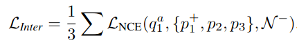
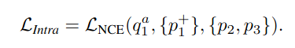
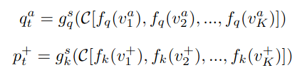
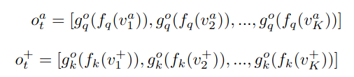
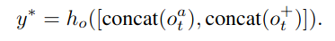
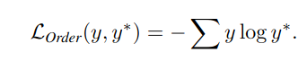

#### Video Contrastive Learning with Global Context [[NCE-LOSS](../../02/SimCLR)]

this article is mainly contribute the following:

* global context sampling method for video level contrastive learning
* a video consensus  constrain for self supervised learning

## model structure

 

### Inter-Loss

the inter loss uses augmented samples $P_1^+$​ from anchor frame $Q_1^a$ ​and samples $\{P_2, P_3\}$​​ from the same video to formulate  positive 

​                                        

### Intra-Loss

when using the intra loss, the samples from the same video will also be discrimination as negative.

### segment-Loss

* divide the whole video as K segments $\{ S_1, S_2, ... S_k\}$

* anchor tuple $t^a = \{ v_1, v_2, .. v_k\}, v_i \in S_i$

* the positive sample is from the same video segments, but consist of different frames

  $t^+ = \{ v_1^+, v_2^+, .. v_k^+\}, v_i^+ \in S_i$

### order-Loss

guarantee the sampled frames follow the correct order, which is a property of video consensus, this constrain can be regard as a important regularization rule

