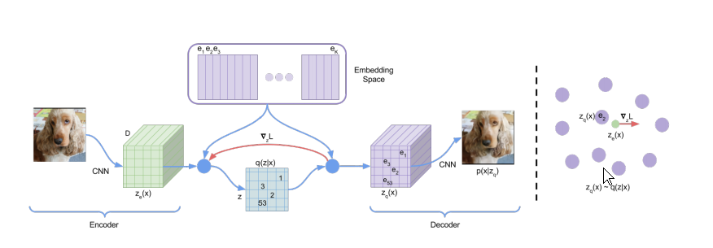
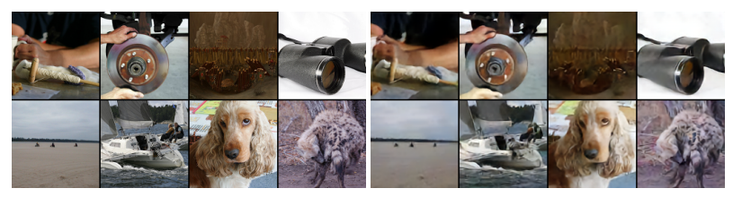
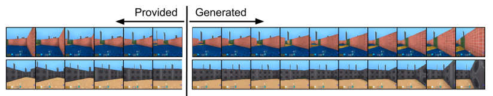

#### Neural Discrete Representation Learning

这篇长话短说，直接说人语了，我肚子太疼了，md

### Ideology

#### Discrete Latent variable

这是一个长度为$L$ 的字典，通过编码器，生成的向量，在这个字典中查询最相近的特征向量，这里我想到的好处是，字典可以充分训练饱含语义信息，这样的查询替换可以大幅度减少噪声，可以提高编码的语义纯度，同时得到的离散化查询结果，就是那个字典里的特征向量的坐标 $i$ ,这个举措可以减少存储的信息，可以进一步使用哈夫曼编码减少存储，好东西！

#### Train process

训练过程包含的weight有 **encoder**  **codebook** 以及 **decoder**， 所以损失函数需要同时训练这三个部分
$$
L = log(x|\mathcal Z_q(x)) + ||sg(\mathcal Z_e(x))- e|| + ||sg(e) -\mathcal Z_e(x)||
$$

* reconstruction loss  减少重建误差

* embedding loss   让编码字典向量更加趋近编码器输出

  除了使用$L^2$ 距离以外，还可以使用移动平均来制作词向量 $e_t = e_{t-1} + \mathcal Z(x)^{permute}$

* commitment loss  让编码器输出也趋近字典向量

训练过程中，用最近的字典向量替换原来的编码器encoder输出的向量，这个过程是index，索引，不可导，这里采用一个简单的办法就是，把梯度直接拷贝到encoder的输出张量上，然后传递到encoder上。

#### VAE description

VAE 模型需要优化ELBO目标, 只要边界够低，最终的损失也应该下降：
$$
L = log(x|z) - KL(p(z|x) || p(z)) \\
L = log(x|\mathcal Z_e(x)) - KL(p(e|x) || p(e)) \\
$$
assume embedding $e \in N\times D$ is uniform distribution, $q(x)$ 是查表的结果，查表只能查到一个最相近的，所以是一个冲激响应，或者离散的看，是一个独热编码, 同时训练的时候假定词向量的先验分布是一个均匀分布，后面训练完vae, 使用其他办法训练得到先验分布
$$
L = log(x|\mathcal Z_e(x)) - \Sigma_{i=0}^N[{1\over N}log({1\over N}) + {1\over N} \mathcal I(i = I)] \\
L = log(x|\mathcal Z_e(x)) + const
$$

#### Prior distribution

文章中，这块说的没有很清楚，应该就是用pixelCNN,waveNet,来构建自回归模型，建模字典词向量对于一个图像，一段语音，内部的概率是怎样的。
$$
p(s) = \Pi_{i=0} \ p(s_i | s_{i-1}...s_0)
$$

### Experiment

* image

* video

