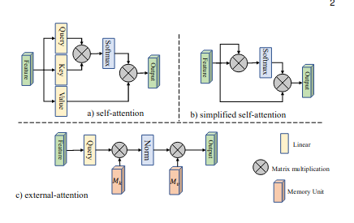
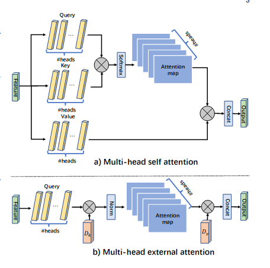
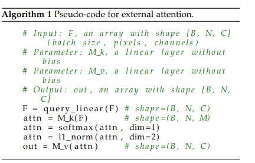
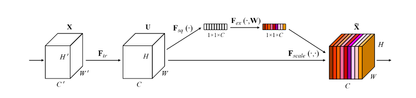
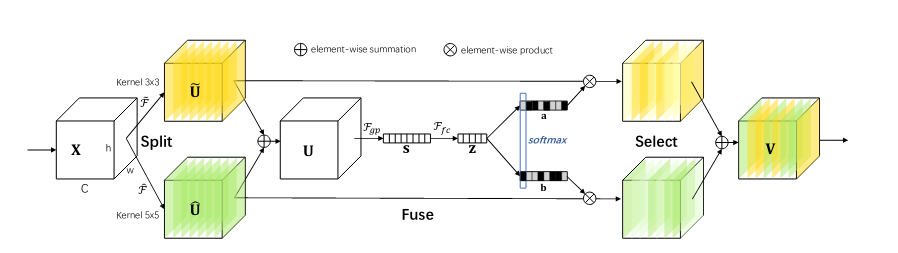
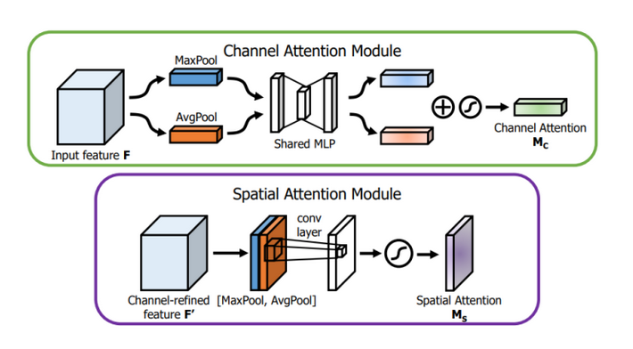
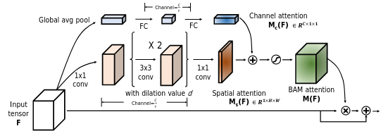
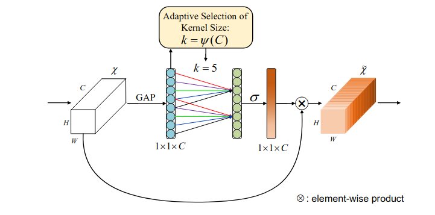

### External Attention



​	外注意力机制，不同于自注意力，自注意力是使用自己的不同特征来加权重新得到更强的特征，外注意力特征则是使用一个可学习的记忆块来做从特征空间或者向量空间来理解的话就是：给一个足够强可以描述当前空间的向量组，用这个来描述所有的特征，有点类似于更换基向量的线性变换

多头注意力：



问题：

* 看论文的时候，他的伪代码上softmax归一化是在第一个维度（b, **n**, m ），后面又来了一次归一化norm，这次是在第二个维度（b, n, **m**）,（m代表memory block 里面的向量个数）感觉有点离谱，我觉得应该只给第二个维度m上直接一个softmax就行，就像self attention那样

  

6月再看了一次，我觉得还是他的问题，没必要这样，消融实验上也没有证明两个差距，只是论文里面说这个attention对input dim（n）很sensitive，double normalization is necessary

### SE attention



这个有点久远了，我还给别人分享的时候，讲错了，这篇是做通道注意力

* 融合$F_{scaled}(.,.)$ 是乘法
* $F_{squeeze}$ 是均值向量，不是所有的

为了不继续下次尴尬，我特地贴上代码：

```python
class SEAttention(nn.Module):
    def __init__(self, channel=512,reduction=16):
        super().__init__()
        self.avg_pool = nn.AdaptiveAvgPool2d(1)
        self.fc = nn.Sequential(
            nn.Linear(channel, channel // reduction, bias=False),
            nn.ReLU(inplace=True),
            nn.Linear(channel // reduction, channel, bias=False),
            nn.Sigmoid()
        )
    def forward(self, x):
        b, c, _, _ = x.size()
        y = self.avg_pool(x).view(b, c)
        y = self.fc(y).view(b, c, 1, 1)
        return x * y.expand_as(x)
```

### Selective Kernel Attention



和SE基本上差不多，感觉就是替换了SE里面那个均值向量

问题：两个卷积核和一个大卷积核能不能等效？

​	如果没有激活函数的话，我直觉上感觉可以，没有激活函数的情况下，可能中间的fuse没意义吧，因为$U$ 可以通过大卷积核学习出来，这也说明激活函数的非线性作用很重要

### Bottleneck Attention





这两个都是结合通道注意力和空间注意力（pooling + 大大大大卷积）

问题：通道注意力与空间注意力到底在干什么？

我感觉空间注意力做的工作在于迅速扩大感受野，通道注意力在于压缩信息或者压缩特征，目前还是没理解这个地方以及意义。。。。

### ECA-Net 

某个比赛还帮我们完成绝杀的作品



通道注意力，对通道进行local attention，通道上用一个一维卷积！！！高效！！！

代码实现：

```python
class ECAAttention(nn.Module):

    def __init__(self, kernel_size=3):
        super().__init__()
        self.gap=nn.AdaptiveAvgPool2d(1)
        self.conv=nn.Conv1d(1,1,kernel_size=kernel_size,padding=(kernel_size-1)//2)
        self.sigmoid=nn.Sigmoid()
    def forward(self, x):
        y=self.gap(x) #bs,c,1,1
        y=y.squeeze(-1).permute(0,2,1) #bs,1,c
        y=self.conv(y) #bs,1,c
        y=self.sigmoid(y) #bs,1,c
        y=y.permute(0,2,1).unsqueeze(-1) #bs,c,1,1
        return x*y.expand_as(x)
```

