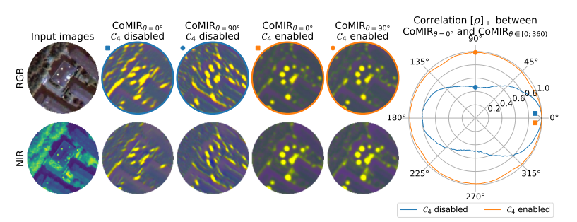
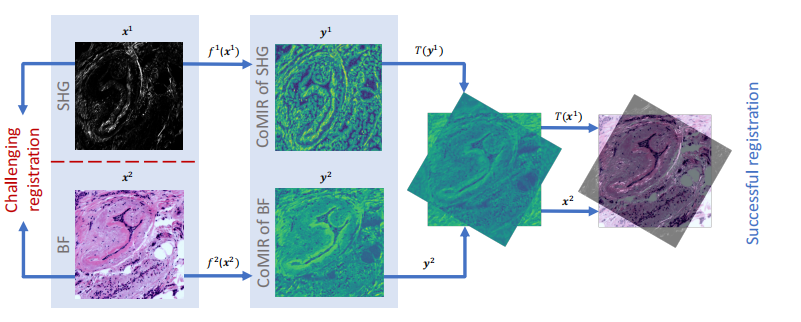
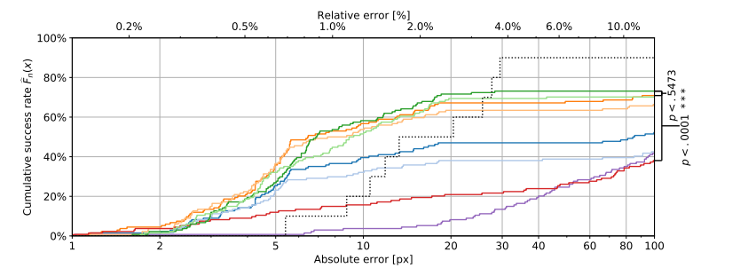

#### CoMIR: Contrastive Multimodal Image Representation for Registration

multimodal image contrastive learning is the basic topic in machine learning and computer vision, this paper proposes a general contrastive method to **use neural network mapping a different modal to a mono-modal**, which is a latent space of original modal. Thus some operations like different modal image registration or image segmentation can be very efficient. 

  

this paper mainly argues the **following two viewpoints**, which are also their pivotal contribution

#### Rotational equivariance

 The equivariance is sounds like invariance, which is an orthodox idea, while the equivariance is infrequent.

Given a modality independent function map $F : x \to y$,  $T^x$ is the inverse transformation for origin space  corresponding to $T^y$, which is applied for latent space.  The equivariance can be formulated as the following:

​												$F(T^x(x))= T^y(F(x)) $

this viewpoint is pivotal in this contrastive approach, instead of conventional self-supervise in computer vision, which is only based on **instance discriminator theory**

#### contrastive learning

this paper use **Unet** map the original input pair  $x_1 \to x_2$, which are different modal input pair, to a mono modal, use self-supervise methods to force $y_1, y_2$ in a same latent space $y_n \in \Omega $

​												$y_n = UNet_n(x_n)$

as mentioned in the previous sector, this contrastive learning will not only supervise which feature map  $y_2^i$instance is corresponding to the given feature map $y_1$,  but maximize the inner product between the inverse transformed feature map.  $T$ is an general affine transform for 2d image. 

​											$max \ h(F(T^x_1x_1), F(T^x_2x_2)) \ \ \ x_1 \to x_2$ 

​									    	$max \ h(T_2^y(y_2), T_1^y(y_1)) $

this operation is a joint supervise action aims to force the latent feature map $y$ is equivariance aspect to rotation. if we separate the joint action, we will get the equal constrains:

​						$max \ [ h(T_1^y(F(T_1^x(x)), F(x))]$

​	      		   	$max \ [h(T_2^y(F(T_2^x(x)), F(x)]$

#### experimental result

after trained, the unet pair can be used in bimodal image registration:

​																$y_i = F(x_i)$

​															$T = Reg(y_i, y_j)$ 

the measurement for error rate is use the individual mean square error for each corner, then sum them up.

