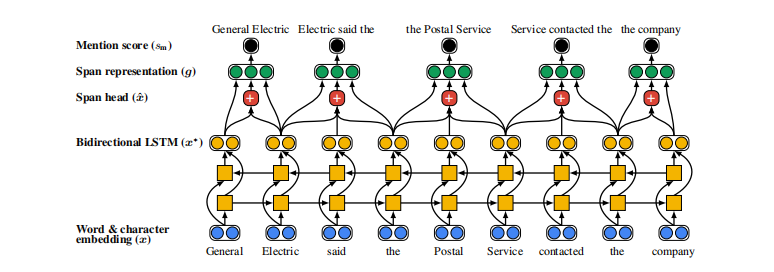
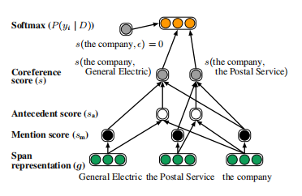

### End-to-end Neural Co-reference Resolution

### The Basic Concepts

#### what is co-reference resolution?

The Co-reference resolution is aiming at clustering the same mention in a speech or passages, it is necessary to recognize the same entity with different word description, which is vital for downstream task, like relationship resolution, and translation.

### The architecture

other architecture use exp-dot function to simulate the co-reference link relationship representation, just like the $word2vec$, which has a clear and easy math formulation:

$$P(y_i|y_j) = {e^{v_i^T v_j} \over \Pi_{k \in D} e^{v_k^T v_j}} $$

but this architecture consider the conditional distribution as a neural network approximation task, instead of just vector dot.

 $$P(y_i|y_j) = {e^{s(i,j)} \over \Pi_{k \in D} e^{s(k,j)}} $$

and use a function $s$, which is :

$s(i,j) = s_{mention}(i) + s_{mention}(j) + s_a(i,j)$

the mention score $s_{mention}(i)$ is imply the probablity of $span_i$ to be an entity

the main network design is : 

 

when inferencing, the mention score can use a threshold to discard some span  

