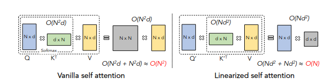
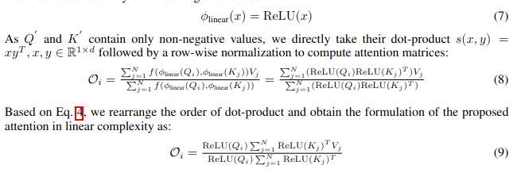
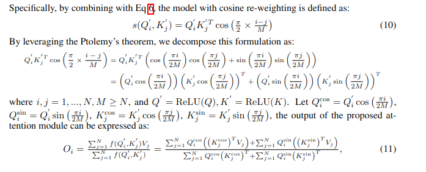

#### COSFORMER : RETHINKING SOFTMAX IN ATTENTION

## BackGround

In order to reduce the time complexity of softmax transform operator while keeping the efficiency of transformer block. a lot work proposed to decrease the quad time complexity.

### pattern based attention mechanism

Pattern based methods sparsify the attention matrix with handcrafted or learnable patterns.

As an early approach, Lee et al. (2019) leverages the inducing points from the sparse Gaussian process to reduce the quadratic complexities of a transformer. Child et al. (2019) reduces the complexity by applying combination of strided pattern and local pattern to the vanilla attention matrix. Longformer (Beltagy et al., 2020) designs fixed diagonal sliding windows combined with global window, and the sliding window pattern can also be extended with dilation to enlarge the receptive field. Zaheer et al. (2020) presents a more powerful and expressive sparse attention mechanism, which combines multiple types of attention patterns and gives a thorough study of sparse attention mechanism. Instead of fixed patterns, Kitaev et al. (2019) and Daras et al.(2020) group the attention computation process into buckets by local sensitive hashing, while Roy
et al. (2020) uses mini-batch spherical k-means

### kernel based attention mechaism

When faced with longer input sequences, it is more efficient to directly reduce the complexity of the theoretical calculation method. 

Kernel based methods speed up selfattention by reducing the computation complexity of self-attention from quadratic to linear. Vyaset al. (2020) approximate the full attention with a fixed number of cluster attention groups by assuming neighbouring queries in Euclidean space should have similar attention distributions. Peng et al.(2020) chooses to use the production of Gaussian kernel functions to approximate Softmax, changing the order of scale dot product calculation, thus reducing the theoretical time to linear complexity and Choromanski et al. (2020) uses Haar measurement based kernel instead. Wang et al. (2020) imports the low-rank prior for attention matrix and approximate softmax with SVD decomposition manner. Xiong et al. (2021) utilizes the Nystr ̈om method with segment-means to generate a lowrank approximation of the Softmax matrix. Katharopoulos et al. (2020) formalizes the transformer layer as a recurrent neural network. In this paper, we demonstrate that the approximation to Softmax is unneccessary for Linearization of self-attention module.

### Terminology

The Linear projection kernel uses the following formulation:

The cos based re-weight mechanism main idea is : 

Thus the proposed module only consumes linear time complexity

