# CUBLAS　学习笔记

## 数据类型

* leading dimension 

  列优先情况下的二维数组行数，用来算出每列矩阵元素的起始位置

实验数据类型

```c++
template<typename T>
class Matrix{
public:
    T* hostPtr;
    T* devicePtr;
    int rows{};
    int cols{};
    Matrix(int rows, int cols)
    {
        hostPtr = new T[rows*cols];
        for(int i=0; i<rows; i++)
        {
            for(int j=0; j<cols; j++)
            {
                hostPtr[i*cols + j]  = (T)(std::rand()* 1.0 / (1<<30));
            }
        }
        hostPtr[0] = 0;
        cudaMalloc(&devicePtr, sizeof(T)*rows*cols);
        this->rows = rows;
        this->cols = cols;
    }
    Matrix(Matrix& other)
    {
        this->rows = other.rows;
        this->cols = other.cols;
        hostPtr = new T[rows*cols];
        for(int i=0; i<rows; i++)
        {
            for(int j=0; j<cols; j++)
            {
                hostPtr[i*cols + j]  = other.hostPtr[i*cols + j];
            }
        }
        cudaMalloc(&devicePtr, sizeof(T)*rows*cols);
    }
    void toDevice()
    {
        cublasSetMatrix(rows, cols, sizeof(T), hostPtr, rows, devicePtr, rows);
    }
    void toHost()
    {
        cublasGetMatrix(rows, cols, sizeof(T), devicePtr, rows, hostPtr, rows);
    }
    friend std::ostream& operator<<(std::ostream &os, Matrix<T> &matrix)
    {
        for(int i=0; i<matrix.rows; i++)
        {
            for(int j=0; j<matrix.cols; j++)
            {
                os<<matrix.hostPtr[i*matrix.cols + j] << ' ';
            }
            os << std::endl;
        }
        return os;
    }
    ~Matrix(){
        delete []hostPtr;
        cudaFree(&devicePtr);
    }
};
```

## Level 1 function

每个函数基本有四个类型：

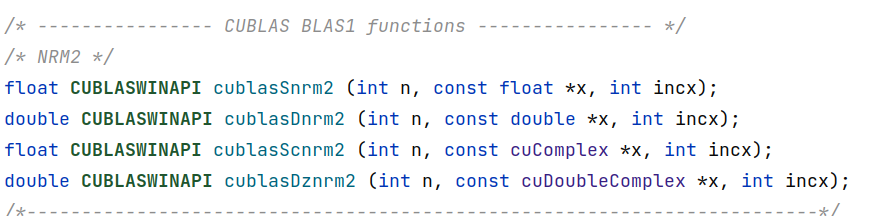

### [cublasIamin()](https://docs.nvidia.com/cuda/cublas/index.html#cublasi-lt-t-gt-amin)

```c
	matrix.toDevice();
    int max, maxp;
    max = cublasIdamax(10, matrix.devicePtr, 1);
    cublasIdamax_v2(handler, 10, matrix.devicePtr, 1, &maxp);
    cudaDeviceSynchronize();
    std::cout<<max << ' '<<maxp;
```

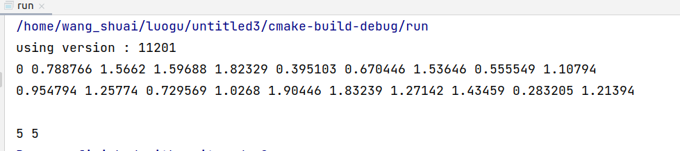

### [cublasasum()](https://docs.nvidia.com/cuda/cublas/index.html#cublas-lt-t-gt-asum)

```c
double sum= 0;
    sum = cublasDasum(10, matrix.devicePtr, 1);
    std::cout<<"sum = "<<sum<<std::endl;
```

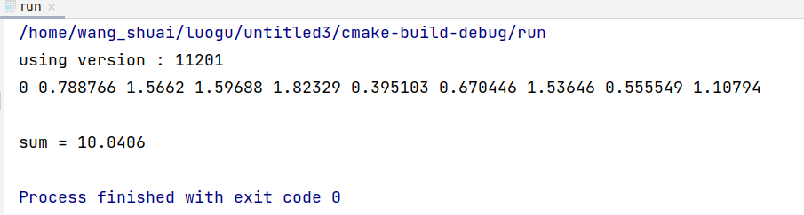

### [cublasdot()](https://docs.nvidia.com/cuda/cublas/index.html#cublas-lt-t-gt-dot)

```c++
	Matrix<float> m1(1, 10), m2(1, 10);
    m1.toDevice();
    m2.toDevice();
    std::cout<<m1<<m2;
    int dot = 0;
    dot = cublasSdot(10, m1.devicePtr, 1, m2.devicePtr, 1);
    std::cout<<"dot = "<<dot;
```

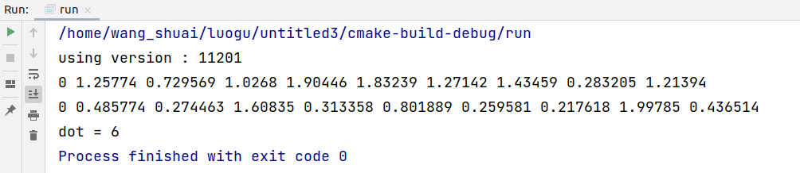

### [cublascopy()](https://docs.nvidia.com/cuda/cublas/index.html#cublas-lt-t-gt-copy)

```c++
Matrix<float> m1(1, 10), m2(1, 10);
    m1.toDevice();
    m2.toDevice();
    std::cout<<m1<<m2;
    cublasCopyEx(handler, 10, m1.devicePtr, cudaDataType::CUDA_C_32F, 1, m2.devicePtr, cudaDataType::CUDA_C_32F, 1);
    m1.toHost();
    m2.toHost();
    std::cout<<"after copy : "<<std::endl;
    std::cout<<m1<<m2;
```

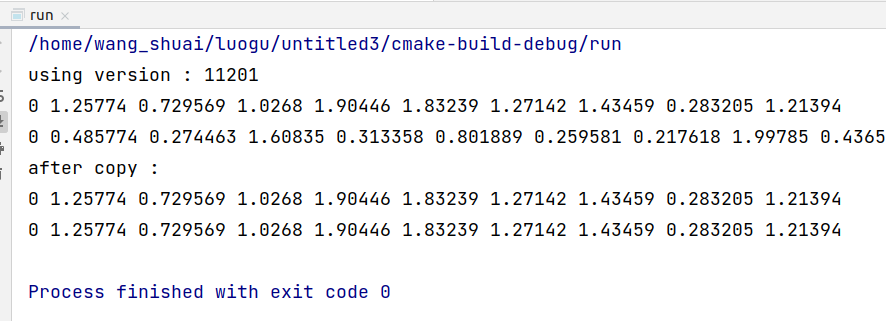

### [cublasrot()](https://docs.nvidia.com/cuda/cublas/index.html#cublas-lt-t-gt-rot)

注意，需要使用弧度制

```c++
 Matrix<float> x(1, 10), y(1, 10);
    x.toDevice();
    y.toDevice();
    std::cout<<x<<y;
    float cos = std::cos(180/180*3.14);
    float sin = std::sin(180/180*3.14);
    std::cout<<"after rotate" << std::endl;
    cublasRotEx(handler, 10, x.devicePtr,
                CUDA_C_32F,
                1, y.devicePtr, CUDA_C_32F,
                1, &cos,&sin,CUDA_C_32F, CUDA_C_32F);
    x.toHost();
    y.toHost();
    std::cout<<x<<y;
```

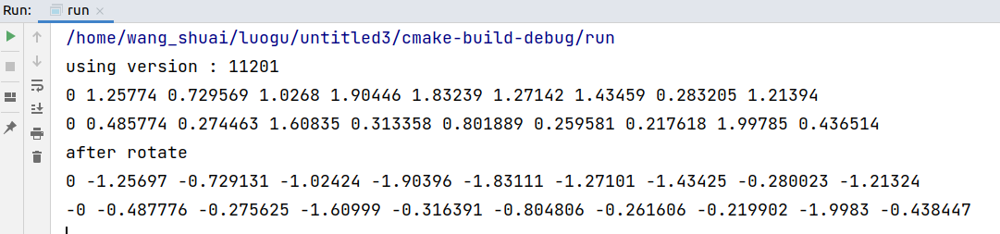

发现 cos， sin真的是按照公式的，没有做归一化

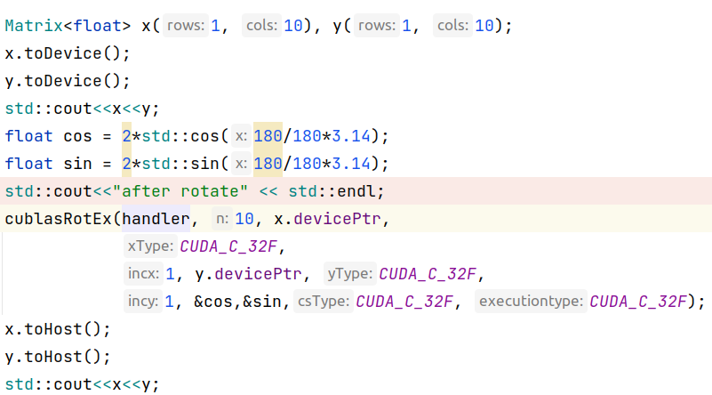

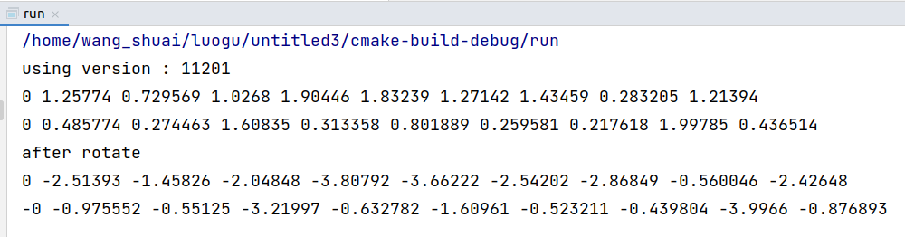

### [cublasrotm()](https://docs.nvidia.com/cuda/cublas/index.html#cublas-lt-t-gt-rotm)

```c++
	Matrix<float> x(1, 10), y(1, 10);
    x.toDevice();
    y.toDevice();
    std::cout<<x<<y;
    float cos = 2*std::cos(60/180*3.14);
    float sin = 2*std::sin(60/180*3.14);
    float params[5] = {1.0, cos, sin, sin, -cos};
    std::cout<<"after rotate" << std::endl;
    status = cublasRotmEx(handler,10, x.devicePtr,CUDA_C_32F,
                 1, y.devicePtr, CUDA_C_32F, 1, params, CUDA_C_32F,
                 CUDA_C_32F);
    x.toHost();
    y.toHost();
    std::cout<<x<<y<<status;
```

打印消息是不支持，我也不知道为啥

## Level 2 function

### [cublasgbmv()](https://docs.nvidia.com/cuda/cublas/index.html#cublas-lt-t-gt-gbmv)

矩阵与向量的乘法，**y**=*α* op(*A*)**x**+*β***y**  从这里也看出cuda 里面存储是列优先存储

```c++
	Matrix<float> m(3,3), v(3,1), out(3,1);
    v <<= {2.0, 3.0, 1.0};
    m <<= {1.0, 0, 1.0, 0, 1.0, 1.0, 0., 0., 1.0};
    out <<= {0,0,0};
    std::cout<< v << m;
    float alpha = 1.0;
    v.toDevice();
    m.toDevice();
    out.toDevice();
    cublasSgbmv_v2(handler, cublasOperation_t::CUBLAS_OP_T, 3, 3, 1,1, &alpha, 		m.devicePtr, 3, v.devicePtr, 1, &alpha, out.devicePtr, 1);
    out.toHost();
    std::cout<<"out: " << std::endl <<out;
```

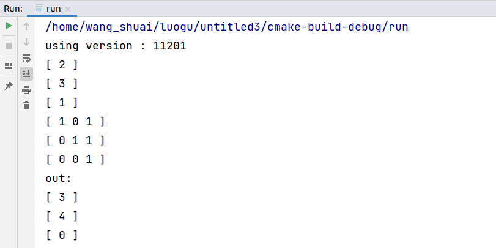

### [cublasger()](https://docs.nvidia.com/cuda/cublas/index.html#cublas-lt-t-gt-ger)

```c++
	Matrix<float> m(3,3), v(3,3), out(3,3);
    v <<= {2.0, 3.0, 1.0};
    m <<= {1.0, 0, 1.0, 0, 1.0, 1.0, 0., 0., 1.0};
    out <<= {0,0,0};
    std::cout<< v << m;
    float alpha = 1.0;
    v.toDevice();
    m.toDevice();
    out.toDevice();
    cublasSger(3,3, 1, v.devicePtr, 1, m.devicePtr, 1, out.devicePtr, 3);
    out.toHost();
    std::cout<<"out :"<<std::endl <<out;
```

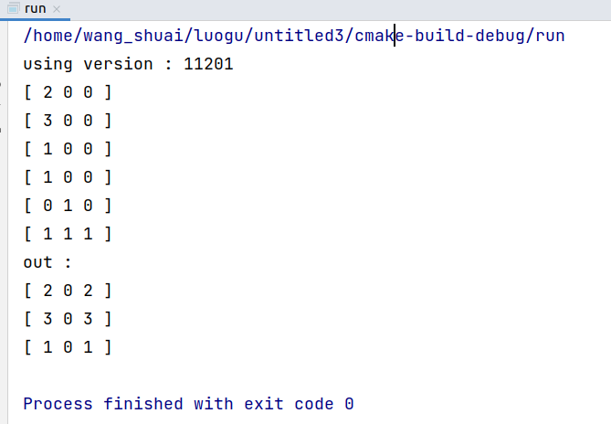

### [cublassbmv()](https://docs.nvidia.com/cuda/cublas/index.html#cublas-lt-t-gt-sbmv)

**y**=*α**A***x**+*β***y

```c++
	Matrix<float> m(3,3), v(3,1), out(3,1);
    v <<= {2.0, 3.0, 1.0};
    m <<= {1.0, 0, 1.0, 0, 1.0, 1.0, 0., 0., 1.0};
    out <<= {0,0,0};
    std::cout<< v << m;
    float alpha = 1.0;
    v.toDevice();
    m.toDevice();
    out.toDevice();
    cublasSsbmv_v2(handler,cublasFillMode_t::CUBLAS_FILL_MODE_FULL, 3,3, &alpha, m.devicePtr, 3, v.devicePtr,1, &alpha, out.devicePtr,1);
    out.toHost();
    std::cout<<"out: " << std::endl <<out;
```


## Level 3 function

### [cublasgemm()](https://docs.nvidia.com/cuda/cublas/index.html#cublas-lt-t-gt-gemm)

```c++
   Matrix<float> m(3,4), v(3,1), out(3,3);
    m <<= {1.0, 1.0, 1.0, 99, 0.0, 1.0, 1.0,99, 0.0, 0.0, 10.0, 99};
    std::cout<<m;
    m.toDevice();
    float alpha = 1.0;
    float beta = 0;
    cublasSgemm_v2(handler, cublasOperation_t::CUBLAS_OP_N, cublasOperation_t::CUBLAS_OP_N,
                   3,3,3,&alpha, m.devicePtr, 3,m.devicePtr, 3,&beta, out.devicePtr, 3);
    out.toHost();
    std::cout<<out;
```

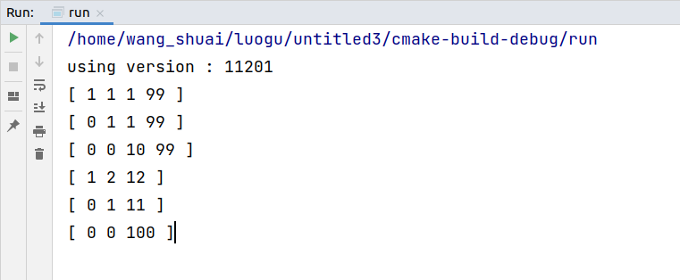

