## Dbow2 库分析

## 特征向量

这里的特征向量是图像中的特征点的描述子，在深度学习中，一般把特征叫做特征向量，也就对应着手工构造时代的描述子。

### Brief 特征点

**数据结构**：

特征点使用256维的bit向量存储

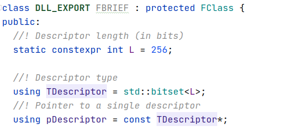

**计算均值**：

1. 统计每个纬度的值

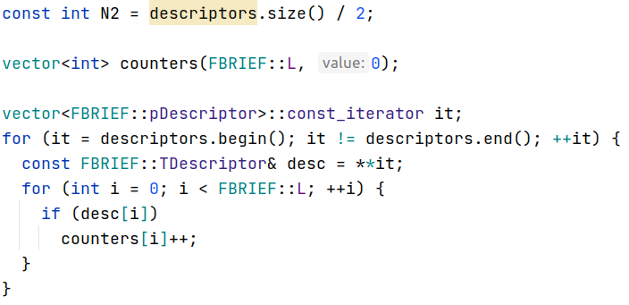

2. 如果有一般的向量在这个纬度的值都存在，那么均值向量的该纬度值，也应该存在

   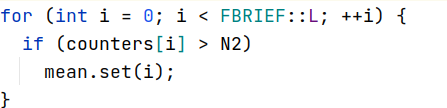

**计算向量距离**：

直接计算汉明距离即可

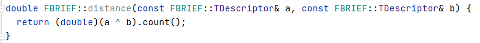

### ORB 特种点

**数据结构**：

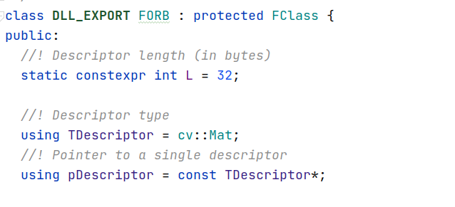

**计算均值**：

很麻烦没看懂

**计算距离**：

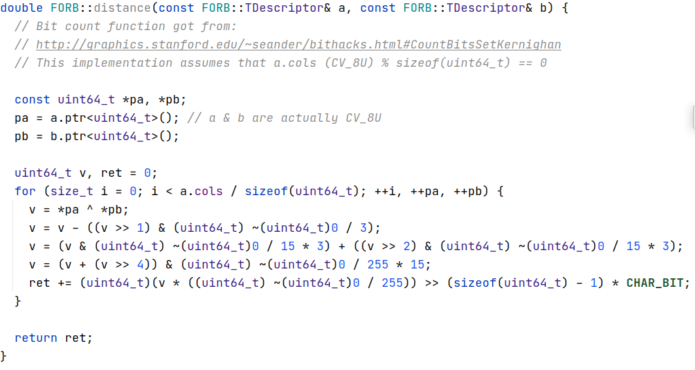

## 查询树

### 构造查询树

**Kmeans 初始化：**

kmeans 初始化点的办法采用kmeans++中的技术：

1. 随机选择一个初始点
2. 计算每个点到已经出现的最近聚类中心的距离，作为成为下一个聚类中心的概率
3. 不断重复2,直到产生出了足够多的聚类中心

**Kmeans 层次聚类**

1. 初始化
2. 根据每个点到聚类中心的距离，分配类别
3. 重新计算聚类中心，直到所有聚类中心不再变化
4. 对于每个类，继续递归聚类

如果没有足够多的的特征向量输入完成要求的层数，直接构造叶结点

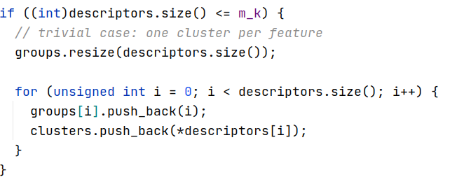

如果已经构造完成了要求的层数，就不用继续递归了，表明这种情况下叶结点的特征向量就是聚类中心，这个中心代表了众多该类的特征向量

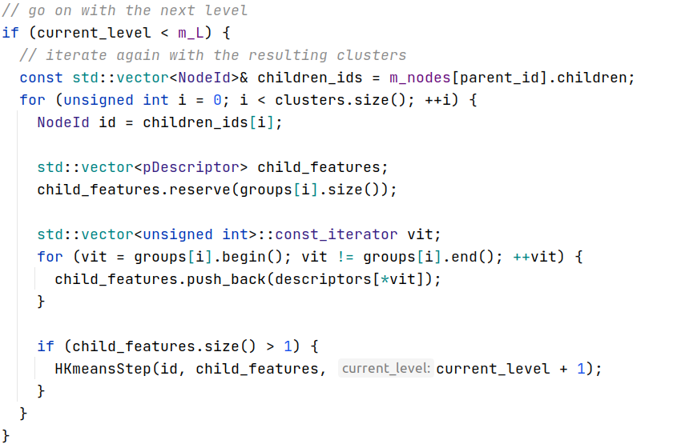

### 查询

对于图片的每个特征向量都查询与特征向量最相似的节点，同时返回$(id, weight)$

$id$就是输出的查询向量的维度，weight就是那个纬度上的值，这样就可以得到一个稀疏向量

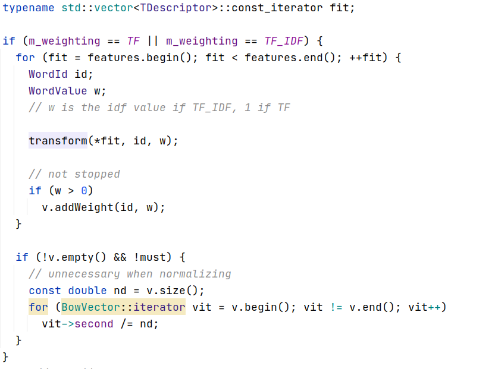

**流程**：

从根节点点开始，递归找寻最像的儿子节点，直到到达叶结点，每个节点都存着，当时聚类产生的聚类中心，这个中心就是用来和特征点描述子，也就是我说的特征向量的距离的特征向量

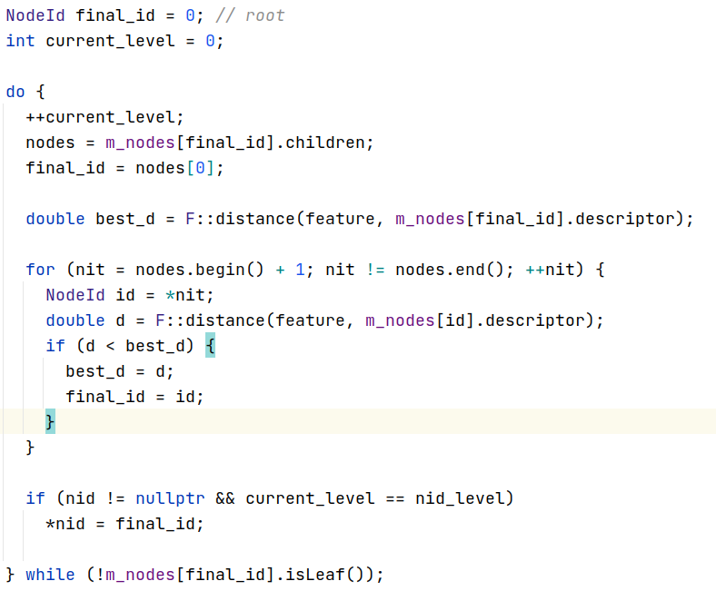

## 查询向量

查询向量，是将图像提取出来的特征在查询树中查询得分，每个特征向量可以查询得到$(id, score)$

为了查询效果更好，会使用大量的特征点特征向量，因此，如果对于有$N$个节点的查询树，构造查询向量$V_N$的话，内存开销会很大，因此采用稀疏向量的方式构建

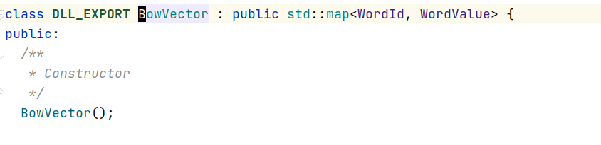

稀疏向量用map数据结构构成，worldid代表稀疏向量的下标，value是该位置的值，在查询树一起链接起来看的话，worldid是树的叶结点标号，value是相似度

## 相似度计算

图像的相似度计算，通过衡量两个图像经过查询树得到查询向量的距离来衡量，如果两个查询向量的相似度很高，那么就认为两个图像具有很高相似度

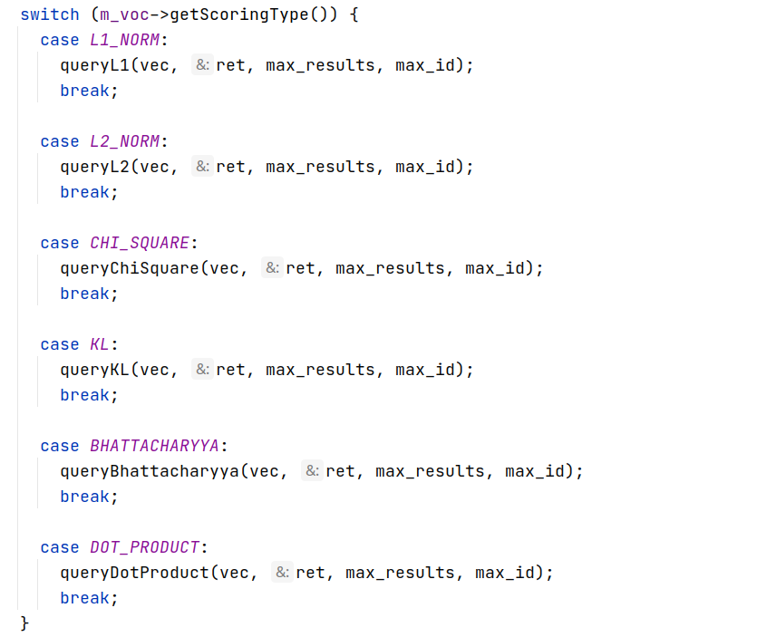

### InvertFile 存储结构

为了稀疏向量的距离计算速度加快，采用invertFile的存储结构，将每张图片的查询向量存储起来，通过衡量两个图像的查询向量的相似度，来确定两个图片的相似度，以完成回环检测。

正常文件存储方式：

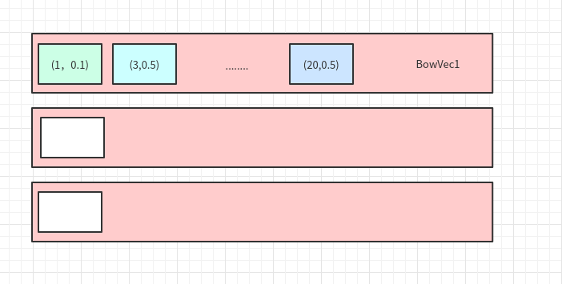

反转文件存储方式：

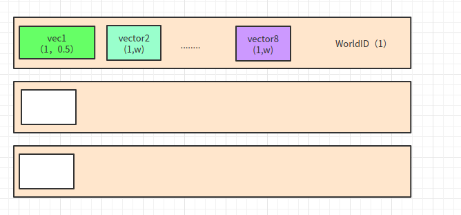

这样在查询的时候可以大大加速：

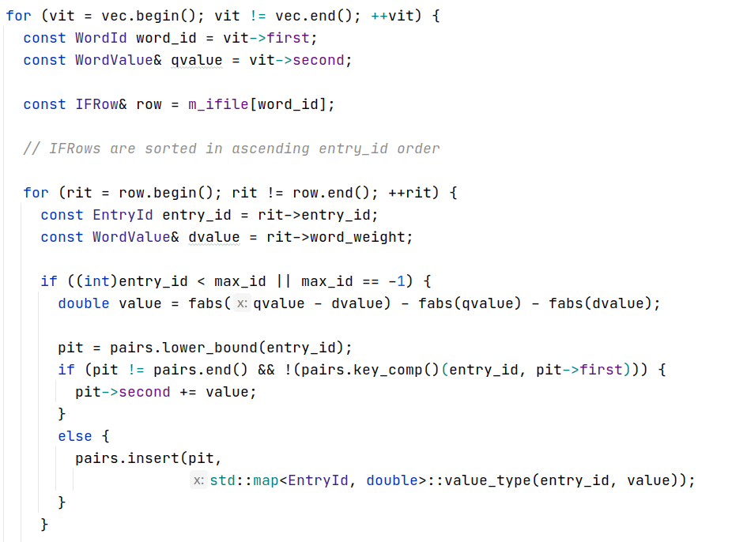

只需要查询Q向量不稀疏的位置就行，遇到没有计算的K向量，就插入，计算过的K向量，就加上新的误差

总结：使用cnn特征，查询的时候用cosine值作为监督信号训练一个我觉得很好，也是slam与深度学习结合的一个很好的点子