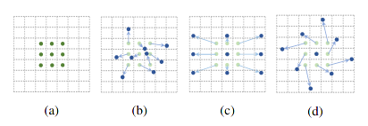
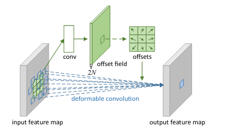
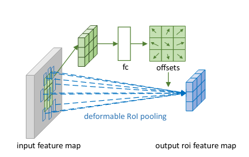
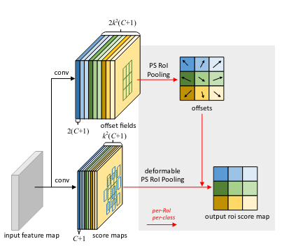

### Deformable Convolutional Networks

* (a) normal cnn
* (b) deformable cnn
* (c) (d) special case of deformable cnn

### Motivation

Convolution neural network is limited to its fixed grid sampling setting,  which prohibits further application for geometric transformations, Thus a capable approach is needed in order to facilitate efficiency of convolution neural network.

### Ideology

#### General CNN

* sample a fixed  grid for convolution template over feature map 

* use matrix multiply to generate output feature map from $K$ and $G_{feature}$
  $$
  G = [(-k,-k), ... ,(-1, -1), (1,0) ,... (0,0), .. (k,k)] \\
  G_{feature} = G \cross F_{feature-map} \\
  F_{output} = G_{feature} \cross K_{kernel}
  $$

#### Deformable CNN

what if we extend the fixed sample grid to center + offset paradigm, which can be formulated as :
$$
G = [(-k,-k), ... ,(-1, -1), (1,0) ,... (0,0), .. (k,k)] \\
G^{offset} = Conv_0(F_{feature}) \\
G_{feature} = (G+G^{offset}) \cross F_{feature-map} 
\\F_{output} = G_{feature} \cross K_{kernel}
$$

#### Deformable Pooling

As for Pooling, $p_0$ is the top left point position of feature map, $(x,y)$ is the in-grid position for $(i,j)$ grid. so $ x \le k, y\le k$, where k is grid size.   a deformable version can be formulated as :
$$
\triangle p = conv(F_{feature}) \\
F_{output}(i,j) = F_{feature}(p_0 + p(x,y) + \triangle p(x,y))
$$

#### Position-Sensitive (PS) RoI Pooling

the pooling occurs on channel wise.

