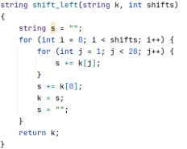

abstract ：  本文实现了上世纪最具知名度的加密算法DES，同时应用与图像内容加密，用可视化的方式展示了加密算法DES存在的一些问题，以及用来改进他的CBC方法

关键字： DES加密，级联DES加密，CBC方法，加密可视化，图像加密

一．问题重述

DES 加密算法是Data Encryption Standard 的缩写，是一种对称加密算法，在1976年被美国联邦政府的国家标准安全局确定为一个安全标准，它使用56位密钥的对称加密算法，本次大作业独立实现DES加密算法，并可视化的加密图像文件，这样可以更立体的认识到加密算法的不足,以及建立对于基于例如CBC算法的改进工作的认识。

 

二．DES文件加密算法

 

1. 密钥生成

密钥是一个长度为64的位串，其中56位是密钥，其他8位是奇偶校验位，在密码编排过程中，这些校验位需要忽略掉

1.1 P1 置换

P1 置换的作用是用来除去上文中提到的奇偶校验位，左图中的{8,16,24,32,40,48,56,64}这些奇偶校验位通过置换，从原来的K中去除

 

1.2 分组循环左移

加密过程总共有16轮，通过设定好的移位步长先生成16个子密钥，在每一轮的加密过程中，初步加密的明文通过二进制加法与子密钥结合，进一步加密，下图是DES 加密的移位表。

 

1.3 P2 置换

经过expand之后的明文有48位，但是子密钥现在还是56位，仍有位数上的差距，现在对子密钥进行压缩

 

2. 分组加密

2.1 最初置换

输入分组明文之后，对输入的明文进行第一步置换，最初置换的作用主要是将明文中的奇偶校验位提取出来，但是不同于密钥的处理步骤，密钥是将奇偶校验位去除掉，这里只是将奇偶校验位提取到同一行，同时将整个明文打乱。

 

2.2 Expand

现在将整个明文分为两部分，L（1,32），R（33，64）两部分，对于R部分进行expand操作，这里的expand操作让我想起了神经网络中的SE结构，也就是隐藏层操作，将R部分映射成为48位的向量。

 

2.3 S box

对于expand之后的R（1,48），按照每六个一组，分为8组，S box 总共有8个，每个分别对一个小分组进行处理，处理的规则为：

例如： 对于第五个小分组011011，采用S5 box，则按照行列索引其中（2,5）位作为列索引，第一位和最后一位作为行索引，找到表中数据作为输出，将R（1,48）映射为（1,32）。

 

下图为DES 加密算法中的8个S 盒，但是S盒的设计细节一直没有公开，是否存在后门，不得而知。

 

2.4 P box

经过S盒处理之后的R（1,32）再次经过一个映射排列，打乱顺序。

 

2.5 密钥加密

对于每一轮加密：

 

2.6 最末置换

经过16轮加密之后，还要进行一次映射，这个映射和第一次执行的映射互为逆操作。

 

三．DES 文件解密算法

四．DES 加密算法实现

算法实现过程中，为了增强编码速度与调试方便性，所有数据类型都是基于c++中的string数据结构实现，这样可以让置换等操作更加方便，输入字符串只包含十六进制的字符也就是{1,2,3,4,5,6,7,8,9,10,A,B,C,D,E,F},所有的非规格化的输入都需要实现一个tostring方法供加密流程调用

**DES 数据结构：**

在构造函数中进行，对16个子密钥的生成工作。

 

**辅助函数**：

1. hex2bin和bin2hex函数

这里采用哈西表的方式完成16进制字符串变为二进制字符串，过程如下：

 

2. permute

 

3. 左移位 shift

 

4. 二进制加法

 

**加密流程：**

1. 进行将格式化输入的16进制字符串，格式化为二进制字符串

2. 进行第一次置换

3. 拆分为left，right两部分

 

4. 进行16轮加密

1. expand

 

2. xor with key

 

3.  s box

 

4.  p box

5. xor with left

​                                                       

5. 最后交换

 

**解密流程：**

解密流程与加密流程完全一样，只需要将密钥顺序调换即可

 

五．CDC 密钥增强

六．多级DES 加密

七．图像信息加密实验

基本基于上面提到的辅助函数，为了让文件加密具有可视化效果，因此采用了对于图像加密，来可视化。

 

说明： opencv读取图片采用3个通道，因此在编码过程中不是很方便，为了让编码更加方便，附加了一个通道，有点类似alpha通道的感觉，也就是png图片的原有格式。

**inplace 加密：**

 

 

**inplace 解密：**

 

 

 

 

结构化图像：

1.  原始图像

 

 

des加密速度实在太慢了，也可能是实现上的问题，因此对于每个图片都进行了压缩

2. DES 加密后图像信息

1. 结构化图像

 

2. 非结构化图像

纹理信息较高，结构信息较少的图片，在des加密后信息保密程度更高。

 

3. 多级DES 加密后图像信息

多级DES 加密实验，采用des3进行加密，原因是更高的级联时间开销受不了，

1. 结构化图像

 

1. 非结构化图像

 

4. CDC 密钥增强

每次加密使用同一密钥，但是加密算法的输入是当前明文分组和前一次密文分组的异或。各密文组yi不仅与当前明文组xi有关，而且通过反馈作用还与以前明文组x1, x2,…, xi-1有关。因此重复的明文分组不会在密文中暴露

**代码实现：**

继承+添加预处理函数

 

 

可以观察到加密效果非常好，根本看不出来加密后是个啥，同时解密后又是高保真的效果