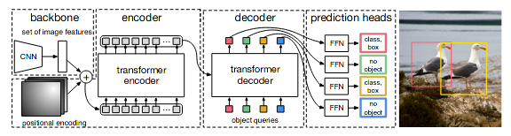
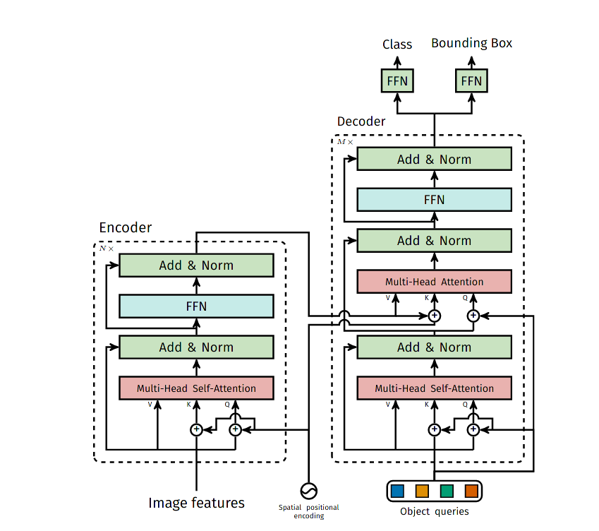
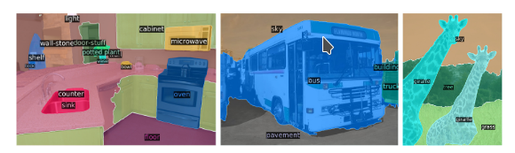
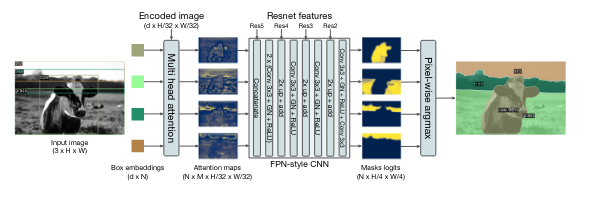
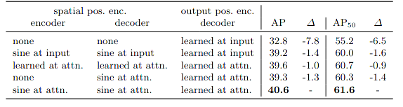
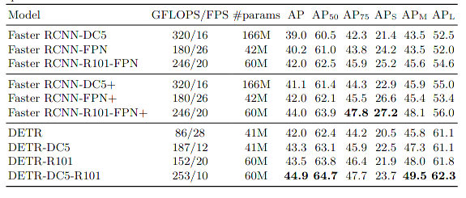

### End-to-End Object Detection with Transformers

This approach streamlines the detection pipeline, effectively removing the need fro many hand-designed components, like nms procudure or anchor generation that explicitly encode the prior knowledge about specific task. And this model architecture is considerately simple and efficient, which produces a pair result with well established and highly-optimized mask-rcnn model.

### Architecture

**DETR** consists of three components, feature extractor, transformer, and predict head(FFN) 

But, to clarify the objective task established on object detection with DETR, which is some different from normal nms or roi based methods. I d better visit the ground truth generation and loss function.

#### Target Assignment

Given a set of fore objects $ y \in \mathcal Y$ from a image with annotations. the assignment task is focusing to schedule an optimal match strategy giving the specific output prediction $\hat y$  a relatively similar target $y$ , in order to supervise detr model better. The similarity is measured by a distance function, taking into account both the class confidence and boxes similarity.

an instance $y$  consists of a class label and a bounding box label. the similarity is formulated as :
$$
\begin{aligned}
\mathcal D(\hat y_i, y_j) &= \hat p_i(c_j) + \mathcal L(\hat b_i, b(j)) \\
\mathcal D(\hat y_i, y_j) &= \hat p_i(c_j) + \mathbb L_{\text{smooth-l1}}(\hat b_i, b(j)) + \mathbb L_{\text {IOU}}(\hat b_i, b(j))
\end{aligned}
$$
The optimal matching strategy is based on minmize the distance between prediction and corresponding  matching target object. 
$$
\text{optimal} = \arg \min \Sigma_i  (-\mathcal D(\hat y_i, y_{\text{optimal(i)}}))
$$

#### Loss funcion

After finding out the corresponding relations between targets and model ouput prediction, then an efficient supervision is on demand, the paper use the following loss function as objective to minmize.
$$
\begin{aligned}
\mathbb D(\hat y_i, y_j) &= - \log \hat p_i(c_j) + \mathcal L(\hat b_i, b(j)) \\
\mathbb D(\hat y_i, y_j) &= - \log \hat p_i(c_j) + \mathbb L_{\text{smooth-l1}}(\hat b_i, b(j)) + \mathbb L_{\text {IOU}}(\hat b_i, b(j)) \\
\mathbb L &= \min \Sigma_i (-\mathbb D(\hat y_i, y_{\text{optimal(i)}}))
\end{aligned}
$$

#### Feature extractor

* resnet-50
* resnet-101
* resnet-dilated finial stage

#### Transformer

Transformer component follows the standard architecture setting, consists of encoder and decoder with position embedding . But the position embedding is different from the original, which is added to the input of every attention layer. 

as the picture shows.

##### encoder

##### decoder

In order to produce permutation various output prediction, A position embedding for decoder is employed, which is  learnt from training. and to cover all target in annotations, the amount $N$ of object query must larger than target ground truth, unmatched prediction will be assigned with a background target. 

#### FFN

as demonstrated above, FFN is used to produce predictions.    

### Segmentation

for transfer DETR architecture to segmentation task, this paper adds a mask prediction head.

the prediction head takes decoder output embedding and feature map produced by feature extractor as input. Employing multi head cross attention to generate an attention score map of the corresponding decoder output embedding, then fad this map to CNN to predict binary mask logits  , the inference procedure will use class id produced from specific token embedding with the highest prediction confidence among all embeddings as pixel segment task class.      

 ### Experiment

* different embedding methods

* detection result

