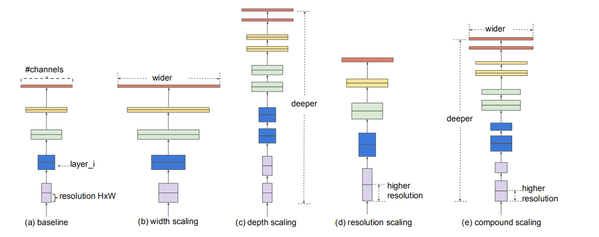
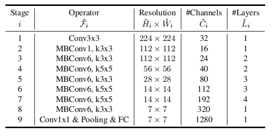
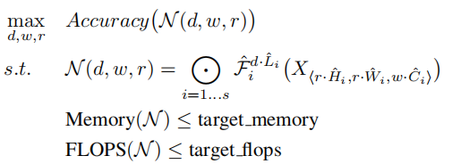
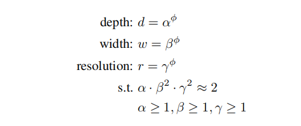
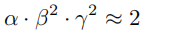
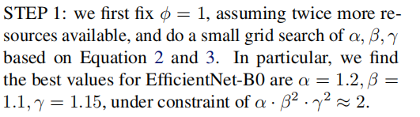
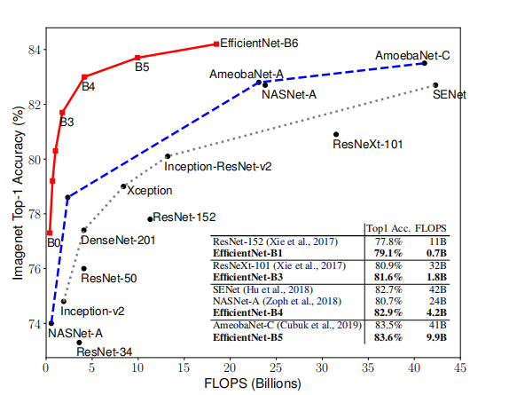
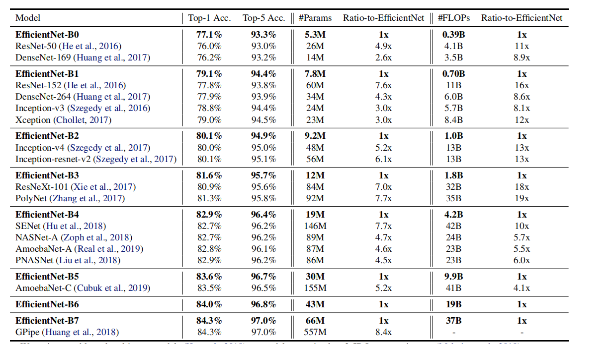
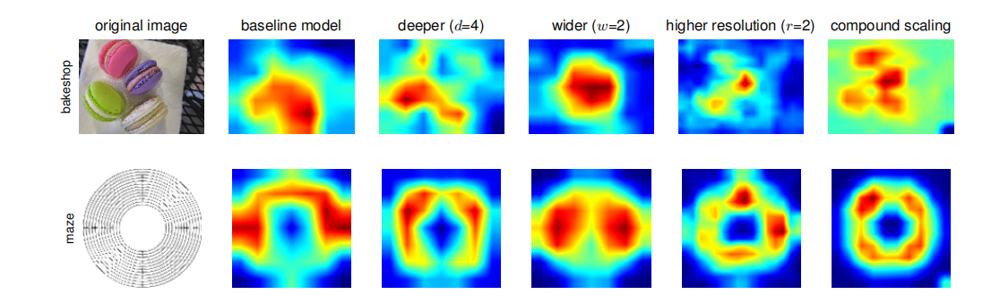

#### EfficientNet: Rethinking Model Scaling for Convolutional Neural Networks

## 论文介绍

本文是2019年谷歌在ICML提出的关于卷积神经网络的结构以及性能之间的平衡分析，实现了在性能和网络的深度，宽度以及分辨率方面的一个均衡，提出的搜索方法也是别具一格，compound scaling up搜索可以完成在多个性能指标之间的平衡，同时也使用这篇文章提出的方法对现有的ResNet，MobileNet结构进行加强，同时基于这个结构的目标检测结构EfficientDet也表现了不错的成绩

## 基本方法

本文主要从宽度，深度，分辨率，三个方面思考神经网络的结构提升，通过三个方面对基础网络结构进行加强，然后生成出一个网络结构家族

举个简单的例子，对于深度方向下手，比较著名的就是Res18,Res50之类

1. 深度，代表着对于基本的结构，进行重复，构造更深的网络
2. 宽度，代表每一层卷积核的数量，体现在输出的张量channel纬度上
3. 分辨率，就是代表输入图片的分辨率，分辨率高，要在指定的结构深度上到达结构，就意味着卷积核的步长会变大，这样感受野也会随之放大，因此体现在网络性质上，就是感受野

### Baseline Architecture

本文也采用了MnasNet中用到的神经网络搜索技术来得到一个比较适合适合研究的Baseline

### 研究建模

整个问题可以简单描述为上图，N代表网络，需要考虑的参数有depth,width,resolution.F是每一层的卷积映射函数，对于输入张量X进行映射，得到输出Y，同时作为下一级输入

但是，对于三个需要研究的方面一起入手，会很复杂，论文提出了，compound scaling method，也就是上图所示，其中$\alpha ,\beta,\gamma$是三个常数，这样只需要研究$\phi$对于网络的影响就行

限制条件表达了，对于资源的建模，也就是d，w，r同时增加一倍，需要的资源，包括计算资源，存储资源都会相应的翻一倍，建模的也挺好的

## 实验

明确研究的变量，$\alpha ,\beta,\gamma，\phi$:

1. 首先通过搜索技术得到最佳的$\alpha ,\beta,\gamma$

   

2. 不断改变$\phi$,得到网络家族EfficientNet

### Scaling up

这个方法有没有用不是你闭门造车说了算，需要经得起检验，因此采用了resnet，mobilenet来测试

### Efficient Net 实验（ImageNet）

### 热力图

可视化的展示很有信服力，的确在这样的研究方式下，分类的感兴趣区域很显然

