#### EfficientNetV2: Smaller Models and Faster Training

## 论文介绍

这个是对于上一代的目标函数的改版，上一代在讨论计算量Flops，这个在讨论网络结构对于训练时间影响，以及相应的训练过程中对于Progressive Training过程中的正则化方法的讨论

## 论文论点

论文聚焦在神经网络训练的时间上，怎么在现有的设备上进行高效率的训练？减少训练时间的同时还能不掉点

1. Processive Training过程对待不同尺度的输入，采用同样的正则化方法是错的
2. Depthwise convolutions 在目前的设备上训练很慢

#### 网络结构

时间加速上要么重新造一张更快的设备，要么让自己的算法训练更高效，显然正常软件研究者都不会选择前者。

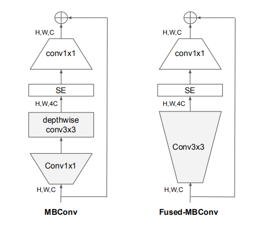

这里采用直接33卷积替换depthwise 卷积，同时作者做了一个实验，证明更换的确是有用的：

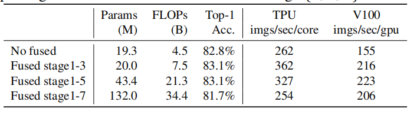

##### 搜索网络结构

前面确定了已经存在更优的网络结构了，现在通过nas技术找到最优的网络结构。

采用MnasNet论文中的方案，和前一代efficientnet-b0的产生方式很类似

* operation types {MBConv, Fused-MBConv}

* kernel size {3x3, 5x5}

* expansion ratio{1, 4, 6}.

得到结果：

这不就是上面证明实验里的fuse1-3吗？但是依旧重新搜了，这就是严谨（有钱）

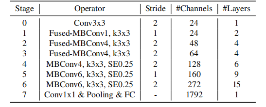

根据第一代提出的scaling up方法，如法炮制，新的家族efficientnetV2 诞生了，同时也了解到，训练时间的确缩短了

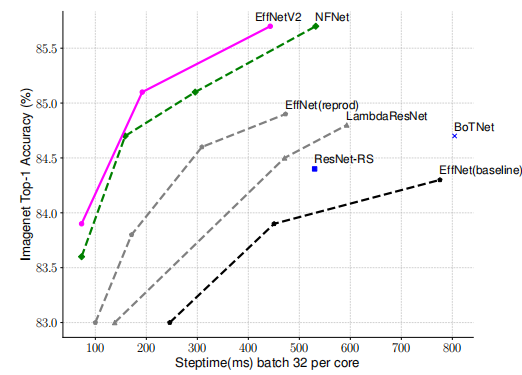

#### Processive Training过程

分辨率对于网络很重要，多分辨率训练可以提高网络性能，因此想到在训练过程改变分辨率，随机改变分辨率，会影响训练的时间，这是由于硬件设备的限制，以前的processive training方法是随着训练不断进行，会加大图片的分辨率，但是正则化方法都不变化

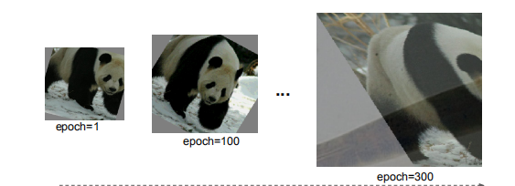

结果这样会导致训练的结果掉点，因此作者提出自适应正则化（线性插值）：

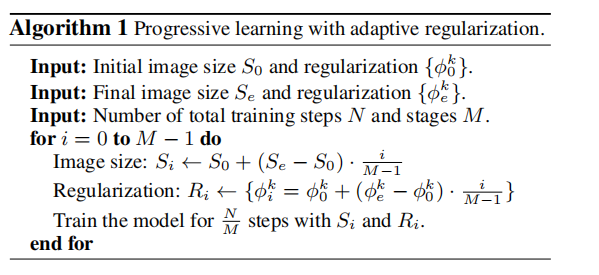

## 实验

实验设置：

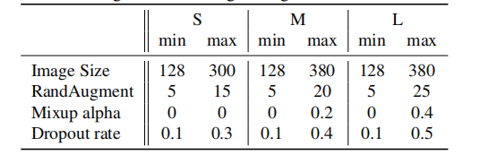

实验结果：

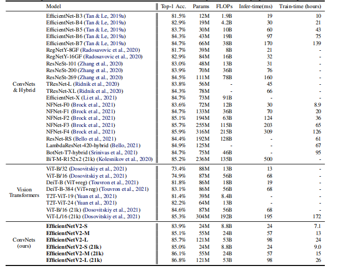

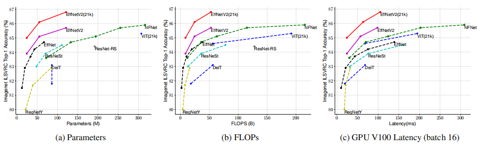

#### 消融实验：

网络结构：

对比两代神经网络，同样训练设置，对比性能

* scaling up大网络

  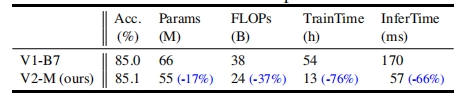

* scaling down小网络

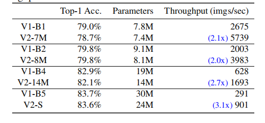

processive training：

* 对于以前的网络，也采用这样的训量贩式，不仅没有掉点，而且还减少了时间

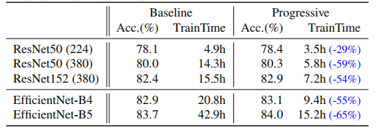

* 对比随机多分辨率，progressive training有点东西

  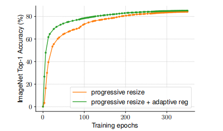