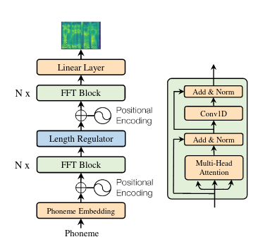
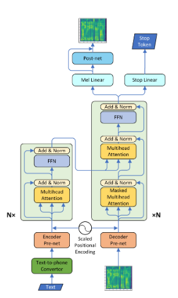
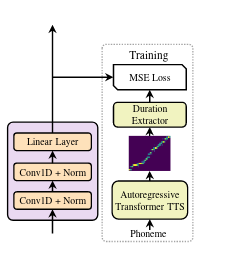
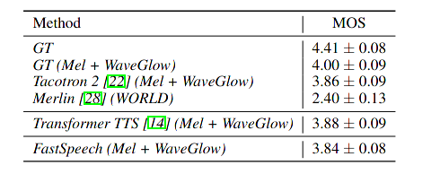
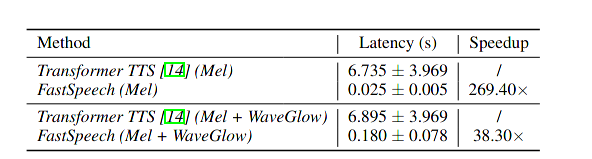
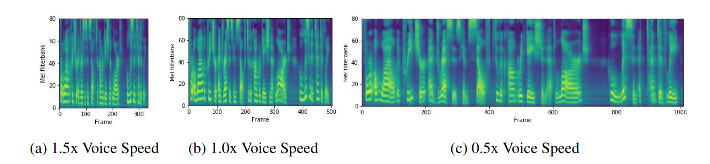

#### FastSpeech: Fast, Robust and ControllableText to Speech

this article thrives to address the  slow inference issue and try their best to improve the robustness of synthesized speech, such as repeated words or missing words problem. Thus them proposed a feed-forward transformer to parallel generate mel-spectrogram.

### Background

* autoregressive model

like transformer, pixelCNN, Dall-e , those all are autoregressive model, which generate tokens or patches based on previously generated items or conditional feature vector. thus above summarized approach suffers from the slow inference speed. 

* autoregressive model in TTS

although transformer and CNN based approaches alleviate the slow synthesis speed, but a unavoidable fact is conditioned model setting will introduce knowledge dependency which harms the parallel capability.

* robustness in TTS

as for TTS topics, the long range dependency enlarges propagation error, which will results wrong attention alignments between text and speech in generation procedure. The resulting phenomenon including repeated or skipped words synthesis.

* non autoregressive sequence generation

without explicitly depending on previous element, non autoregressive generation can greatly speed up the inference process. non autoregressive model has been studied in some sequence generation task such as neural language translation.

### Approach

to solve the problem mentioned above, this paper proposed FFT module and duration regulator to address.

#### Feed-Forward Transformer

    
    

**left : non autoregressive TTS ,    right : autoregressive TTS**

#### duration predictor

the length of input text and output mel-spectrogram is different, and thus there exists a corresponding pattern, which indicates where a text token will map to in spectrogram embedding space. Thus they use a duration predictor to predict the corresponding range in mel-spectrogram embedding space. the target ground is obtained from a well trained autoregressive transformer TTS model.

* target ground truth

As multi head attention module has amount of attention score map, which represent the corresponding level between text token and mel vector. to find the best measurement head score map:
$$
F = {1\over S} \Sigma_{s=1}^S \max_{1\leq t \leq T} a_{s,t}
$$
the head with the highest $F$ score, will be regarded as the ground truth generator.
$$
D = [d_1,d_2, ... d_n]    \\
d_i = \Sigma_{s=1} \arg \max_t a{s,t} = i
$$

* predict module

  

#### length Regulator
$$
\mathcal H_{mel} = \mathcal R(\mathcal H, \mathcal D, \alpha) \\
\mathcal H = [h_1, h_2, h_3, ... h_n]  \ \ \ \ \ \ \ \ h_i \in \mathbb H_{text} \\
\mathcal D_{\alpha} = [\alpha d_1, .. \alpha d_n ]
$$

$\mathcal D$ is predicted from duration predictor. 

for example . if $D = [2,2,3,1], \alpha=1, H=[h1, h2, h3, h4]$ then 

the result $\mathcal H_{mel}$ is :
$$
[h_1, h_1, h_2, h_2, h_3, h_3, h_3, h_4]
$$

### Train

* teacher autoregressive transformer
* fastSpeech with duration predictor

### Experiment

#### audio quality

#### inference speed

#### length control

