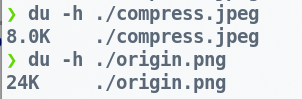
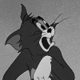
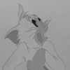
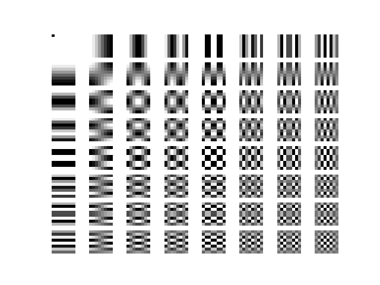
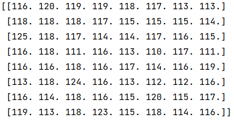
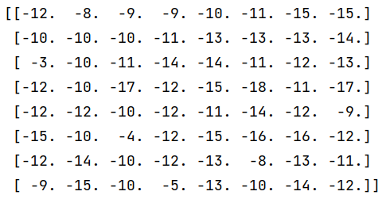
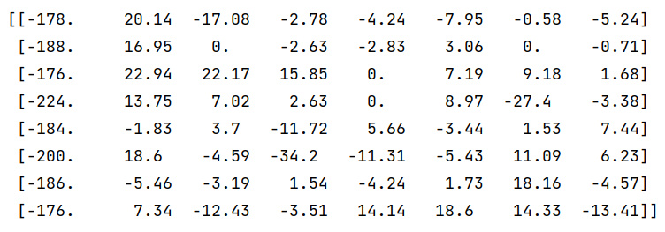
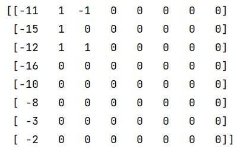
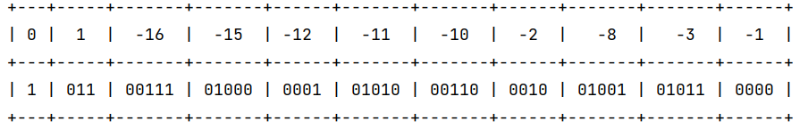

## JPEG compressiom

JPEG stands for joint photographic experts croup, which is a group of image proxessing experts that devised a standard for compressing imags. Thus Jpeg becomes a relativly prevalent algorithm and common used file format in image compression field. 

    
    
    

This is an example, the Left tom cat image only occupies 8.0k in jpeg format which the right counterpart takes three time space than left, but in fact, it is hard for human eye to recognize the distinct difference. 

### what is JPEG comression algorithm ?

Jpeg algorithm is designed for human eyes, it take advantages of the biological property of human vision that human visual system is sensitive to illuminocity of color rather than the chromatic value of an image, and not sensitive to high frequency content of visual content.   JPEG algorithm includes five steps to exploit to compression capability :

1. color transform
2. 2d dft on 8*8 block
3. quantization
4. huffman encoding

#### color transform

The digital image is stored in computer in RGB or BGR format. this color space is convenient for graphic usage, but it does not isolate the illuminance and color of an image because the intensity of RGB format consists of the combination of color and illuminance. **YCrCb** is a  color space what we  desired because it separates the chromatic strength and illuminance of pictures.

    
    
    
    

From left to right, these left  three image represent the **Y-Cr-Cb** channel of the Tom cat image. the **Y** channel indicates the illuminance which is more sensitivce than the color value. and the content of  **Y** is pretty close to real image.

#### DownSample chrominance

Due to the color insensitive property of human visual system, This step take advantage of this special property to decrease storage space by down sample the chrominance channel of image. 

    
    
    
    

#### DFT on block

Once the image is in YCrCb color space and downsampled by a factor, it is partitioned into 8*8 blocks, Each block is transformed by the two dimensional discrete cosine transform(DCT).

Use the mathmetics language to describe discrete cosine transform, The whole transformation formula is :
$$
G_{u,v}={\frac {1}{4}}\alpha (u)\alpha (v)\sum _{x=0}^{7}\sum _{y=0}^{7}g_{x,y}\cos \left[{\frac {(2x+1)u\pi }{16}}\right]\cos \left [{\frac {(2y+1)v\pi }{16}} \right]
$$
As we all know, this transformation is aimed to project the image signal to basic components which are consist of $\cos$ function, this process is some kind like orthogonal decomposition in linear algebra.

before decomposed by DCT, the 8*8 block need to shift a value to calibrate the zero point, for uint8 data type images, the shift magnitude is 127.

    
    
    

from left to right, the images are values of origin image block, value shifted block, finally the coefficient matrix which has the same shape (8,8) as the block. 

#### Quantization

This step is the only one lossy compression step, (other than chroma down sample ), to demonstrate the pivotal step rather than the base table generation. we use  standard Q table , which is :
$$
Q={\begin{bmatrix}16&11&10&16&24&40&51&61\\12&12&14&19&26&58&60&55\\14&13&16&24&40&57&69&56\\14&17&22&29&51&87&80&62\\18&22&37&56&68&109&103&77\\24&35&55&64&81&104&113&92\\49&64&78&87&103&121&120&101\\72&92&95&98&112&100&103&99\end{bmatrix}}.
$$
The following images are coefficient matrix(from above step, left)and quantized DCT coefficients(right).

    
    

#### huffman encode

use huffman encode algorithm in a zig zag forward path to store and compress information. 

Although the true table will include 255 values from 0 to 255, but in convenience, i just select values appeared in the first quantized block (the above matrix in previous sector we get)

Finally, we call encode this image  in zig zag forward path and store it on disk.

The decode method is a inverse procedure of compression.
