## IR 设计

### 上层指令

上层IR假设有无穷多的寄存器，因此每个指令结果可以直接产生一个结果寄存器，这个结果寄存器和这个指令基本绑定，用这个结果运算等价于用这个指令运算，所以用指令地址表示寄存器号，上层IR指令包含下面这些类型：

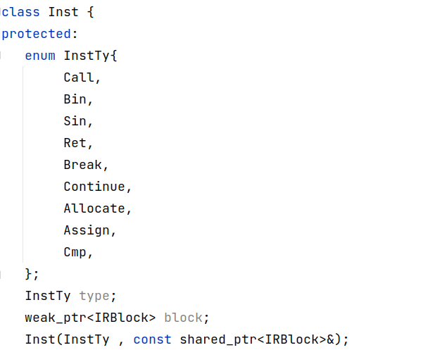

* 分配指令

  当前分配只包括寄存器，我们假设寄存器多的用不完，LLVM中将变量先分配在内存中，然后用mem2reg完成将部分变量提取到寄存器中，然后进行SSA处理，我们这里采取相反的操作方式，一直保持变量在寄存器中，寄存器分配的时候用图着色方法分配，没有分配到的滚到内存中去。

  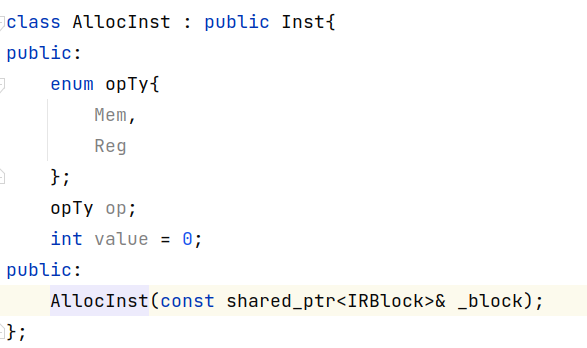

* 一元运算指令

  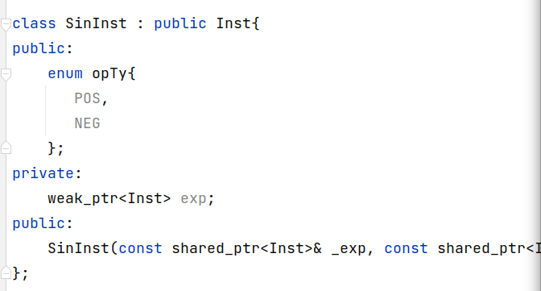

* 二元运算指令

  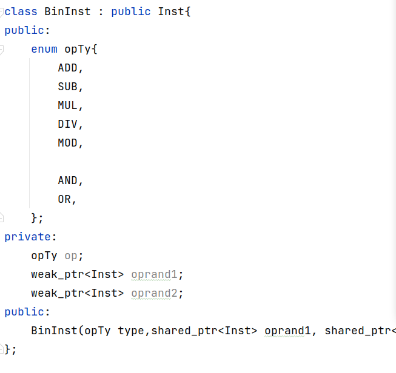

* 函数返回

  

  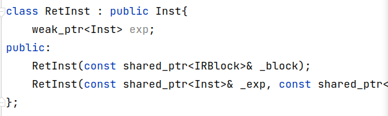

* 函数调用

  函数调用的包含实参和指向函数定义的指针

  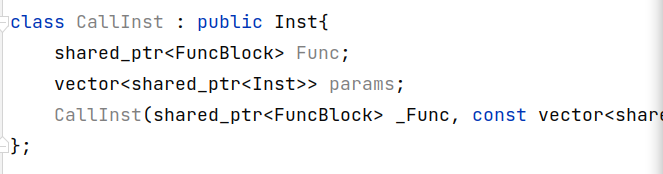

* Break

  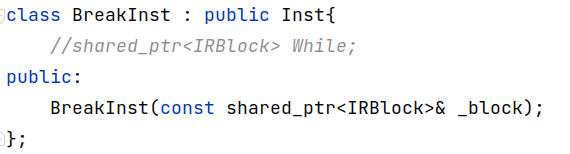

* Continue

  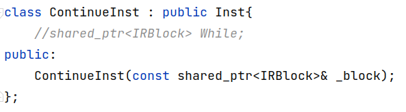

* 赋值语句

  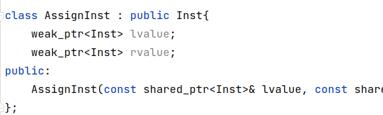

* 比较指令

  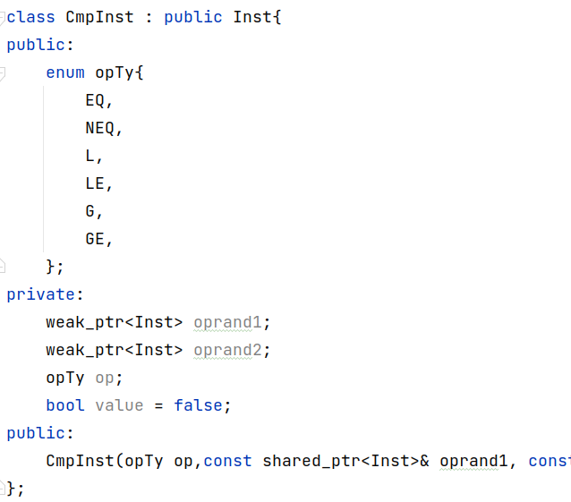

### 基本块

每个块有自己的符号表，同时每个块可以访问父亲的符号表，查找的时候自底向上查找变量定义

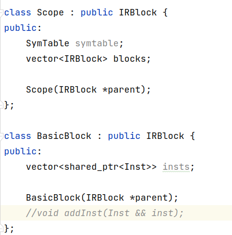

### 符号表

包含函数符号表，变量符号表， 常量符号表？（常量传播用的上？）

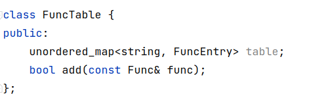

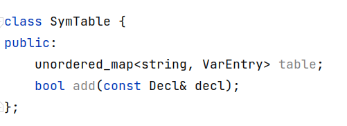

