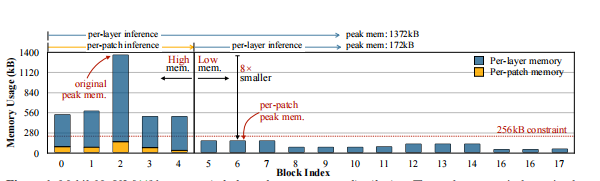
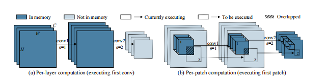
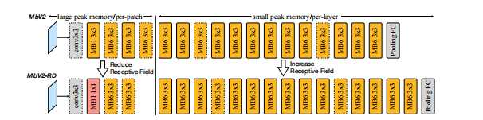
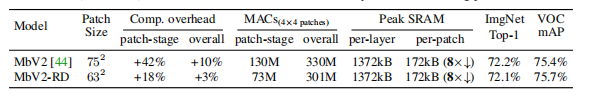
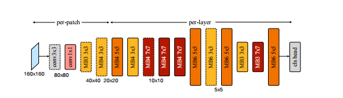
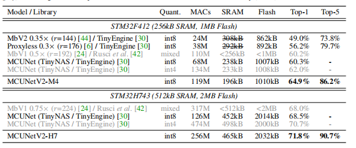
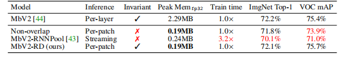

---

title: mcu-netv2
date: 2021-11-12 18:21:48
categories:
- cv
tags:
- cv
- tinyML
cover: image-20211112182302346.png
---

#### MCUNetV2: Memory-Effificient Patch-based Inference for Tiny Deep Learning

## Motivation

Tiny deep learning on MCU is challenging due to the limited memory size. This paper find the bottleneck is caused mainly by the imbalanced memory distribution in convolution neural network designs, the first several layer have a magnificent memory usage compared to the last layers. To alleviate this issue. This paper a patch based inference technology, which is scheduled on a spatial region of the feature map. But due to the overlapping receptive filed, there exists a heavy wasted computation for **repeated overlapping areas**.

* **imbalanced memory usage distribution**
* **computation overhead**

## Technology

### Patch based inference

consider a CNN based neural network, as the feature map decrease, the demands for memory usage also disappear. So the bottleneck lays on the head layer, where has a big feature map. as the digram shows. Per layer inference needs to store the input and output, thus costume a vast memory will easily excel and overflow the border of the physical memory. thus limit the dense application of tinyML eg. detection...

Thus a novelty approach proposed by this paper: **patch by patch inference**

allocate a buffer to host the final output activation, and compute the output patch accordingly, Thus only need to store the activation from one patch but not the entire feature map, reducing the peak memory

### Redistribute the receptive field

Mentioned the patch approach, this will exist the computation overhead, which is related to the receptive field of the patch-based initial stage, for example ,given input shape (224, 224, 3),  a  4*4 patch  feature map  with a receptive field of 16,  when mapped to the original image, will needs to compute 56 + 16 = 72 , where 72 is a overhead.

  To alleviate this problem, this paper consider to reduce a receptive field of the patch inference, and increase the layer inference receptive field. this schedule works. 

## Neural network search

* backbone search   [[MnasNet]()]

* inference scheduling search

  search patch number and the block number to use patch inference.

* Joint search [[Evolution search]()]

## Experiment

* ImageNet accuracy

* Detection Task

