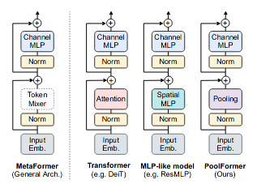
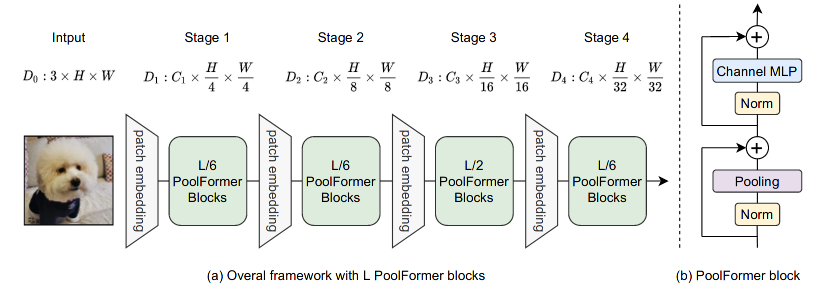
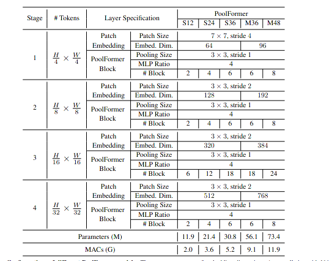
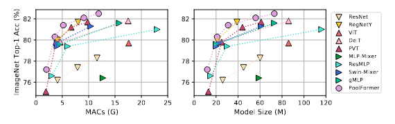
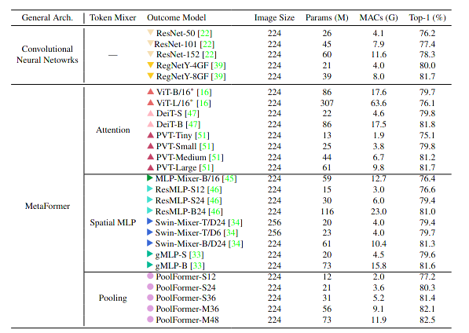

#### MetaFormer is Actually What You Need for Vision

Transformer shows great potential in computer vision tasks, a common belief is their attention-base information fusion mechanism plays this vital role respect to their competence. But recently paper focused on a spatial MLP indicates perhaps the pivotal component can be attributed to the transformer architecture, which consists of fusion block and project block, Thus this paper use a embarrassing simple fusion operator **Spatial Pooling** to prove their argument!

### Ideology



#### PatchEmbed

patch embedding is patch based embed approach, a patch is a spatial region $\Omega$
$$
\hat {\mathcal X} = w^T {\vec {[p_{ij \in \Omega}]} } + b_{\Omega}
$$


#### MetaFormer

Based on visual transformer and Mixer transformer,  this paper abstracts a universe architecture to unify the transformer family.  which commonly consists of two parts, fusion block and project block. In general, fusion part plays a vital role as token Mixer, which is propagate the global or local information between tokens. and MLP project head focus on project feature vector to a new embedding space.
$$
\mathcal Y = fusion(\hat {\mathcal X}) + \mathcal X \\
\mathcal Z = w_2^Tf(w_1^T\hat {\mathcal Y}) + \mathcal Y
$$

  #### PoolFormer

to prove the super power of metaFormer architecture, this paper use an extremely simple operator **Spatial Pooling** to achieve a relative reasonable result.
$$
{\mathcal U}_i = \bar {\mathcal V}_{i \in \Omega} - \mathcal V_i
$$

```python
import torch.nn as nn
class PoolFormerBlock(nn.Module):

def __init__(self, dim, pool_size=3, mlp_ratio=4.,act_layer=nn.GELU, 			norm_layer=GroupNorm,drop=0., drop_path=0.,
use_layer_scale=True, layer_scale_init_value=1e-5):
	super().__init__()
	self.norm1 = norm_layer(dim)self.token_mixer = Pooling(pool_size=pool_size)
	self.norm2 = norm_layer(dim)mlp_hidden_dim = int(dim * mlp_ratio)self.mlp = 			Mlp(in_features=dim, hidden_features=mlp_hidden_dim,
	act_layer=act_layer, drop=drop)
# The following two techniques are useful to train deep PoolFormers.
	self.drop_path = DropPath(drop_path) if drop_path > 0. \else nn.Identity()
	self.use_layer_scale = use_layer_scale if use_layer_scale:self.layer_scale_1 = 		       nn.Parameter(
               layer_scale_init_value * torch.ones((dim)), requires_grad=True)
    self.layer_scale_2 = 
    nn.Parameter(
        layer_scale_init_value * torch.ones((dim)),      requires_grad=True)
def forward(self, x):
    if self.use_layer_scale:
      x = x + self.drop_path(self.layer_scale_1.unsqueeze(-1).unsqueeze(-1)
        * self.token_mixer(self.norm1(x)))
      x = x + self.drop_path(self.layer_scale_2.unsqueeze(-1).unsqueeze(-1)
        * self.mlp(self.norm2(x)))
    else:
      x = x + self.drop_path(self.token_mixer(self.norm1(x)))x = x +                             self.drop_path(self.mlp(self.norm2(x)))
    return x
```




### Experiment

#### setting



#### Result




