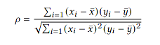
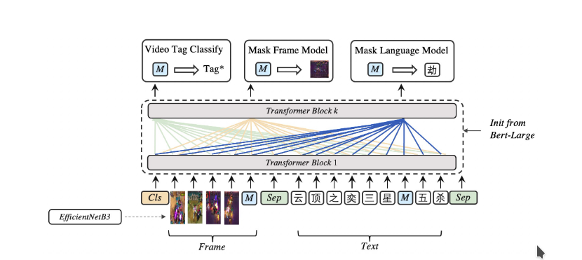
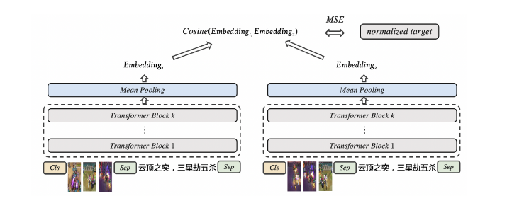
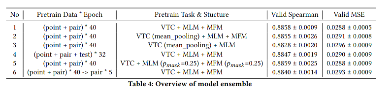

##### Top1 Solution of QQ Browser 2021 Ai Algorithm Competition Track 1 : Multimodal Video Similarity

读一下大佬们的多模态视频分类技术报告，还是感慨有钱啊，穷孩子都没能力预训练，当然也有一些好玩的东西

#### QQ Browser 2021 Ai Algorithm Competition (AIAC) Track 1 

来自于一个腾讯浏览器举办的多模态视频相似度算法竞赛，评估标准定义为 **与人为标签的相关性**

### 预训练

* Video Tag Classify

* Mask Frame Model

  将Frame的feature设为0 向量，经过transformer之后生成TOKEN，最大化这个TOKEN和原来的Frame的特征的互信息，用**NCE-LOSS**监督

* Mask Language Model

### 微调

用**MSE-LOSS** 监督微调，减少对应 video embedding 之间的相似度 与 真值的差距

### Ensemble

使用了6个模型，将特征向量cat到一起，然后用**SVD**降维到256维的向量

