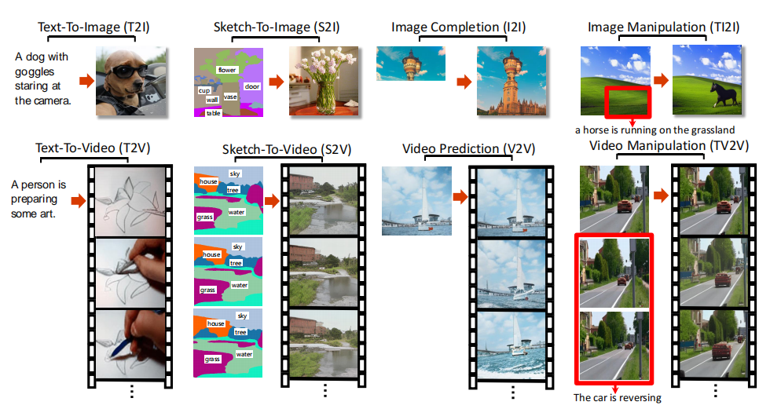
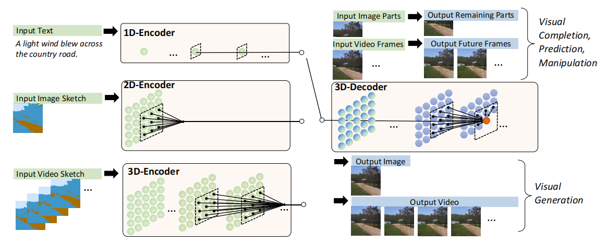
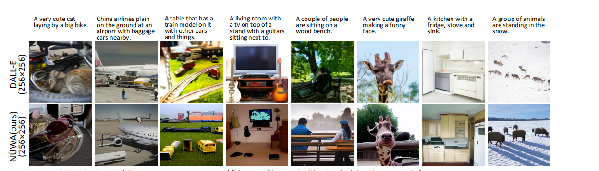

#### NUWA Visual Synthesis Pre-training for Neural visUal World creAtion

仍旧是使用codebook的离散表示，不过这一次，编码器，解码器，都不一样了。还有就是，**怎么采样生成的？**

### Ideology

#### Data Structure

* text  size : $1, 1 ,s, d$  使用词向量
* image size : $h,w,1,d$  使用VQ-GAN同款codebook得到

* video  size : $h,w,s,d$  使用VQ-GAN同款codebook得到

#### 3D Nearby Self-Attention

输入$X$ 大小为$[h,w,s,d]$ , 解码过程的condition $C$ 大小为 $[h', w', s', d]$ , 这是一个四维张量，如果计算cross attention, 时间空间复杂度都很高，所以这里采用了贪心的策略，只在一个临域内做attention.
$$
i',j',k' = {i{h' \over h}}, {j{w' \over w}}, {k{s' \over s}} \\
N^{(i,j,k)} = \{ C_{abc} | \ \ \ |a-i'| \leq e^h, |b-j'| \leq e^w,|c-k'| \leq e^s\} \\
\mathcal Q^{(i,j,k)}, \mathcal K^{(i,j,k)}, \mathcal V^{(i,j,k)}, = \mathcal W_q^T X, \ \ \ \ \mathcal W_k^T N^{(i,j,k)}, \ \ \ \  \mathcal W_v^T N^{(i,j,k)} \\
y_{ijk} = sfmx({\mathcal Q_{ijk}^T \mathcal K_{ijk} \over d}) \mathcal V_{ijk}
$$
减少了时间复杂度 $\mathcal O(hws^2)$ 到 $\mathcal O(hws \times e^he^we^s) $

#### AutoEncoder

生成目标 $Y_{ijk}$ , 给定生成条件 $C_{ijk}$

* embedding

$$
\mathcal Y_{ijk} = Y_{ijk} + p_i^h + p_j^w + p_k^s \\
\mathcal C_{ijk} = C_{ijk} + p_i^{h'} + p_j^{w'} + p_k^{s'}
$$

* encoder
  $$
  \mathcal C^l = 3DNA \ \ (\mathcal C^{l-1}, \mathcal C^{l-1})
  $$

* decoder

$$
\mathcal Y^l = 3DNA \ \ (\mathcal Y^{l-1}, \mathcal Y^{l-1}) + 3DNA \ \ (\mathcal Y^{l-1}, \mathcal C^{L})
$$

#### sample

不清楚怎么生成采样的？

### Result

