---

title: openmp
date: 2021-05-08 12:34:55
categories:
- os
- openmp
tags:
- os
- parallel
- openmp
cover: image-20210508130211335.png
---

## 并行计算

利用openmp实现并行计算，了解openmp的编程模型以及并行计算的特点

openmp 适用于下面两种编程模型（统一内存访问和多处理机）：

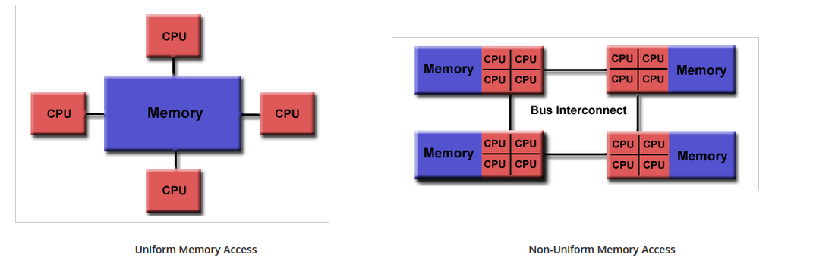

在高性能计算中，通常mpi和openmp混合使用，mpi负责多处理机的主机层面的并行交互

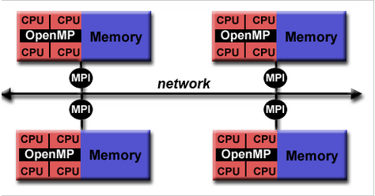

openmp的编程模型基于线程实现并行，通过fork和join来控制线程，openmp在内存方面共享内存，

### 矩阵计算

串行计算矩阵的运算，以及利用openmp来进行并行编程

#### 矩阵加法

串行矩阵加法：

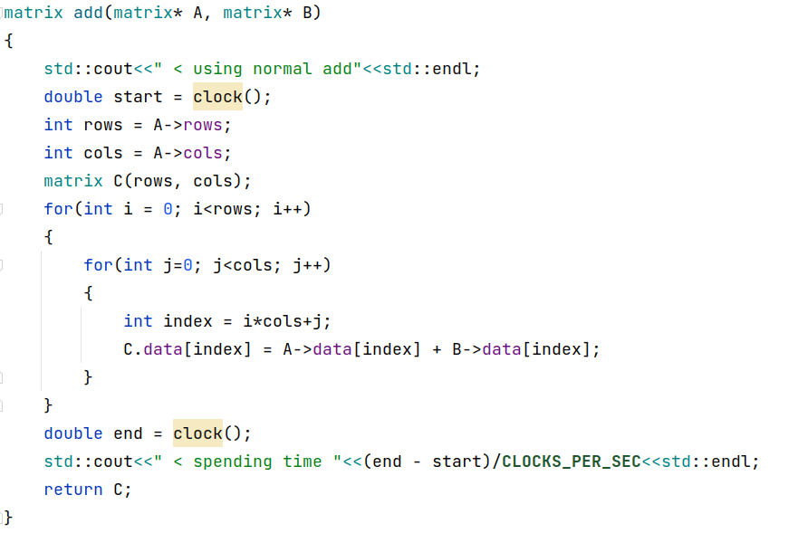

并行矩阵加法：

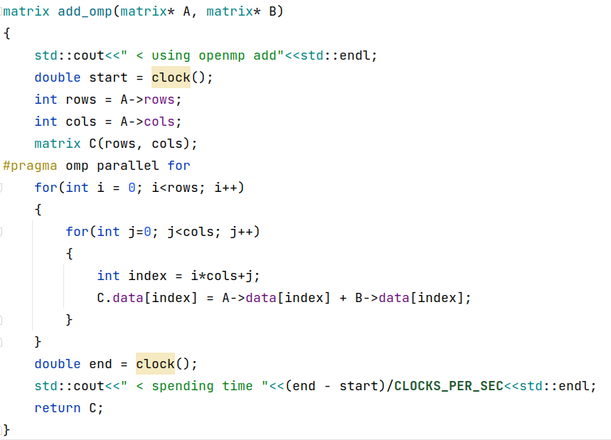

性能对比：

* 正常串行加法：

  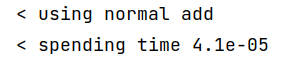

* 一个外层循环

  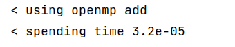

  调节环境变量，设置并行线程数为8，发现速度还能提升：

  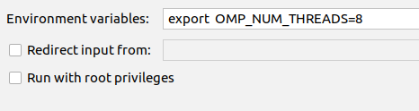

  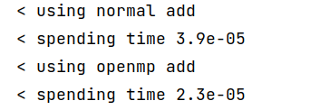

#### 矩阵减法

串行矩阵减法：

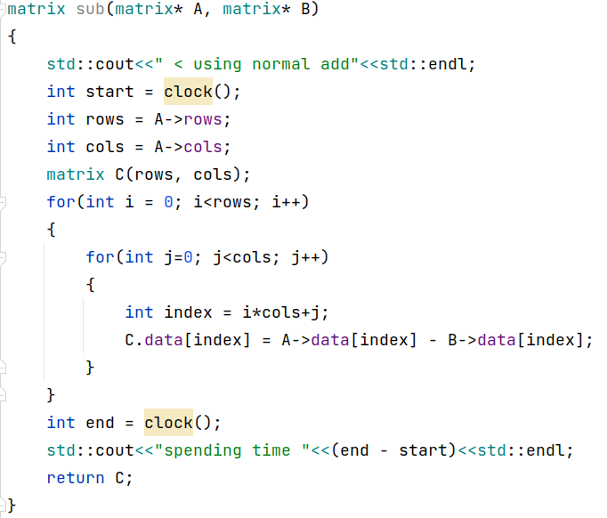

并行矩阵减法：

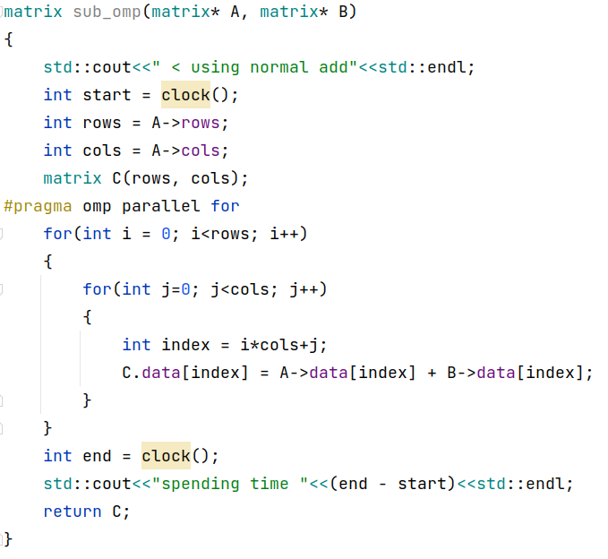

#### 矩阵乘法

串行矩阵乘法：

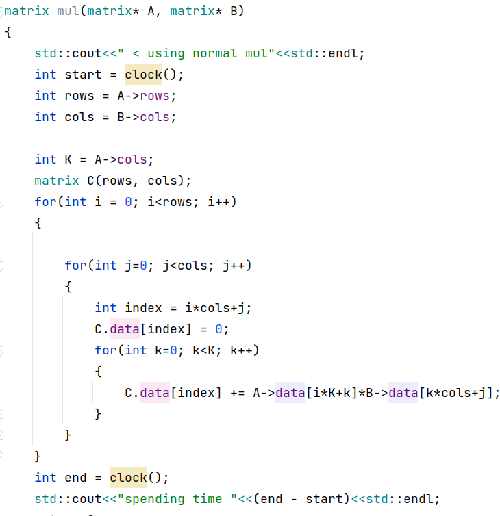

并行矩阵乘法：

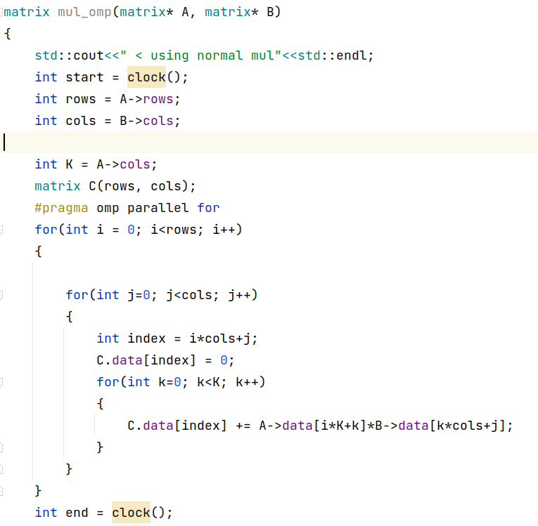

运行效率：性能提升了5倍

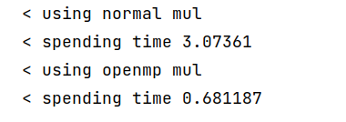

#### 矩阵点乘

串行矩阵点乘：

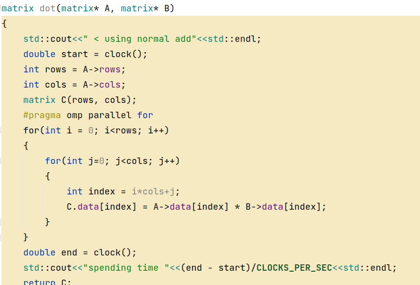

并行矩阵点乘：

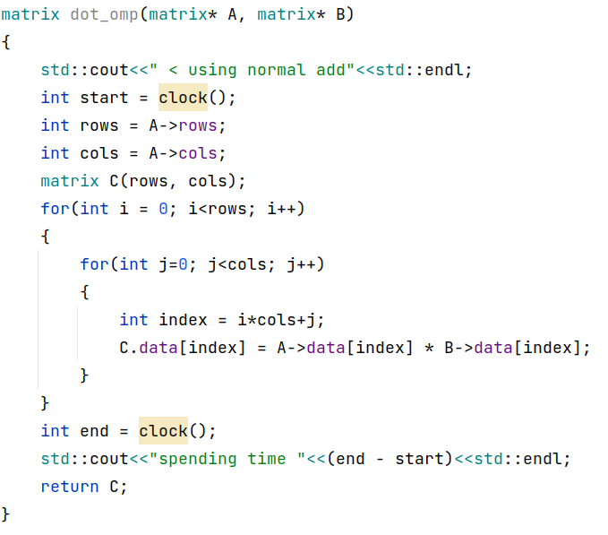

#### 矩阵除法

### 排序算法

#### 插入排序

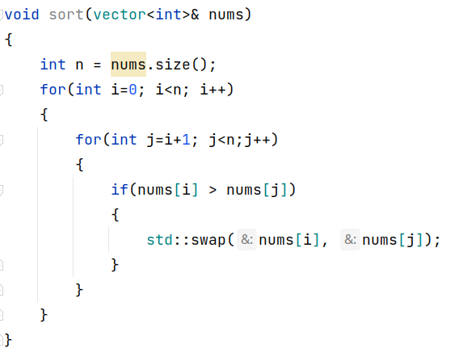

排序结果：

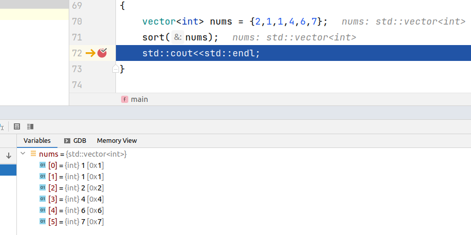

采用omp并行之后：（排序结果出错了，想想逻辑的确不对，这块不能并行）

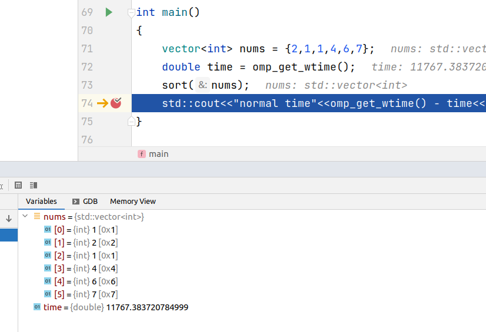

#### 快速排序

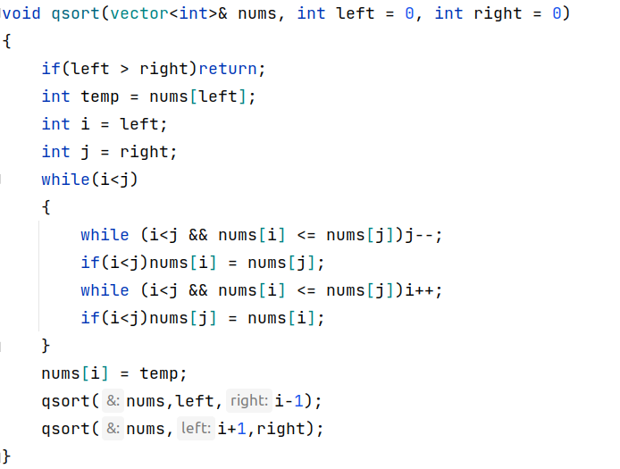

排序结果：

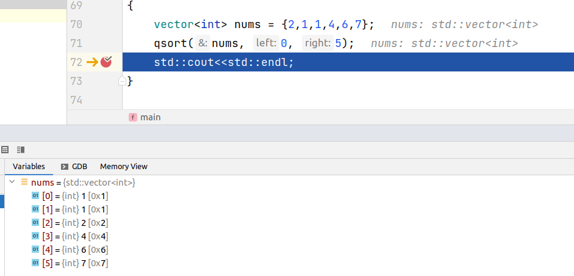

并行化：

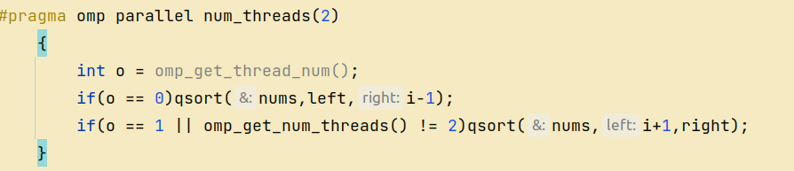

并行化结果：

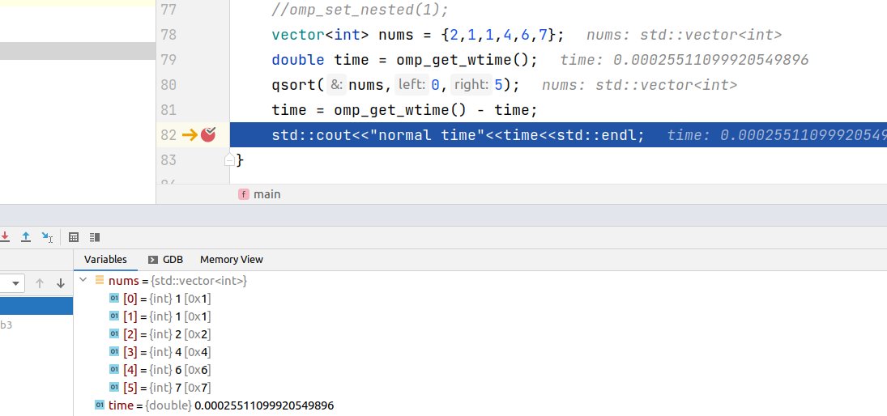

#### 归并排序

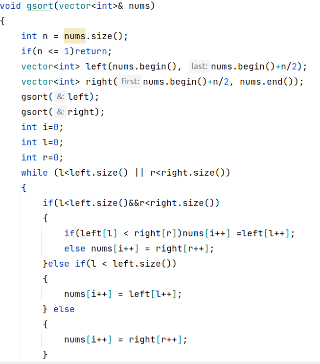

排序结果：

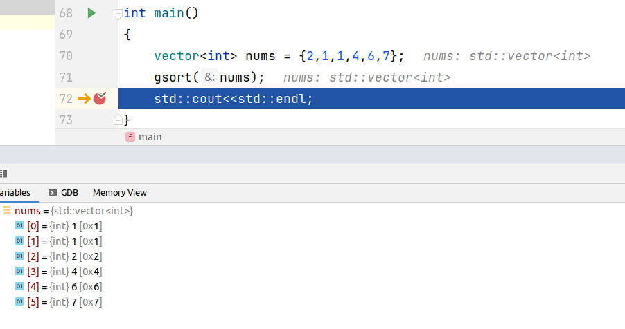

并行化：

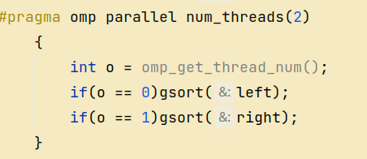

并行化结果：

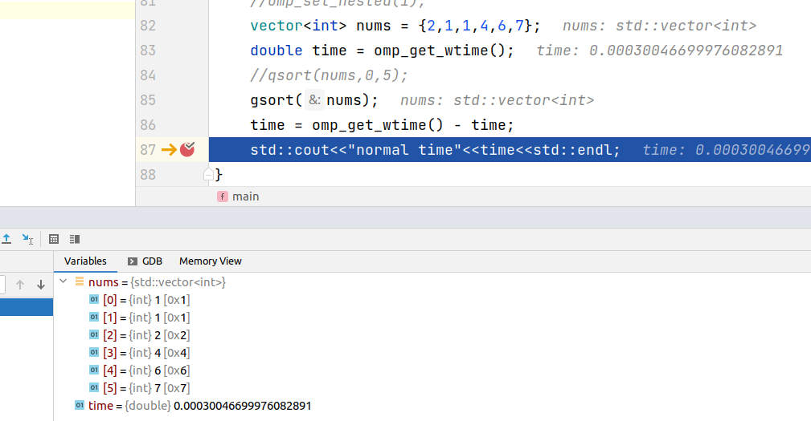

