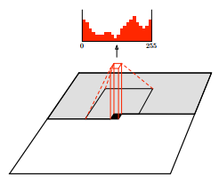
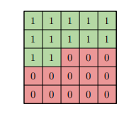
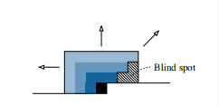
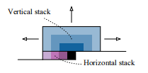
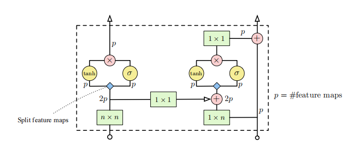
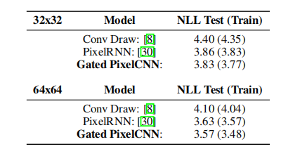
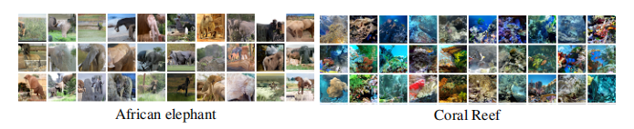

#### Conditional Image Generation with PixelCNN Decoders

Recent advances in image modeling with neural networks have made it feasible to generate diverse natural images that capture the high level structure of the training data, While such unconditional models are fascinating in their own right, many of the practical application requires the model to be conditioned on prior information.

### Gated PixelCNN

pixelCNNs model the joint distribution of pixels over an image as the product of conditional distributions
$$
p(x) = \Pi _{i=1}^{n^2} p(x_i | x_0, .. x_{i-1})
$$
which takes the prior information as the input, then output the predict digits which presents RGB value of the pixel,  which consist the $N, N,3, 256$ tensor-size output image   

#### Gated Convolutional Layer

The highly unlinear activation function which assists the pixelRNN to obtain more complex interaction or connection between pixels which may has a long range property. to amend this issue, a proposed function to replace RELU activation function emerged.
$$
\mathcal y = \tanh(w_{k.f} ^T x) \odot \sigma(w_{k,g}^T x)
$$

#### Blind spot in the receptive filed

use convolution function to generate the corresponding pixel will introduce the mask convolution kernel to avoid current pixel see future pixel and facilitate to speed up the whole process parallelly.  but this will have a blind block aspect to receptive filed. To address this blind block problem, this paper proposes a stack cnn [vertical and horizontal], the above dependency will not need to use mask, which will eliminate the blind problem.

    
    
    
    

### Conditional PixelCNN

given the condition embed, the distribution can be rewrited as following:
$$
p(x|h) = \Pi_{i=1}^{n^2} p(x_i | x_1 ... x_{i-1}, h) \\
$$
and the activations will need to change :
$$
\mathcal y = \tanh(w_{k.f} ^T x + v^Th) \odot \sigma(w_{k,g}^T x + v^T h)
$$

### Experimental 

* unconditional generation

* conditional generation 

