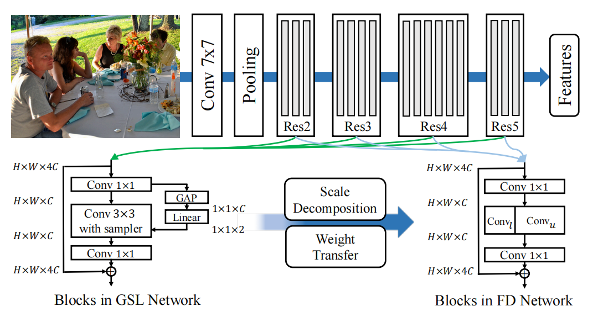
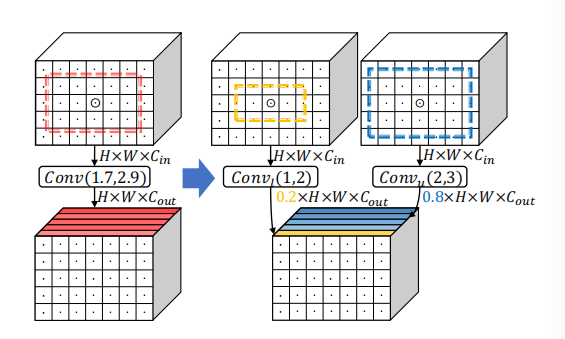
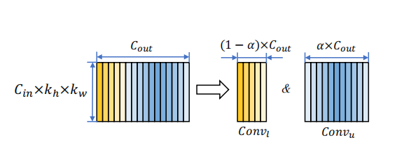
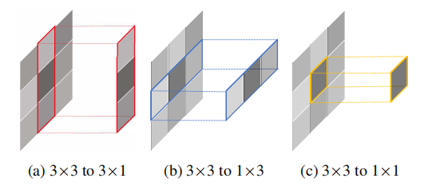

**Practical Object Detection with Scale-Sensitive Network**

object detection is one of the most important and fundamental question in computer vision area, while the dynamic range of object boxes hinders the forwarding of accuracy. To alleviate this issue, a lot of receptive field algorithm are proposed, the most famous idea is to introduce the dilation into conv operation, but the static configuration of dilation is expert-knowledge needed and is not optimal compared to end2end learning architecture, thus dynamic operation via interpolation have emerged  , like DCN(deformable conv) STN, in order to embrace the dynamic property. But the interpolation is not compatible with TVM or hardware accelerator, thus is not enough for realtime application.

### Architecture

#### Global Scale Learner

as demonstrated  above, this module employs a linear layer to predict an appropriate dilation factor.

#### Scale Decomposition

#### weight transfer

    
    

