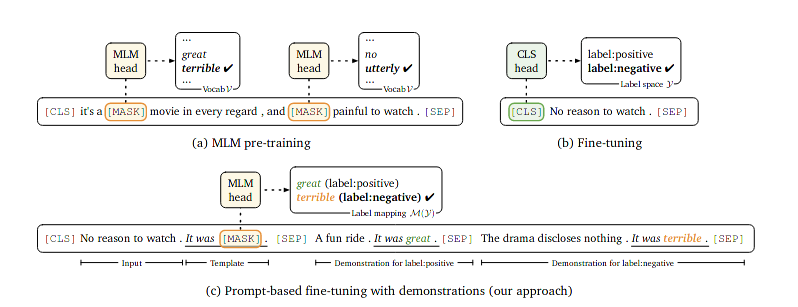

#### Making Pre-trained Language Models Better Few-shot Learners

### Motivation

when referring to neural language process, the crazy increasing model size jumps into our mind, thus there exist an obvious question, shell we finetune or adjust the pre-trained language model when encounter a new downstream task. The deep knowledge handled by the model maybe enough for new task. This paper proposes a template generation diagram for prompt based finetune.

### Background

Neural language process is a vast battleground for self-supervised learning. Mask-Language-Model diagram contributes to initial the weight holden by neural network. After pre-trained, model will be tansfered to a new downstream task with some layer fixed or through a relatively small learning rate. The finetune procedure is based on gradient-back-propagation, which consumes an absolutely big memory corresponding to the size of model. thus a new diagram is necessary for crazy increased model size, eg.GPT3 GPT2

* **MLM**

* **FINE-TUNING**

* **Prompt**

  prompt can be formulated as following:

  Given a input pair $<x_i, y_i>$, $x_i$ represent the input data, while $y_i$ indicate the label value, which can be discrete or continuous. the prompt use template to rewrite input $x_i$ to :
  $$
  x^{prompt}_i = x_i, <SEP>, It \ Is <Mask>, <SEP>
  $$
  which is classify or regress the corresponding output token, depending on the downstream setting.

