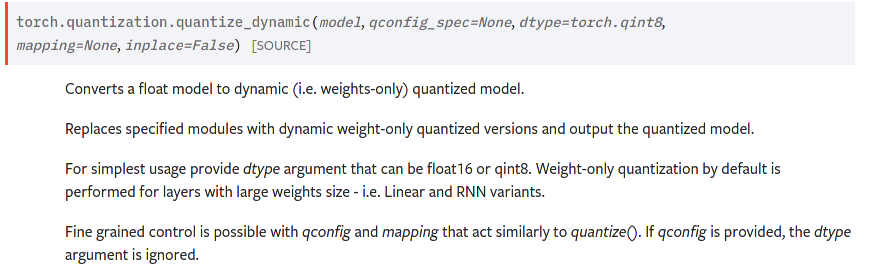
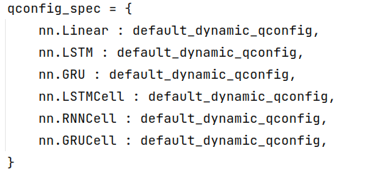
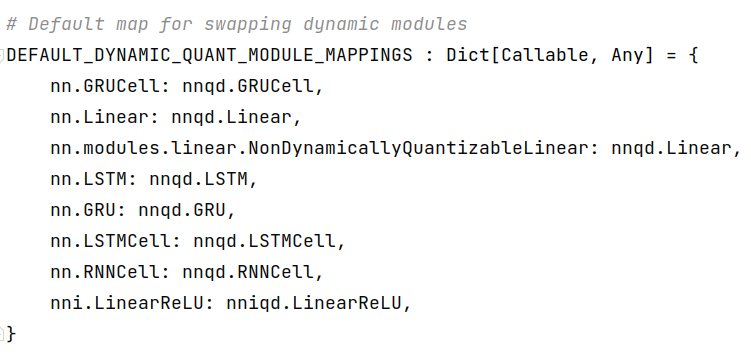
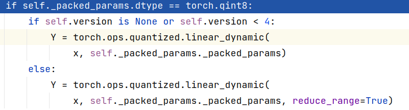
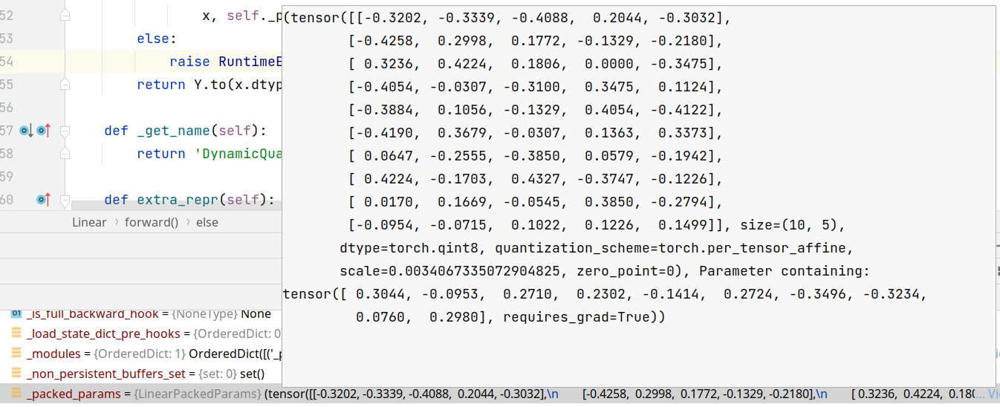
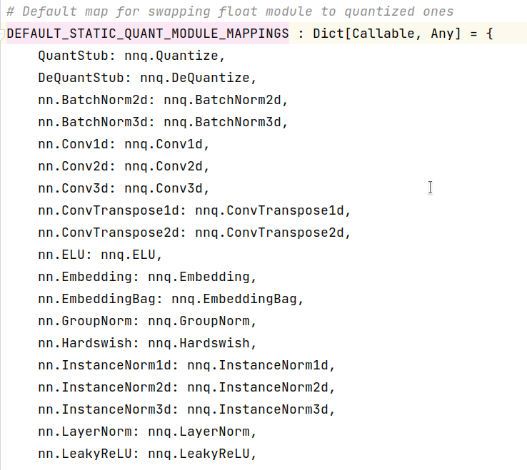
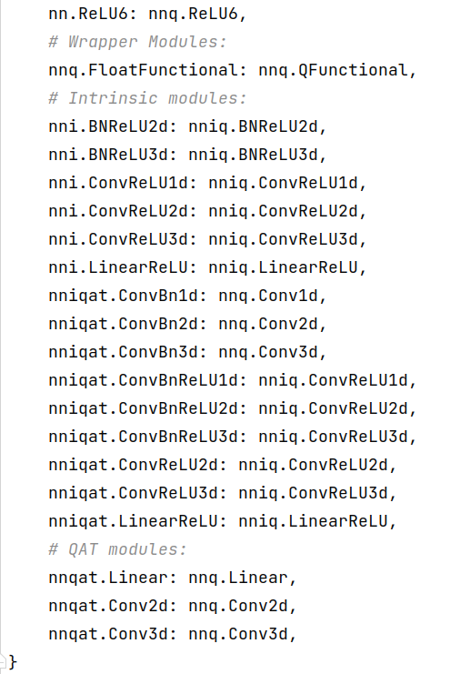
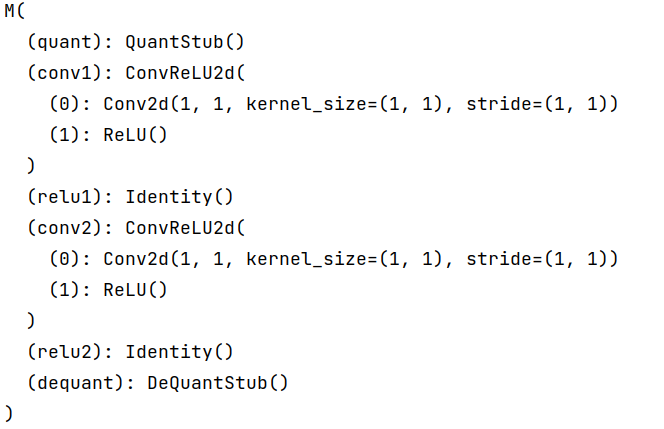
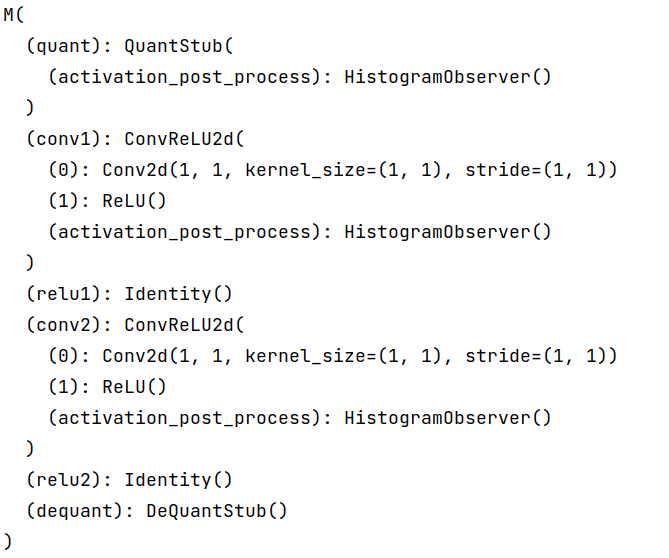
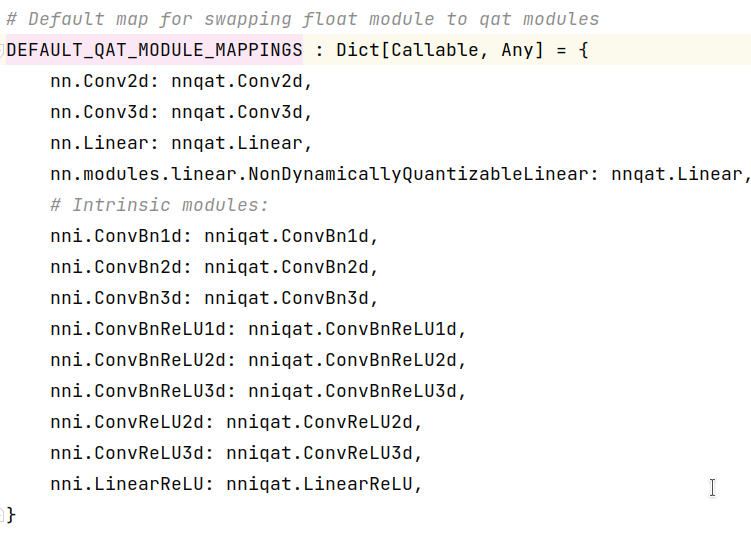

## PyTorch 中的 Quantization

pytorch中的量化支持三种类型，大概是三种：

*  dynamic quantization
*  static quantization
*  quantizaition aware training

支持这些功能的辅助函数主要是两个：` prepare`  和 ` convert`

#### quantized tensor

一个量化张量有两种量化方案：1. 在这个张量里面进行数据表示  2. 在一个通道上进行数据表示

量化的数据表示是为尽可能减少量化误差，因为int8只有255个数，如果映射到float 全集上，那误差必定大的和马一样，还好数据集有一定的数据特征，一般在运算中，结果会集中到一个范围上。
$$
\mathbb Q(x, s,z) = \text{round}({x\over s} + z)
$$

#### prepare function

prepare function 提供给不同的量化类型，添加`observer`, `observer` 通过运行过程统计特定数据集的数字特征，比如说最大值最小值， 或者直方图特征，用这些特征来计算的到输出范围的零点zero和scale，最终达到矫正数据表示范围的效果，减少量化误差

函数的主要调用就是  `add_observer` 

```python
def prepare(model, inplace=False, allow_list=None,
            observer_non_leaf_module_list=None,
            prepare_custom_config_dict=None):
		... # some code
    add_observer_(
        model, qconfig_propagation_list, observer_non_leaf_module_list,
        custom_module_class_mapping=custom_module_class_mapping)
    return model
```

判断是否需要加入observer , observer的作用是对于张量tensor进行后处理，也就是前文提到的矫正数据输出，所以在pytorch中，`observer`在模型中默认的名称是`activation_post_process`。

```python
 def insert_activation_post_process(m, special_act_post_process=None):
        """ Adds an activation post process module and register
        a post hook that calls the module
        """
        # We don't insert observer/fake_quantize for DeQuantStub
        if needs_observation(m) and not isinstance(m, DeQuantStub):
            # observer and hook will be gone after we swap the module
            m.add_module('activation_post_process', get_activation_post_process(
                m.qconfig, device, special_act_post_process))
            # Register observer as the first entry in the hook list
            # All post forward hooks are preserved and will be executed after the observer before convert
            handle = register_activation_post_process_hook(m)
            m._forward_hooks.move_to_end(handle.id, last=False)
```

如何控制加入的observer类型呢？这个参数是通过`qconfig`指定的

```python
class QConfig(namedtuple('QConfig', ['activation', 'weight'])):
    def __new__(cls, activation, weight):
        return super(QConfig, cls).__new__(cls, activation, weight)
```


#### convert function

根据定义的`mapping` , 将矫正好的预备量化的模型，转化为量化模型，当然这个既然是转换，只要你有定义的映射，就都可以转换，比如quantization aware trainning 就涉及包装原来的推理模型用来训练，这个包装就是convert实现的，训练完，再一次调用convert，得到量化模型

```python
def _convert(
        module, mapping=None, inplace=False,
        convert_custom_config_dict=None):
...
    custom_module_class_mapping = convert_custom_config_dict.get("observed_to_quantized_custom_module_class", {})

    if not inplace:
        module = copy.deepcopy(module)
    reassign = {}
    for name, mod in module.named_children():
        # both fused modules and observed custom modules are
        # swapped as one unit
        if not isinstance(mod, _FusedModule) and \
           type(mod) not in custom_module_class_mapping:
            _convert(mod, mapping, True,  # inplace
                     convert_custom_config_dict)
        reassign[name] = swap_module(mod, mapping, custom_module_class_mapping)

    for key, value in reassign.items():
        module._modules[key] = value

    return module
```


### dynamic quantization

 目前支持的种类有限，只有linear 以及一些RNN，在自己调试过程中，了解到这种quantization只是对weight进行了量化，进行节省空间，bias基本还是保持float.

官方文档也是这样说的：

<center class="half">
    
    
</center>


config 是这样定义的，包含`activation` 和 `weight` 两部分，貌似感觉没用到？

```python
default_dynamic_qconfig = 
				QConfigDynamic(
                    activation=default_dynamic_quant_observer,
                    weight=default_weight_observer)
float16_dynamic_qconfig = 		
				QConfigDynamic(
					activation=PlaceholderObserver.with_args(dtype=torch.float32),
                    weight=PlaceholderObserver.with_args(dtype=torch.float16))
```

动态量化主要过程就是把支持的上面所罗列出来的模型类型，根据`mapping`替换为量化版本,用的正是convert function



```python
def quantize_dynamic(model, qconfig_spec=None, dtype=torch.qint8,
                     mapping=None, inplace=False):
    ... # some code
    if not inplace:
        model = copy.deepcopy(model)
    model.eval()
    propagate_qconfig_(model, qconfig_spec)
    convert(model, mapping, inplace=True)
    return model
```

替换完成之后，推理是怎么进行的呢，在调试过程中，发现是通过`linear_dynamic` 函数实现的，同时也发现只有weight是qint8类型，输入的x仍旧是float32，这说明dynamic只是将权重量化，减少存储空间罢了：

<center>
    
    
</center>

### static quantization

静态量化，相比于动态量化，就多了多维卷积等支持类型，多的不是一点半点。

<center>
    
    
</center>


静态量化的过程：输入输出包装， 加入`observer` ,  针对数据集进行zero,scale校准，转换`convert`

```python
def quantize(model, run_fn, run_args, mapping=None, inplace=False):
    ... #some code
    model.eval()
    prepare(model, inplace=True)
    run_fn(model, *run_args) # carlibrate according to a dataset 
    convert(model, mapping, inplace=True)
    return model
```


<center>
     
    
</center>

可以看到，左边为原模型， 右边为`prepare` 加入`observer`之后的模型，之后把数据集跑一遍，统计得到最优的scale和zero。

### Quantizaition Aware Training

QAT 是怎么回事呢？理解了pytorch中的基本quantization过程，有一个问题就是，这种数据表示的溢出是原来训练过程没有遇到的，所以这个量化会不会不是最优的，我们应该让训练过程就模拟这种数据表示。

```python
def prepare_qat(model, mapping=None, inplace=False):
    mapping = get_default_qat_module_mappings()
    if not inplace:
        model = copy.deepcopy(model)
    propagate_qconfig_(model, qconfig_dict=None)
    convert(model, mapping=mapping, inplace=True, remove_qconfig=False)
    prepare(model, observer_non_leaf_module_list=set(mapping.values()), inplace=True)
    return model

def quantize_qat(model, run_fn, run_args, inplace=False):
    ... # some code
    if not inplace:
        model = copy.deepcopy(model)
    model.train()
    prepare_qat(model, inplace=True)
    run_fn(model, *run_args)
    convert(model, inplace=True)
    return model
```

和static quantize很像，不同的地方在于static是统计数据集的数字特征，而这个则是训练+统计数据集的数字特征（prepare函数添加了observer）， 为了可以模拟量化的表示来训练，肯定需要包装一下原来的网络结构，这里（prepare_qat）用的`convert` 根据mapping来转化为模拟量化过程的对应模型。



以卷积为例，在qat中被修改成这样，用`self.weight_fake_quant` 来模拟量化：

```python
class Conv2d(nn.Conv2d):
    _FLOAT_MODULE = nn.Conv2d

    def __init__(self, in_channels, out_channels, kernel_size, stride=1,
                 padding=0, dilation=1, groups=1,
                 bias=True, padding_mode='zeros', qconfig=None,
                 device=None, dtype=None) -> None:
        factory_kwargs = {'device': device, 'dtype': dtype}
        super().__init__(in_channels, out_channels, kernel_size,
                         stride=stride, padding=padding, dilation=dilation,
                         groups=groups, bias=bias, padding_mode=padding_mode,
                         **factory_kwargs)
        assert qconfig, 'qconfig must be provided for QAT module'
        self.qconfig = qconfig
        self.weight_fake_quant = qconfig.weight(factory_kwargs=factory_kwargs)

    def forward(self, input):
        return self._conv_forward(input, self.weight_fake_quant(self.weight), self.bias)
```

这个训练过程需要很好的数值敏感性，因为权重一直在变，同时还在统计数据集的数字特征，权重是会影响数字特征的，因为`observer` 统计的是激活之后的函数。


